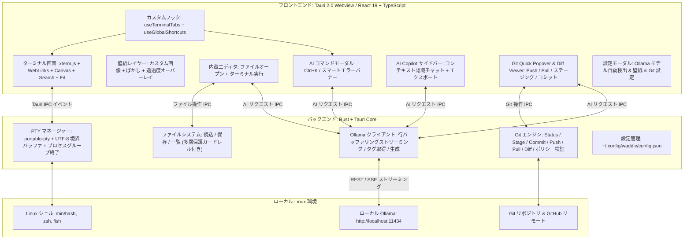

<div align="center">

# 🐧⚡ Waddle
### 完全ローカルAI統合型 次世代 Linux ターミナルエミュレータ


[](https://tauri.app/)
[](https://www.rust-lang.org/)
[](https://react.dev/)
[](https://ollama.com/)
[-FCC624?style=for-the-badge&logo=linux&logoColor=black)](https://www.kernel.org/)
[](#-このプロジェクトについて--ai-vibe-coding)
[](LICENSE)

<p align="center">
  <strong>超高速 PTY ターミナル × 完全ローカル AI（Ollama） × 簡易内蔵エディタ × 背景壁紙カスタマイズ</strong><br>
  外部クラウドにデータを一切送信しない、プライベートかつインテリジェントな Linux 向けターミナルエミュレータ
</p>

<p align="center">
  <a href="README.md">English</a> | <a href="README.ja.md">日本語</a>
</p>

</div>

---

## 📸 スクリーンショット

| 🐧 超高速ターミナル & 背景壁紙 | 🤖 AI コマンド生成アシスタント (`Ctrl + K`) |
| :---: | :---: |
|  |  |
| *CachyOS, Fish Shell, Powerline Nerd Fonts & 透過サイバーパンク壁紙* | *自然言語でのコマンド生成・危険コマンド警告・即時実行* |

| 📝 簡易内蔵コードエディタ (`Ctrl + E`) | 💬 コンテキスト認識型 AI Copilot サイドバー |
| :---: | :---: |
|  |  |
| *2画面分割編集、クイックオープン、AIリファクタリング (`Ctrl + Shift + K`)* | *カレントディレクトリ・Gitブランチ・コマンド履歴を把握した対話アシスタント* |

---

## 🤖 このプロジェクトについて (AI Vibe Coding)

> [!IMPORTANT]
> ### 💡 AI Vibe Coding による開発
> **Waddle** は、**Google DeepMind の Antigravity (Gemini)** との対話的ペアプログラミング（AI Vibe Coding）によって作成されたプロジェクトです。
> 人間による設計方針・アイデアの提示と、AI による実装・デバッグ・最適化のフローを組み合わせ、低レイヤの Rust PTY プロセス管理、Linux `/proc/<pid>/cwd` によるリアルタイムパス追跡、WebKitGTK 最適化、React 19 フロントエンド、透明 xterm.js レンダリング、ローカル Ollama ストリーミングクライアント、簡易コードエディタに至るまでフルスクラッチで実装されました。

---

## 🌟 主な機能

### 1. 🤖 自然言語からのコマンド自動生成 (`Ctrl + K`)
- 「ポート8080を使っているプロセスを終了したい」「過去3日間に更新されたログを検索」といった自然言語の指示から、ローカル AI が即座に正確な Linux コマンドと解説を生成します。
- 危険な破壊的コマンド（`rm -rf` やパーティション操作等）は、AI が自動で警告タグを表示します。
- `Enter` でターミナルへ入力挿入、`Ctrl + Enter` で即座に実行できます。

### 2. 🖼️ 背景画像・壁紙の自由なカスタマイズ & ネイティブピッカー (`Ctrl + ,`)
- **OS ネイティブファイル選択**: 「📁 参照...」ボタンから Linux デスクトップ標準のファイル選択ダイアログ（`zenity` / `kdialog`）が直接起動し、PC 内の任意の画像（PNG, JPG, SVG, WebP, GIF, BMP）を迷わず選択・適用可能。
- **画像マジックバイト & 拡張子検証**: アップロードされた画像は先頭ヘッダーバイト（PNG, JPEG, WebP, GIF, BMP, SVG）とホワイトリスト拡張子を厳格に検証し、悪意あるシェルスクリプトやバイナリの偽装保存を遮断。
- **軽量ストレージ & アセットプロトコル**: 画像は Base64 ではなく `~/.config/waddle/wallpapers/` へ独立保存され、Tauri v2 のセキュアな `protocol-asset` 経由で直接ロード（旧バージョンの Base64 形式からの自動移行機能付き）。設定ファイル `config.json` は常に数十〜数百バイトの超軽量を維持します。
- **起動遅延ゼロ（非同期デコード & GPU 隔離）**: 画像デコードをバックグラウンドスレッドで非同期処理（`decoding="async"`）し、CSS の GPU レイヤー分離（`contain: strict`）を行うことで、高解像度 4K 壁紙を設定していてもターミナルが **0ms で即座に起動** します。
- **透過度 & すりガラスぼかし調整**: 画像不透明度（10%〜100%）とぼかし（0〜20px）をスライダーで直感的に調整。ターミナル文字のコントラストを維持するダークオーバーレイも完備。

### 3. 📂 左側ファイルツリーサイドバー (`Ctrl + B`)
- **ディレクトリ階層ナビゲーション**: ターミナルのカレントディレクトリと自動連動し、フォルダの展開・折りたたみ（遅延読み込み）、ファイル拡張子別アイコン表示をサポート。
- **インクリメンタル検索 & 隠しファイル表示**: 上部の検索バーで素早くファイルをフィルタリング可能。ドットファイル（`.`で始まる隠しファイル）の表示/非表示もワンクリックで切り替え。
- **エディタ & ターミナル直結**: ファイルをクリックするだけで内蔵エディタ（`Ctrl+E`）が自動展開されて即座にロード。ホバーアクションからパスのターミナル挿入や新規ファイル/フォルダ作成も可能。

### 4. 📝 簡易内蔵エディタ & AI コード支援 (`Ctrl + E`)
- ターミナルとシームレスに切り替えられるスライドイン型コードエディタを内蔵。
- **クイックオープン & 保存**: カレントディレクトリのファイル一覧表示、ファイル名での直接オープン、`Ctrl + S` による保存。
- **安全確認付き Run in Terminal**: ワンクリックで開いているスクリプト（Python, Bash, JS/TS, Rust 等）やバッファ内容をアクティブなターミナルで実行。破壊的コマンドが含まれる場合は、実行前に `DangerousCommandModal` が自動でインターセプトし、誤爆を防止。
- **AI リファクタリング (`Ctrl + Shift + K`)**: エディタ内のコードに対して、ローカル AI に修正・機能追加・エラーハンドリングの挿入を直接指示可能。

### 5. 🪟 柔軟なマルチペイン分割 & ドラッグによるリサイズ（2・3・4分割 & 10種類のレイアウト）
- **タブ内マルチターミナルワークフロー**: 1つのタブを 2分割・3分割・4分割（または単一ペイン）に自由に切り替え可能。各ペインは独立した PTY セッションを持ち、アクティブペインのカレントディレクトリ（CWD）を自動継承。
- **視覚的な10種類のレイアウトプリセット**:
  - **1分割**: 単一ペイン (`single`)
  - **2分割**: 左右2分割 (`split-2-h`), 上下2分割 (`split-2-v`)
  - **3分割**: 左メイン＋右2段 (`split-3-left-main`), 上メイン＋下2列 (`split-3-top-main`), 縦3列 (`split-3-h`), 横3段 (`split-3-v`)
  - **4分割**: 2×2格子グリッド (`grid-4`), 左メイン＋右3段 (`split-4-left-main`), 縦4列 (`split-4-h`)
- **インタラクティブなドラッグリサイズ境界線**: ペイン境界にマウスホバーするとネオン発光のリサイズハンドル（`col-resize` / `row-resize`）が出現。マウスドラッグでペイン比率を 15%〜85% の範囲で直感的に自由調整可能。
- **自動文字枠再フィッティング**: リサイズ境界線のリリース時に `@xterm/addon-fit` が行数・列数を即座に再計算し、文字の折り返しを瞬時に最適化。
- **ペインズーム（最大化）モード**: 作業中の特定ペインをフルサイズに一時最大化可能。上部のリストアバーからワンクリックで元の分割レイアウトに復帰。
- **アクティブペインの強調とスマート連動**: 選択中ペインはアクセントカラーと発光ボーダーで明示。AI コマンド生成（`Ctrl + K`）、Copilot チャット、内蔵エディタ、ステータスバーはすべてアクティブなペインとシームレスに自動連動。

### 6. 🔎 ターミナル内リアルタイムログ検索 (`Ctrl + Shift + F` / `Ctrl + F`)
- **全スクロールバック高速検索**: `@xterm/addon-search` を搭載し、ターミナルの過去ログ全行を対象としたハードウェアアクセラレーションテキスト検索。
- **フローティング検索バー**: 美しいダークグラスデザインの検索バーが右上にポップアップし、次の一致 / 前の一致をキー操作（`Enter` / `Shift + Enter`）または矢印ボタンで素早くナビゲーション。
- **検索オプション**: 大文字小文字の区別（`Aa`）および正規表現検索（`.*`）のトグルを完備。ヒット箇所はターミナル上でリアルタイムハイライト表示。`Esc` キーで瞬時にクローズ。

### 7. 🚨 コマンドエラーの自動診断 & 誤検知ノイズ抑制
- ターミナル上でコマンドが失敗（非ゼロ終了コードや stderr エラー）すると、スマートエラーバナーが自動出現。
- **ノイズ抑制フィルター**: 探索・確認用コマンド（`grep`, `find`, `cat`, `echo`, `diff`, `git log` 等）は自動で除外され、同一エラー出力の重複通知も抑制。
- ワンクリックで「なぜ失敗したのか」をローカル AI が分析し、修復用コマンドを提案・即実行できます。

### 8. 💬 コンテキスト認識型 AI Copilot サイドバー & 会話履歴エクスポート
- ターミナルの状態（カレントディレクトリ、Git ブランチ、変更ファイル数、直前のコマンド履歴）を自動的に把握した対話型 AI アシスタント。
- AI の回答に含まれるコードブロックはワンクリックでターミナルへの挿入・実行・コピーが可能。
- **会話履歴エクスポート**: ワンクリックでチャットセッションを構造化された **Markdown (`.md`)** または機械可読な **JSON (`.json`)** として直接保存・エクスポート可能。タイムスタンプやシェル状態、提案コマンドも完全に保存。

### 9. 🦙 ローカル Ollama モデルの自動検出 & 行バッファリングストリーミング
- マシンにインストールされている Ollama モデル（`llama3.2`, `deepseek-r1`, `qwen2.5-coder`, `codellama`, `mistral` 等）を自動取得・一覧表示。
- **行バッファリングストリーミング**: HTTP チャンク分割境界をまたぐ不完全な JSON パケットを行単位で完全復元・アセンブルしてからパースすることで、トークンの脱落やレスポンス破損を徹底防止。
- 設定画面（`Ctrl + ,`）からいつでもモデルを切り替え可能。
- **API キー不要、クラウドレス、データ流出の心配ゼロ。**

### 10. ⚡ 高性能 PTY & 遅延ゼロの 2D Canvas アクセラレーション
- **Rust ネイティブ PTY コア**: `portable-pty` による極小 I/O レイテンシ。
- **マルチバイト UTF-8 境界保護**: 8192 バイトの読み込み境界で分割された不完全なマルチバイト文字を内部バッファで自動保持・連結し、日本語や絵文字の `\u{FFFD}` 文字化けを完全に防止。
- **プロセスグループ終了 & ゾンビ化防止**: タブやペインを閉じた際、プロセスグループ（`-pid`）全体に対して `SIGHUP`、`SIGTERM`、`SIGKILL` を順次シグナル送信。孤立したバックグラウンドプロセスや暴走パイプラインを確実にクリーンアップ。
- **起動遅延ゼロ（0ms 即時起動）**: 高効率な 2D Canvas レンダラー（`@xterm/addon-canvas`）を採用し、GPU ドライバの初期化ブロッキングや透過バグを回避。アプリ起動の第 1 フレームからキー入力を即座に受付。
- **スマート Git & CWD 監視**: ウィンドウ非アクティブ時（`document.hidden`）はポーリングを自動一時停止し、コマンド実行完了時には即座に更新。

### 11. 🎨 全22種類の洗練されたテーマ & 高電圧ネオンコレクション
- **厳選された全22種類のプリセットテーマ（ネオン系11種・クラシック系11種）**:
  - **⚡ 高電圧ネオン・ハデハデコレクション（全11種）**:
    - **Neon Overdrive**: レーザーピンク×鮮烈シアンの純度100%サイバーパンク
    - **Toxic Matrix**: 電脳バイオハザード・蛍光放射性ライム＆エメラルド発光
    - **Outrun Sunset**: 灼熱ネオンオレンジ×ゴールド×夕暮れトワイライト
    - **Electric Violet**: ブラックライトUVパープル×スクリーミングマゼンタ
    - **Neo Tokyo 2099**: AKIRA レーザーレッド×ゴールドの攻撃的メガシティ夜景
    - **Acid Cyber**: 蛍光ペンのような超高明度アシッドイエロー×蛍光ライム
    - **Miami Vice Neon**: 澄んだターコイズ×フラミンゴピンクのパステルネオン
    - **Laser Glitch**: 漆黒空間に走るグリッチマゼンタ×エレクトリックシアン閃光
    - **Plasma Cyan**: プラズマ炉心のような極限ルミネセンス・シアン＆サファイア
    - **Cyberpunk 2077**: ナイトシティ・ネオンイエロー×シアン×ホットピンク
    - **Synthwave '84**: 80年代レトロフューチャー・ネオンパープル＆ネオングリッド
  - **スタンダード・プロコレクション（全11種）**:
    - **Waddle Cyber (Default)**: ネオンブルー×サイバーダーク
    - **Tokyo Night**, **Catppuccin Mocha**, **Dracula**, **Nord (Arctic)**
    - **Gruvbox Dark**, **One Dark Pro**, **Rosé Pine**, **Monokai Pro**
    - **Solarized Dark**, **Midnight Abyss (OLED 純黒 #000000)**
- **UI 全体の動的ネオン発光同期**: ターミナルの文字色（ANSI 16色）だけでなく、タイトルバー、タブ、アクティブ枠線、ステータスバー、ダイアログのグローオーラまでテーマのアクセント色に合わせて完全同期発光。
- **設定画面でのリアルタイム見本プレビュー**: `<optgroup>` 分類、アニメーション `⚡ NEON` バッジ、アクセント/カーソル/ANSI見本、プロンプトのミニターミナル再現。
- **Nerd Fonts**: **JetBrainsMono Nerd Font**, **MesloLGS NF**, **FiraCode Nerd Font**, **Hack Nerd Font** などのプリセット選択およびカスタムフォント指定に対応。

### 12. 🌐 多言語・UI言語切り替え機能 (英語 US / UK, 日本語)
- **設定画面から選べる言語**: 設定（`Ctrl + ,`）から **英語 (US)**、**英語 (GB / UK)**、**日本語** をいつでも自由に切り替え可能。
- **リアルタイム反映 & 設定の永続化**: 言語を選択すると設定画面を含め、タイトルバー、ファイルツリー、エディタ、AIモーダル、エラーバナー、検索バーが即座に切り替わり、`~/.config/waddle/config.json` に安全に保存されます。
- **世界水準の英語デフォルト**: 初回起動時や新規インストール時は国際標準の英語（`en-US`）がデフォルト設定として適用され、英語圏・日本国内のどちらの開発者にも最適化されています。

### 13. 🛡️ 包括的な多層防御セキュリティ & AI ガードレール
- **ファイルシステム操作の保護ガードレール**:
  - **前方一致によるシステム領域保護**: `/etc`, `/usr`, `/bin`, `/sbin`, `/boot`, `/lib`, `/sys`, `/proc`, `/dev`, `/root`, `/run` などのシステム重要領域配下の全ファイル・サブディレクトリの削除および書き込みを前方一致（`canonical.starts_with(sys_path)`）で確実に遮断。
  - **ユーザー重要資格情報の保護**: SSH 秘密鍵（`id_rsa`, `id_ed25519`, `id_ecdsa`, `id_dsa`）、GPG 秘密鍵（`~/.gnupg/private-keys-v1.d`）、システムキーリング（`~/.local/share/keyrings`）の読み出し・書き込み・削除を遮断。設定ルート（`~/.config` 自体）の削除も防止。
  - **安全な書き込み検証**: `create_file` および `write_file` において書き込み前に正規パスを検証し、システムファイルの意図しない上書きや攻撃を防止。
  - **先行バリデーション**: ファイルの存在確認を行う前にセキュリティ検証を実施し、ファイル探索や情報漏洩を防御。
- **間接的プロンプトインジェクション対策**:
  - タグ文字エスケープ: AI に渡す端末出力内の `<untrusted_terminal_output>` および `</untrusted_terminal_output>` を無害化置換し、プロンプト脱出攻撃を完全に遮断。
  - メタデータのサニタイズ: Git ブランチ名、直前のコマンド、CWD に含まれる制御文字やタグ文字を自動サニタイズ。
- **単語境界を考慮した危険コマンド検知 & 確認モーダル (`DangerousCommandModal`)**:
  - Rust バックエンドと React フロントエンドで判定パターンおよび単語境界（`\b`）チェックを完全同期。
  - 無害なコマンドや変数名（例: `echo 'imparted wisdom'`）に対する誤検知（False Positive）を防止。
  - 検知対象:
    - ファイル削除・切り詰め: `rm`, `rmdir`, `find -delete`, `find -exec rm`, `truncate -s 0`, `shutil.rmtree`
    - 破壊的 Git 操作: `git clean -f`, `git clean -fdx`, `git reset --hard`, `git push --force`
    - プロセス置換・eval: `bash <(`, `sh <(`, `zsh <(`, `eval "$(`
    - ディスク・パーティション操作: `mkfs`, `dd if=`, `fdisk`, `parted`, `gdisk`, `wipefs`, `shred`
    - 危険なリダイレクト・権限変更: `> /dev/`, `> /etc/`, `> /boot/`, `chmod -R`, `chmod 777`, `chown -R`
    - システム停止・フォークボム: `reboot`, `shutdown`, `poweroff`, `init 0`, `init 6`, `:(){ :|:& };:`
  - 警告モーダルから「確認して実行」「安全に入力のみ（Enterは手動）」「キャンセル」を選択可能。
- **エディタ実行保護**: 内蔵エディタからの実行時にも同一の危険コマンド検知が働き、不用意な破壊的操作を防止。
- **アセットプロトコルの最小権限化**: Tauri の `assetProtocol.scope` を `$CONFIG/waddle/**/*`、`$PICTURE/**/*`、`$DOWNLOAD/**/*` に厳密限定。`$CONFIG/**/*` への広大なアクセス権を撤廃し、ブラウザのクッキーや各社 CLI トークン（`gh` 等）へのアクセスを遮断。
- **壁紙バイナリヘッダー検証**: 先頭マジックバイトを検査し、画像形式（PNG, JPEG, WebP, GIF, BMP, SVG）以外の実行ファイルやスクリプトの保存を拒否。
- **リモート Ollama 警告バナー**: 設定画面で `localhost` 以外の外部エンドポイントが指定された際、外部ネットワークへのデータ送信リスクを促すアンバー警告バナーを即時表示。
- **バックグラウンドプロセスの安全化**: Git 状態取得時に `--no-optional-locks` および `GIT_OPTIONAL_LOCKS=0` を指定してリポジトリのインデックスロック競合を防ぎ、ファイルダイアログ起動では `/usr/bin/` の絶対パスを優先検証。

### 14. 🐙 Git & GitHub 連携、ローカル AI コミット生成 & Push/Pull ポリシー
- **ステータスバー連動 Quick Git Popover**: ステータスバーの Git バッジをクリックして展開。ブランチのワンクリック切り替え、ステージ/アンステージ（ファイル単体・一括）、変更の破棄（Discard）、コミットメッセージ入力を提供。
- **1クリック Pull & Push (`git pull` / `git push`)**: ポップオーバーのヘッダーから直接リモートへ push または最新の変更を pull。遅延（Behind）はアンバー、先行（Ahead）はシアンのバッジで件数が発光表示。非同期実行（`spawn_blocking`）と `GIT_TERMINAL_PROMPT=0` により、GUI やターミナル入力を一切フリーズさせません。
- **ローカル Ollama による Conventional Commit 自動生成**: ステージされた差分（Diff）をもとに、標準的な Conventional Commits 形式（`feat: ...`, `fix: ...` 等）のコミットメッセージをローカル AI が瞬時に自動生成。コードや差分は外部クラウドへ一切送信されません。
- **内蔵 GUI Diff ビューワー**: アプリ内で unified diff をシンタックスハイライト付きで視覚的に確認。未追跡ファイルにも対応し、差分確認画面から直接「ステージに追加」「変更を破棄」が可能。
- **ファイルツリー Git 状態装飾**: 変更（M）、未追跡（U）、ステージ済（S）、競合（C）の各バッジをファイルツリーにリアルタイム表示。変更を含む親フォルダには点灯インジケータードットが表示され、変更箇所が一目瞭然。
- **設定画面での ON/OFF 切り替え & GitHub 特化接続制限**:
  - **Git 連携の有効化トグル**: 設定画面（`Ctrl + ,`）から Git 連携を OFF に切り替えることで、バックグラウンドの Git ポーリングを全停止し、超軽量なローカルターミナルとして動作可能。
  - **GitHub 限定セキュリティポリシー**: `git remote -v` を検査し、GitLab や独自サーバーなど GitHub 以外のリモートに対する push/pull 操作を事前遮断し、ステータスバーとポップオーバーで警告。
  - **厳格な CSP 制限**: Webview のネットワーク接続先を `localhost:11434` (Ollama) および `github.com` のみに厳格制限。

### 15. 🔄 ワンクリック・ワークスペース全リフレッシュ & 安全確認ダイアログ
- **タイトルバー直結リフレッシュボタン**: タイトルバー右側（レイアウト選択と設定ボタンの間）に「リフレッシュ（Refresh）」ボタンを常設。
- **安心のモーダル確認ダイアログ**: クリック時に確認ダイアログを起動。全タブ・分割ペインの終了、実行中プロセスの停止、セッション保存情報（`localStorage`）のクリア、初期ホームディレクトリへのリセットを視覚的バッジ付きで明示し、誤操作を確実に防止。
- **完全クリーンアップ**: 確認実行後、すべての PTY プロセスを安全に終了させ、初期ホームディレクトリでの単一タブ・単一ペインを生成。ファイルツリーのキャッシュや開いているエディタ・AIモーダルも瞬時に初期状態へと安全復帰。

---

## ⌨️ ショートカットキー一覧

| ショートカット | 動作 |
| :--- | :--- |
| `Ctrl + K` | **AI コマンド生成モーダル** を開く |
| `Ctrl + B` | **ファイルツリーサイドバー** の表示/非表示を切り替え |
| `Ctrl + E` | **簡易内蔵エディタ** の表示/非表示を切り替え |
| `Ctrl + S` *(エディタ内)* | ファイルを保存 |
| `Ctrl + Shift + K` *(エディタ内)* | **AI コード編集・リファクタリング** を開く |
| `Ctrl + Shift + F` / `Ctrl + F` | **ターミナル内ログ検索** の表示/非表示を切り替え |
| `Ctrl + T` | 新規ターミナルタブを開く |
| `Ctrl + W` | 現在のターミナルタブを閉じる |
| `Ctrl + Shift + W` | 現在のアクティブな分割ペインを閉じる |
| `Ctrl + Shift + S` | 分割ペインの**スワップ（配置入れ替え）** |
| `Ctrl + Alt + ↑ / ↓ / ← / →` | **分割比率のキーボードリサイズ**（5%刻み） |
| `Alt + 1` | **単一ペイン（1画面）** レイアウトへ切り替え |
| `Alt + 2` | **2分割（左右）** レイアウトへ切り替え |
| `Alt + 3` | **3分割（左メイン）** レイアウトへ切り替え |
| `Alt + 4` | **4分割（2×2グリッド）** レイアウトへ切り替え |
| `Alt + Z` | **アクティブペインのズーム（最大化 / 元に戻す）** |
| `Alt + ↑ / ↓ / ← / →` | 分割ペイン間のフォーカス移動 |
| `Ctrl + ,` | **設定画面**（Ollama モデル、壁紙、テーマ、フォント、言語、Git連携ON/OFF）を開く |
| `ステータスバーの Git バッジ` | **Git クイックポップオーバー**（ブランチ切替、ステージ、コミット、Push、Pull、Diff）を開く |
| `Ctrl + Enter` *(Git コミット入力)* | ステージされた変更をコミット |
| `Enter` *(AIモーダル内)* | 生成されたコマンドをターミナルに入力挿入 |
| `Ctrl + Enter` *(AIモーダル内)* | 生成されたコマンドをターミナルで即時実行 |
| `Enter` / `Shift + Enter` *(検索内)* | ターミナル内の次の一致 / 前の一致へ移動 |
| `Esc` | 開いているモーダル・検索バー・ポップアップを閉じる |

---

## 🏗️ アーキテクチャ



---

## 🚀 クイックスタート

### 1. 必要環境

- [Rust (Cargo)](https://rustup.rs/) (1.70 以上)
- [Node.js & npm](https://nodejs.org/) (Node 18 以上)
- [Ollama](https://ollama.com/) (ローカル AI エンジン)

### 2. Ollama のセットアップ

```bash
# Ollama サーバーを起動
ollama serve

# モデルをダウンロード（軽量モデル推奨）
ollama pull llama3.2
# またはコーディング特化モデル
ollama pull qwen2.5-coder
# または推論特化モデル
ollama pull deepseek-r1
```

### 3. 開発モードでの起動

```bash
# リポジトリのクローン
git clone https://github.com/your-username/Waddle.git
cd Waddle

# 依存パッケージのインストール
npm install

# 開発サーバー起動
npm run tauri dev
```

---

## 📦 プロダクションビルド（スタンドアロンバイナリ作成）

Waddle を最適化された単一バイナリや Arch Linux 向けネイティブパッケージとしてビルドする場合：

```bash
# Arch Linux 向け Pacman パッケージ (.pkg.tar.zst) をビルド
npm run package
# または: npm run build:pacman
```

### Pacman によるシステムインストール (Arch Linux / CachyOS / Manjaro / EndeavourOS):
```bash
sudo pacman -U src-tauri/target/release/bundle/pacman/waddle-0.1.0-1-x86_64.pkg.tar.zst
```

### 生成される成果物:
- **Arch Linux Pacman パッケージ (~7.9 MB)**: `src-tauri/target/release/bundle/pacman/waddle-0.1.0-1-x86_64.pkg.tar.zst`
- **スタンドアロン実行ファイル (~18 MB)**: `src-tauri/target/release/waddle`
- **PKGBUILD**: リポジトリ直下に配置済み（`makepkg -si` によるビルド・AUR対応）

---

## 💻 技術スタック

| レイヤー | 使用技術 |
| :--- | :--- |
| **フレームワーク** | [Tauri 2.0](https://tauri.app/)（`protocol-asset`, `tray-icon` 対応） |
| **バックエンド** | Rust, `portable-pty`, `tokio`, `reqwest`, `serde`, `base64`, `libc` |
| **フロントエンド** | React 19, TypeScript, Vite, Vanilla CSS |
| **ターミナルコア** | `@xterm/xterm`, `@xterm/addon-canvas`, `@xterm/addon-search`, `@xterm/addon-fit`, `@xterm/addon-web-links` |
| **ローカル AI エンジン** | [Ollama](https://ollama.com/) (`/api/generate`, `/api/chat`, `/api/tags`) |
| **ネイティブ連携** | GTK / Wayland ネイティブファイルピッカー（`zenity` / `kdialog`）、Linux `/proc` ファイルシステム |
| **アイコン・マークダウン** | `lucide-react`, `react-markdown`, `remark-gfm` |

---

## 🔒 プライバシー & セキュリティ

- **完全オフライン & ローカル完結**: テレメトリ（利用状況送信）や外部クラウド API との通信は一切ありません。入力したコマンドやログが外部に送信されることはありません。
- **データ主権の保証**: 機密データを扱う企業環境や、エアギャップ（閉域網）環境でも安心してご利用いただけます。
- **多層防御（Defense-in-Depth）アーキテクチャ**:
  - **厳格な CSP 設定**: Webview からの不正な外部接続やスクリプトインジェクション攻撃を遮断。
  - **最小特権のアセットプロトコル**: 壁紙ディレクトリ（`$CONFIG/waddle/**/*`）等に読み込みを厳密限定し、`~/.config` 配下のブラウザセッションや機密トークンの漏洩を防止。
  - **ファイルシステム操作の保護**: システム全域の前方一致削除防止、SSH秘密鍵・GPG秘密鍵・キーリングの読み出し/書き込み/削除拒絶、機密ディレクトリ（`~/.ssh`, `~/.gnupg`）への書き込み制限。
  - **プロンプトインジェクション遮断**: タグエスケープと境界隔離により、悪意ある端末ログによる AI 脱出を無力化。
  - **単語境界を考慮した破壊的コマンド事前検知**: ターミナルおよびエディタからの `rm -rf`、Git破壊操作、プロセス置換等の実行前に確認モーダルを表示（安全な貼り付け・即時実行・キャンセルの選択が可能）。
  - **壁紙バイナリ整合性検証**: マジックバイト検査によりスクリプト等の不正ファイル保存を防御。
  - **リモートエンドポイント警告**: 外部 Ollama サーバー利用時の通信リスクを可視化。
  - **Git 連携の完全ローカル制御 & GitHub 限定ポリシー**: 設定画面から Git 連携をいつでも無効化でき、バックグラウンドでの Git ポーリングを全停止可能。有効時も非 GitHub リモートに対する push/pull を事前検知して自動遮断し、Webview CSP と連携して不用意な外部データ通信を防止。

---

## 📄 ライセンス

本プロジェクトは [MIT License](LICENSE) のもとで公開されています。

---

<p align="center">
  Crafted via <strong>AI Vibe Coding</strong> 🐧⚡<br>
  Built with ❤️ for Linux Developers
</p>

