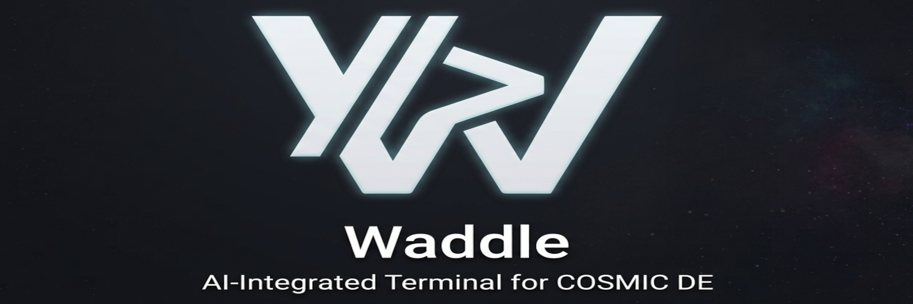

<div align="center">

# 🐧⚡ Waddle
### 完全ローカルAI統合型 次世代 Linux ターミナルエミュレータ



[](https://tauri.app/)
[](https://www.rust-lang.org/)
[](https://react.dev/)
[](https://ollama.com/)
[-FCC624?style=for-the-badge&logo=linux&logoColor=black)](https://www.kernel.org/)
[-00C49F?style=for-the-badge&logo=archlinux&logoColor=white)](#environment-notice)
[](#vibe-coding)
[](LICENSE)

<p align="center">
  <strong>超高速 PTY ターミナル × 完全ローカル AI（Ollama） × 簡易内蔵エディタ × 背景壁紙カスタマイズ</strong><br>
  外部クラウドにデータを一切送信しない、プライベートかつインテリジェントな Linux 向けターミナルエミュレータ
</p>

<p align="center">
  <a href="README.md">English</a> | <strong>日本語</strong>
</p>

</div>

---

<a id="environment-notice"></a>
> [!WARNING]
> ### 動作環境に関する重要なご注意 (Environment Notice)
> 本アプリケーション（Waddle）の開発、動作検証、および自動/手動テストは、すべて **CachyOS の COSMIC Desktop Environment** 上で行われております。  
> **他のデスクトップ環境（KDE Plasma, GNOME, XFCE 等）や他のディストリビューションでは動作確認が取れておりません。** 環境固有のウィンドウマネージャー、コンポジター、Wayland 挙動、フォントレンダリング等の差異により、一部の表示や挙動が異なる可能性があります。

---

## 📸 スクリーンショット

| 🐧 超高速ターミナル & 背景壁紙 | 🤖 AI コマンド生成アシスタント (`Ctrl + K`) |
| :---: | :---: |
|  |  |
| *CachyOS, Fish Shell, Powerline Nerd Fonts & 透過サイバーパンク壁紙* | *自然言語でのコマンド生成・危険コマンド警告・即時実行* |

| 📝 簡易内蔵コードエディタ (`Ctrl + E`) | 💬 コンテキスト認識型 AI Copilot サイドバー |
| :---: | :---: |
|  |  |
| *2画面分割編集、クイックオープン、AIリファクタリング (`Ctrl + Shift + K`)* | *カレントディレクトリ・Gitブランチ・コマンド履歴を把握した対話アシスタント* |

---

## 🚀 クイックスタート (Quick Start)

### 1. 必要環境

- **検証済み動作環境**: **CachyOS + COSMIC Desktop Environment**
  - *※ KDE Plasma, GNOME, XFCE 等の他環境や他ディストリビューションでは動作未検証です。*
- [Rust (Cargo)](https://rustup.rs/) (1.70 以上)
- [Node.js & npm](https://nodejs.org/) (Node 18 以上)
- [Ollama](https://ollama.com/) (完全ローカル AI エンジン)
- **Nerd Fonts (推奨)**: Waddle はフォントを同梱しません。グリフやアイコンを最適に描画するため、ホスト OS に JetBrainsMono NF、FiraCode NF 等のインストールを推奨します（詳細は[ライセンス条項](#フォントおよびライセンスについて-fonts--licensing)参照）。

### 2. Ollama のセットアップ

```bash
# Ollama デーモンを起動
ollama serve

# 推奨モデル（軽量・高速）をダウンロード
ollama pull llama3.2

# またはコーディング特化モデル
ollama pull qwen2.5-coder
```

### 3. 開発モードでの起動

```bash
# リポジトリのクローン
git clone https://github.com/wammed/Waddle.git
cd Waddle

# 依存パッケージのインストール & 開発サーバー起動
npm install
npm run tauri dev
```

### 4. プロダクションビルド & パッケージング

```bash
# Arch Linux 向けネイティブ Pacman パッケージ (.pkg.tar.zst) をビルド
npm run package

# システムへのインストール (Arch Linux / CachyOS / Manjaro):
sudo pacman -U src-tauri/target/release/bundle/pacman/waddle-0.1.0-1-x86_64.pkg.tar.zst
```
*スタンドアロン実行ファイル出力先: `src-tauri/target/release/waddle` (~18 MB)。*

---

## 💡 主な特徴 (Features)

- 🤖 **100% 完全ローカル AI**: Ollama をバックエンドとし、クラウド通信ゼロでコマンド生成（`Ctrl + K`）、自律型エラー監視（Watchdog）、コンテキスト認識チャットを提供。
- ⚡ **超低遅延 PTY コア**: 32KB 出力コアレッシングとカーネル協調フロー制御により、大量ストリーミング時でも遅延ゼロ・メモリ 300MB 未満を保証。
- 📝 **設定ファイル特化・安全設計の内蔵エディタ (`Ctrl + E`)**: dotfiles や YAML/JSON 等の安全な編集に特化。Monaco 不採用の超軽量デュアルレイヤー、ReDoS 排除、UID 所有権検証、最大 6 世代 AutoSave を完備。
- 🪟 **柔軟なマルチペイン分割**: 1〜4 画面（全10プリセット）に対応し、キーボードや境界線ドラッグによるリサイズ・スワップ・ズーム（`Alt + Z`）をサポート。
- 🖼️ **Kitty 画像プロトコル完全対応**: `yazi`, `ranger`, `fastfetch` 等の CLI/TUI ツールからの画像描画を完全サポート。安全なサンドボックスで DoS を防御。
- 🛡️ **Rust コア集約セキュリティ境界 (`CommandPolicy`)**: 全コマンドを `Safe`, `Review`, `Block` で機械的判定。SSRF/DNS Pinning やリアルタイム機密情報マスク（`SecretMasker`）を内蔵。
- 🎨 **全22種のネオンテーマ & 背景壁紙**: 透過・ぼかしのリアルタイムプレビュー、ホスト OS の Nerd Fonts による美しいターミナル描画。

> 📖 **全 24 機能の詳細解説や内蔵エディタの機能制限マトリクスは [💡 機能仕様書 (docs/FEATURES.ja.md)](docs/FEATURES.ja.md) をご覧ください。**

---

## ⌨️ 主なショートカットキー

| ショートカット | 動作内容 |
| :--- | :--- |
| `Ctrl + K` | **AI コマンド自動生成** モーダルを開く |
| `Ctrl + E` | **簡易内蔵エディタ** の表示/非表示を切り替え |
| `Ctrl + B` | **ファイルツリー サイドバー** の表示/非表示を切り替え |
| `Alt + 1 ~ 4` | レイアウト切り替え（**1画面、左右2分割、左メイン3分割、2×2グリッド**） |
| `Alt + Z` | 分割ペインの **最大化（ズーム） / 復元** |
| `Ctrl + T` / `Ctrl + W` | 新規ターミナルタブを開く / 現在のタブを閉じる |
| `Ctrl + Shift + H` | **セッション タイムライン & 履歴復元** モーダルを開く |
| `Ctrl + Shift + F` | **ターミナルログ検索** バーの開閉 |
| `Ctrl + ,` | **設定画面**（テーマ、フォント、AI、壁紙、言語等）を開く |

> 📖 **エディタ編集キー、クリップボード同期、ペイン微調整などの全ショートカット一覧は [⌨️ ショートカットキー & 操作ガイド (docs/SHORTCUTS.ja.md)](docs/SHORTCUTS.ja.md) をご覧ください。**

---

## 📚 ドキュメントポータル (Documentation)

Waddle の詳しいアーキテクチャや技術ドキュメントは `docs/` ディレクトリに集約されています：

- **[📚 ドキュメンテーションポータル (docs/PORTAL.ja.md)](docs/PORTAL.ja.md)**: 全技術ドキュメントの総合目次・ハブ
- **[💡 機能仕様書 (docs/FEATURES.ja.md)](docs/FEATURES.ja.md)**: 全24機能の網羅的な技術仕様 & 設計思想
- **[⌨️ ショートカットキー操作ガイド (docs/SHORTCUTS.ja.md)](docs/SHORTCUTS.ja.md)**: キーバインドの完全リファレンス
- **[📐 アーキテクチャ解説 (docs/ARCHITECTURE.ja.md)](docs/ARCHITECTURE.ja.md)**: PTYコア、IPC境界、プロセス管理の内部機構
- **[🛡️ セキュリティポリシー (docs/SECURITY.ja.md)](docs/SECURITY.ja.md)**: 脅威モデル、多層防御、SSRF/DNS Pinning仕様
- **[🧪 テスト計画書 (docs/TEST_PLAN.ja.md)](docs/TEST_PLAN.ja.md)**: 統合テストパイプライン、カバレッジ、品質保証

---

## 🧪 テスト & 品質保証

Waddle は、単一コマンドおよび Git フック（Lefthook）で連動する多層テストパイプラインを備えています：

```bash
# 全自動テストパイプラインの実行 (Security + Unit/Coverage + Visual + Memory)
npm run test:all

# 各個別テストの実行
npm run test:unit      # Vitest (カバレッジ計測) + Cargo test
npm run test:security  # Gitleaks + Secretlint + cargo-audit + cargo-deny
```

*詳細な検証項目と手順は [テスト計画書 (docs/TEST_PLAN.ja.md)](docs/TEST_PLAN.ja.md) をご覧ください。*

---

<a id="vibe-coding"></a>
## 🤖 このプロジェクトについて (AI Vibe Coding)

> [!IMPORTANT]
> ### 💡 AI Vibe Coding による開発
> **Waddle** は、**Google DeepMind の Antigravity (Gemini)** との対話的ペアプログラミング（AI Vibe Coding）によって作成されたプロジェクトです。
> 人間による設計方針・アイデアの提示と、AI による実装・デバッグ・最適化のフローを組み合わせ、低レイヤの Rust PTY プロセス管理、Linux `/proc/<pid>/cwd` によるリアルタイムパス追跡、WebKitGTK 最適化、React 19 フロントエンド、透明 xterm.js レンダリング、ローカル Ollama ストリーミングクライアント、簡易コードエディタに至るまでフルスクラッチで実装されました。

---

## 📄 ライセンス

本プロジェクトは [MIT License](LICENSE) のもとで公開されています。

ソースコードのみの配布方針、サードパーティ製クレート・パッケージのライセンス適合性（`cargo-deny` によるパーミッシブポリシー準拠）、GTK3 / WebKitGTK などシステム共有ライブラリの動的リンク解決、および再配布向けパッケージング時のライセンス抽出手順についての詳細は、[LICENSES.ja.md](LICENSES.ja.md) を参照してください（アプリ内の設定画面「About / ライセンス」からも主要OSSへの謝辞や正式ライセンス文書への導線を確認できます）。

### フォントおよびライセンスについて (Fonts & Licensing)

Waddle は **Nerd Fonts をサポートしていますが、フォントファイルの同梱・再配布は行っていません**。

本アプリケーションは、ローカルの `font-family` 宣言を通じてユーザーのホスト OS にインストールされたフォントを参照します。Nerd Font プリセットやアイコン・グリフを利用する場合は、ユーザー自身でホスト OS にフォントをインストールしてください。設定との最適な互換性を得るため、Waddle のプリセットに登録されている以下のフォントファミリの利用を推奨します：

* JetBrains Mono / JetBrainsMono Nerd Font
* MesloLGS NF / MesloLGS Nerd Font
* Fira Code / FiraCode Nerd Font
* Hack / Hack Nerd Font
* Cascadia Code / CaskaydiaCove Nerd Font
* Source Code Pro / SauceCodePro Nerd Font
* Symbols Nerd Font Mono / Symbols Nerd Font

また、Waddle は `Inter`、`Outfit`、`system-ui`、プラットフォーム標準の sans-serif / monospace などの標準システム UI フォントスタックもサポートしています。

これらのフォントファイルは **Waddle のソースリポジトリや配布パッケージには含まれていません**。サードパーティ製フォントをインストールするユーザーは、各フォントのライセンスに従って取得・使用する責任を負います。

Waddle はこれらのフォントバイナリを再配布しないため、個別のフォントライセンスは Waddle の配布物には含まれません。

<p align="center">
  Crafted via <strong>AI Vibe Coding</strong> 🐧⚡ · Built with ❤️ for Linux Developers
</p>
