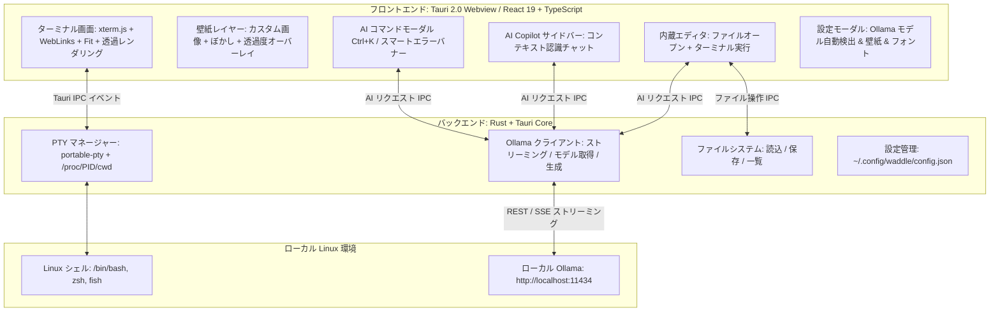

<div align="center">

# 🐧⚡ Waddle
### 完全ローカルAI統合型 次世代 Linux ターミナルエミュレータ


[](https://tauri.app/)
[](https://www.rust-lang.org/)
[](https://react.dev/)
[](https://ollama.com/)
[-FCC624?style=for-the-badge&logo=linux&logoColor=black)](https://www.kernel.org/)
[](#-このプロジェクトについて--ai-vibe-coding)
[](LICENSE)

<p align="center">
  <strong>超高速 PTY ターミナル × 完全ローカル AI（Ollama） × 簡易内蔵エディタ × 背景壁紙カスタマイズ</strong><br>
  外部クラウドにデータを一切送信しない、プライベートかつインテリジェントな Linux 向けターミナルエミュレータ
</p>

<p align="center">
  <a href="README.md">English</a> | <a href="README.ja.md">日本語</a>
</p>

</div>

---

## 📸 スクリーンショット

| 🐧 超高速ターミナル & 背景壁紙 | 🤖 AI コマンド生成アシスタント (`Ctrl + K`) |
| :---: | :---: |
|  |  |
| *CachyOS, Fish Shell, Powerline Nerd Fonts & 透過サイバーパンク壁紙* | *自然言語でのコマンド生成・危険コマンド警告・即時実行* |

| 📝 簡易内蔵コードエディタ (`Ctrl + E`) | 💬 コンテキスト認識型 AI Copilot サイドバー |
| :---: | :---: |
|  |  |
| *2画面分割編集、クイックオープン、AIリファクタリング (`Ctrl + Shift + K`)* | *カレントディレクトリ・Gitブランチ・コマンド履歴を把握した対話アシスタント* |

---

## 🤖 このプロジェクトについて (AI Vibe Coding)

> [!IMPORTANT]
> ### 💡 AI Vibe Coding による開発
> **Waddle** は、**Google DeepMind の Antigravity (Gemini)** との対話的ペアプログラミング（AI Vibe Coding）によって作成されたプロジェクトです。
> 人間による設計方針・アイデアの提示と、AI による実装・デバッグ・最適化のフローを組み合わせ、低レイヤの Rust PTY プロセス管理、Linux `/proc/<pid>/cwd` によるリアルタイムパス追跡、WebKitGTK 最適化、React 19 フロントエンド、透明 xterm.js レンダリング、ローカル Ollama ストリーミングクライアント、簡易コードエディタに至るまでフルスクラッチで実装されました。

---

## 🌟 主な機能

### 1. 🤖 自然言語からのコマンド自動生成 (`Ctrl + K`)
- 「ポート8080を使っているプロセスを終了したい」「過去3日間に更新されたログを検索」といった自然言語の指示から、ローカル AI が即座に正確な Linux コマンドと解説を生成します。
- 危険な破壊的コマンド（`rm -rf` やパーティション操作等）は、AI が自動で警告タグを表示します。
- `Enter` でターミナルへ入力挿入、`Ctrl + Enter` で即座に実行できます。

### 2. 🖼️ 背景画像・壁紙の自由なカスタマイズ & ネイティブピッカー (`Ctrl + ,`)
- **OS ネイティブファイル選択**: 「📁 参照...」ボタンから Linux デスクトップ標準のファイル選択ダイアログ（`zenity` / `kdialog`）が直接起動し、PC 内の任意の画像（PNG, JPG, SVG, WebP, GIF, BMP）を迷わず選択・適用可能。
- **軽量ストレージ & アセットプロトコル**: 画像は Base64 ではなく `~/.config/waddle/wallpapers/` へ独立保存され、Tauri v2 のセキュアな `protocol-asset` 経由で直接ロード。設定ファイル `config.json` は常に数十〜数百バイトの超軽量を維持します。
- **起動遅延ゼロ（非同期デコード & GPU 隔離）**: 画像デコードをバックグラウンドスレッドで非同期処理（`decoding="async"`）し、CSS の GPU レイヤー分離（`contain: strict`）を行うことで、高解像度 4K 壁紙を設定していてもターミナルが **0ms で即座に起動** します。
- **透過度 & すりガラスぼかし調整**: 画像不透明度（10%〜100%）とぼかし（0〜20px）をスライダーで直感的に調整。ターミナル文字のコントラストを維持するダークオーバーレイも完備。

### 3. 📂 左側ファイルツリーサイドバー (`Ctrl + B`)
- **ディレクトリ階層ナビゲーション**: ターミナルのカレントディレクトリと自動連動し、フォルダの展開・折りたたみ（遅延読み込み）、ファイル拡張子別アイコン表示をサポート。
- **インクリメンタル検索 & 隠しファイル表示**: 上部の検索バーで素早くファイルをフィルタリング可能。ドットファイル（`.`で始まる隠しファイル）の表示/非表示もワンクリックで切り替え。
- **エディタ & ターミナル直結**: ファイルをクリックするだけで内蔵エディタ（`Ctrl+E`）が自動展開されて即座にロード。ホバーアクションからパスのターミナル挿入や新規ファイル/フォルダ作成も可能。

### 4. 📝 簡易内蔵エディタ & AI コード支援 (`Ctrl + E`)
- ターミナルとシームレスに切り替えられるスライドイン型コードエディタを内蔵。
- **クイックオープン & 保存**: カレントディレクトリのファイル一覧表示、ファイル名での直接オープン、`Ctrl + S` による保存。
- **Run in Terminal**: ワンクリックで開いているスクリプト（Python, Bash, JS/TS, Rust 等）をアクティブなターミナルで実行。
- **AI リファクタリング (`Ctrl + Shift + K`)**: エディタ内のコードに対して、ローカル AI に修正・機能追加・エラーハンドリングの挿入を直接指示可能。

### 5. 🪟 柔軟なマルチペイン分割（2・3・4分割 & 10種類の選択可能レイアウト）
- **タブ内マルチターミナルワークフロー**: 1つのタブを 2分割・3分割・4分割（または単一ペイン）に自由に切り替え可能。各ペインは独立した PTY セッションを持ち、アクティブペインのカレントディレクトリ（CWD）を自動継承。
- **視覚的な10種類のレイアウトプリセット**:
  - **1分割**: 単一ペイン (`single`)
  - **2分割**: 左右2分割 (`split-2-h`), 上下2分割 (`split-2-v`)
  - **3分割**: 左メイン＋右2段 (`split-3-left-main`), 上メイン＋下2列 (`split-3-top-main`), 縦3列 (`split-3-h`), 横3段 (`split-3-v`)
  - **4分割**: 2×2格子グリッド (`grid-4`), 左メイン＋右3段 (`split-4-left-main`), 縦4列 (`split-4-h`)
- **ミニチュア図付きビジュアルレイアウト切替**: タイトルバーのレイアウトアイコンをクリックすると、各配置のミニチュア図プレビュー付きポップオーバーが表示され、直感的にクリック切り替え可能。
- **ペインズーム（最大化）モード**: 作業中の特定ペインをフルサイズに一時最大化可能。上部のリストアバーからワンクリックで元の分割レイアウトに復帰。
- **アクティブペインの強調とスマート連動**: 選択中ペインはアクセントカラーと発光ボーダーで明示。AI コマンド生成（`Ctrl + K`）、Copilot チャット、内蔵エディタ、ステータスバーはすべてアクティブなペインとシームレスに自動連動。

### 6. 🚨 コマンドエラーの自動診断 & ワンクリック修復
- ターミナル上でコマンドが失敗（非ゼロ終了コードや stderr エラー）すると、スマートエラーバナーが自動出現。
- ワンクリックで「なぜ失敗したのか」をローカル AI が分析し、修復用コマンドを提案・即実行できます。

### 7. 💬 コンテキスト認識型 AI Copilot サイドバー
- ターミナルの状態（カレントディレクトリ、Git ブランチ、変更ファイル数、直前のコマンド履歴）を自動的に把握した対話型 AI アシスタント。
- AI の回答に含まれるコードブロックはワンクリックでターミナルへの挿入・実行・コピーが可能。

### 8. 🦙 ローカル Ollama モデルの自動検出 (完全プライベート & オフライン)
- マシンにインストールされている Ollama モデル（`llama3.2`, `deepseek-r1`, `qwen2.5-coder`, `codellama` 等）を自動取得・一覧表示。
- 設定画面（`Ctrl + ,`）からいつでもモデルを切り替え可能。
- **API キー不要、クラウドレス、データ流出の心配ゼロ。**

### 9. ⚡ 高性能 PTY & Canvas ハードウェアアクセラレーション描画
- Rust ネイティブの疑似端末マネージャー（`portable-pty`）による極小レイテンシ。
- Linux `/proc/<pid>/cwd` を監視し、`cd` 移動を正確にリアルタイム追跡（Git リポジトリの事前高速検出機能付き）。
- `@xterm/addon-canvas` による 2D Canvas ハードウェア描画エンジンを搭載。透過背景上でも DOM レンダリング比で圧倒的に軽快な高速描画を実現。
- 同期ローカルキャッシュ機構により、初回起動時もテーマや壁紙のロード待ち・チラつきなしで即時描画。

### 10. 🎨 全13種類の洗練されたテーマ & UI 全体同期
- **厳選された13種類の開発者向けプリセットテーマ**:
  - **Waddle Cyber (Default)**: ネオンブルー×サイバーダーク
  - **Tokyo Night**: 深い夜空の藍色×ネオンブルー
  - **Catppuccin Mocha**: パステル調の上品なモダンダーク
  - **Dracula**: 定番のゴシックパープル×ハイコントラスト
  - **Nord (Arctic)**: 北極圏をイメージした静謐なアイスブルー
  - **Gruvbox Dark**: レトロで目に優しい温かみのあるアースカラー
  - **One Dark Pro**: Atom / VS Code の名作バランスダーク
  - **Rosé Pine**: 洗練されたラベンダー＆ローズゴールド
  - **Monokai Pro**: 高い視認性を誇る王道ビビッド配色
  - **Cyberpunk 2077**: ネオンイエロー×シアン×ホットピンク
  - **Solarized Dark**: 人間工学に基づいた深いシアン・ブルーベース
  - **Synthwave '84**: 80年代レトロフューチャー・ネオンパープル
  - **Midnight Abyss (OLED)**: 純黒（#000000）で高コントラストな漆黒テーマ
- **UI 全体の動的カラー同期**: ターミナルの文字色（ANSI 16色）だけでなく、タイトルバー、タブ、枠線、ステータスバー、ダイアログのアクセントカラーまでテーマに合わせて自動統一。
- **Nerd Fonts**: **JetBrainsMono Nerd Font**, **MesloLGS NF**, **FiraCode Nerd Font**, **Hack Nerd Font** などのプリセット選択およびカスタムフォント指定に対応。

### 11. 🌐 多言語・UI言語切り替え機能 (英語 US / UK, 日本語)
- **設定画面から選べる言語**: 設定（`Ctrl + ,`）から **英語 (US)**、**英語 (GB / UK)**、**日本語** をいつでも自由に切り替え可能。
- **リアルタイム反映 & 設定の永続化**: 言語を選択すると設定画面を含め、タイトルバー、ファイルツリー、エディタ、AIモーダル、エラーバナーが即座に切り替わり、`~/.config/waddle/config.json` に安全に保存されます。
- **世界水準の英語デフォルト**: 初回起動時や新規インストール時は国際標準の英語（`en-US`）がデフォルト設定として適用され、英語圏・日本国内のどちらの開発者にも最適化されています。

---

## ⌨️ ショートカットキー一覧

| ショートカット | 動作 |
| :--- | :--- |
| `Ctrl + K` | **AI コマンド生成モーダル** を開く |
| `Ctrl + B` | **ファイルツリーサイドバー** の表示/非表示を切り替え |
| `Ctrl + E` | **簡易内蔵エディタ** の表示/非表示を切り替え |
| `Ctrl + S` *(エディタ内)* | ファイルを保存 |
| `Ctrl + Shift + K` *(エディタ内)* | **AI コード編集・リファクタリング** を開く |
| `Ctrl + T` | 新規ターミナルタブを開く |
| `Ctrl + W` | 現在のターミナルタブを閉じる |
| `Ctrl + Shift + W` | 現在のアクティブな分割ペインを閉じる |
| `Alt + 1` | **単一ペイン（1画面）** レイアウトへ切り替え |
| `Alt + 2` | **2分割（左右）** レイアウトへ切り替え |
| `Alt + 3` | **3分割（左メイン）** レイアウトへ切り替え |
| `Alt + 4` | **4分割（2×2グリッド）** レイアウトへ切り替え |
| `Alt + ↑ / ↓ / ← / →` | 分割ペイン間のフォーカス移動 |
| `Ctrl + ,` | **設定画面**（Ollama モデル、壁紙、テーマ、フォント、言語）を開く |
| `Enter` *(AIモーダル内)* | 生成されたコマンドをターミナルに入力挿入 |
| `Ctrl + Enter` *(AIモーダル内)* | 生成されたコマンドをターミナルで即時実行 |
| `Esc` | 開いているモーダルやポップアップを閉じる |

---

## 🏗️ アーキテクチャ



---

## 🚀 クイックスタート

### 1. 必要環境

- [Rust (Cargo)](https://rustup.rs/) (1.70 以上)
- [Node.js & npm](https://nodejs.org/) (Node 18 以上)
- [Ollama](https://ollama.com/) (ローカル AI エンジン)

### 2. Ollama のセットアップ

```bash
# Ollama サーバーを起動
ollama serve

# モデルをダウンロード（軽量モデル推奨）
ollama pull llama3.2
# またはコーディング特化モデル
ollama pull qwen2.5-coder
# または推論特化モデル
ollama pull deepseek-r1
```

### 3. 開発モードでの起動

```bash
# リポジトリのクローン
git clone https://github.com/your-username/Waddle.git
cd Waddle

# 依存パッケージのインストール
npm install

# 開発サーバー起動
npm run tauri dev
```

---

## 📦 プロダクションビルド（スタンドアロンバイナリ作成）

Waddle を最適化された単一バイナリや Arch Linux 向けネイティブパッケージとしてビルドする場合：

```bash
# Arch Linux 向け Pacman パッケージ (.pkg.tar.zst) をビルド
npm run package
# または: npm run build:pacman
```

### Pacman によるシステムインストール (Arch Linux / CachyOS / Manjaro / EndeavourOS):
```bash
sudo pacman -U src-tauri/target/release/bundle/pacman/waddle-0.1.0-1-x86_64.pkg.tar.zst
```

### 生成される成果物:
- **Arch Linux Pacman パッケージ (~6.9 MB)**: `src-tauri/target/release/bundle/pacman/waddle-0.1.0-1-x86_64.pkg.tar.zst`
- **スタンドアロン実行ファイル (~18 MB)**: `src-tauri/target/release/waddle`
- **PKGBUILD**: リポジトリ直下に配置済み（`makepkg -si` によるビルド・AUR対応）

---

## 💻 技術スタック

| レイヤー | 使用技術 |
| :--- | :--- |
| **フレームワーク** | [Tauri 2.0](https://tauri.app/)（`protocol-asset`, `tray-icon` 対応） |
| **バックエンド** | Rust, `portable-pty`, `tokio`, `reqwest`, `serde`, `base64` |
| **フロントエンド** | React 19, TypeScript, Vite, Vanilla CSS |
| **ターミナルコア** | `@xterm/xterm`, `@xterm/addon-canvas`, `@xterm/addon-fit`, `@xterm/addon-web-links` |
| **ローカル AI エンジン** | [Ollama](https://ollama.com/) (`/api/generate`, `/api/chat`, `/api/tags`) |
| **ネイティブ連携** | GTK / Wayland ネイティブファイルピッカー（`zenity` / `kdialog`）、Linux `/proc` ファイルシステム |
| **アイコン・マークダウン** | `lucide-react`, `react-markdown`, `remark-gfm` |

---

## 🔒 プライバシー & セキュリティ

- **完全オフライン & ローカル完結**: テレメトリ（利用状況送信）や外部クラウド API との通信は一切ありません。入力したコマンドやログが外部に送信されることはありません。
- **データ主権の保証**: 機密データを扱う企業環境や、エアギャップ（閉域網）環境でも安心してご利用いただけます。

---

## 📄 ライセンス

本プロジェクトは [MIT License](LICENSE) のもとで公開されています。

---

<p align="center">
  Crafted via <strong>AI Vibe Coding</strong> 🐧⚡<br>
  Built with ❤️ for Linux Developers
</p>
