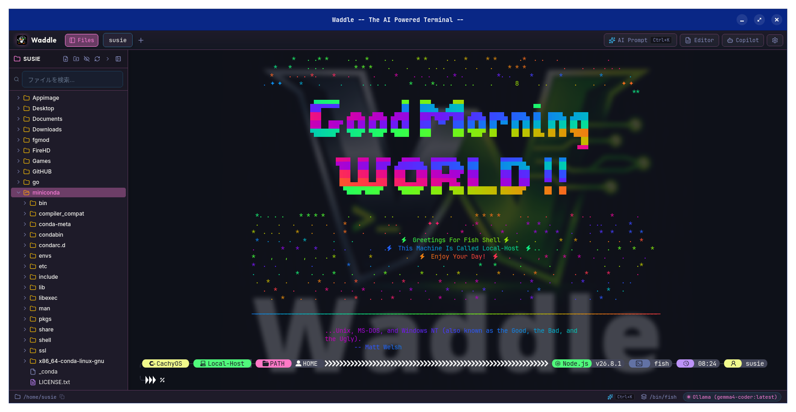
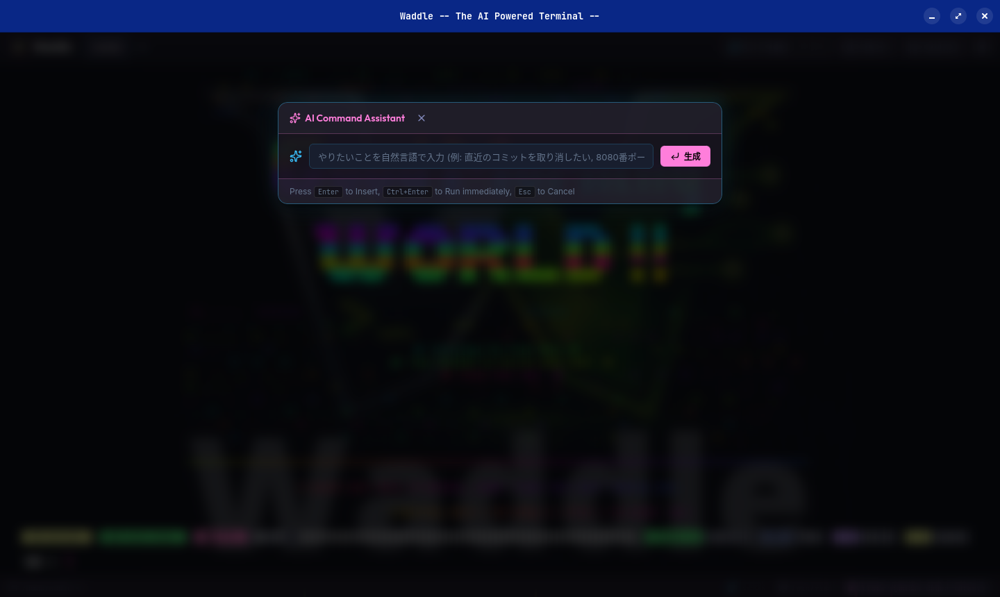
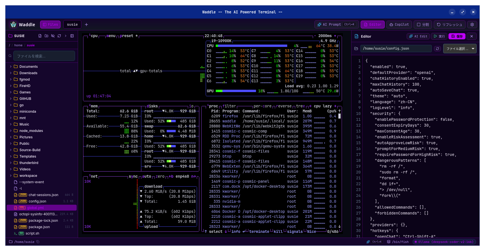
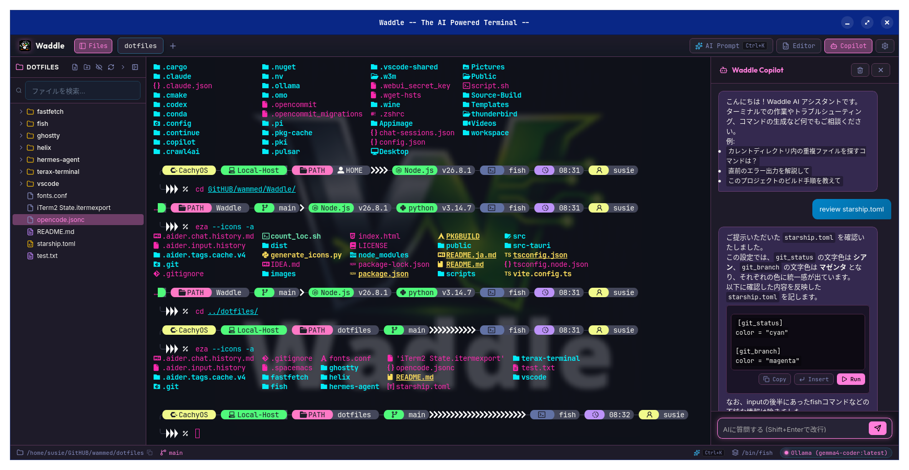

<div align="center">

# 🐧⚡ Waddle
### 完全ローカルAI統合型 次世代 Linux ターミナルエミュレータ


[](https://tauri.app/)
[](https://www.rust-lang.org/)
[](https://react.dev/)
[](https://ollama.com/)
[-FCC624?style=for-the-badge&logo=linux&logoColor=black)](https://www.kernel.org/)
[-00C49F?style=for-the-badge&logo=archlinux&logoColor=white)](#environment-notice)
[](#vibe-coding)
[](LICENSE)

<p align="center">
  <strong>超高速 PTY ターミナル × 完全ローカル AI（Ollama） × 簡易内蔵エディタ × 背景壁紙カスタマイズ</strong><br>
  外部クラウドにデータを一切送信しない、プライベートかつインテリジェントな Linux 向けターミナルエミュレータ
</p>

<p align="center">
  <a href="README.md">English</a> | <strong>日本語</strong>
</p>

</div>

---

<a id="environment-notice"></a>
> [!WARNING]
> ### 動作環境に関する重要なご注意 (Environment Notice)
> 本アプリケーション（Waddle）の開発、動作検証、および自動/手動テストは、すべて **CachyOS の COSMIC Desktop Environment** 上で行われております。  
> **他のデスクトップ環境（KDE Plasma, GNOME, XFCE 等）や他のディストリビューションでは動作確認が取れておりません。** 環境固有のウィンドウマネージャー、コンポジター、Wayland 挙動、フォントレンダリング等の差異により、一部の表示や挙動が異なる可能性があります。

---

## 📸 スクリーンショット

| 🐧 超高速ターミナル & 背景壁紙 | 🤖 AI コマンド生成アシスタント (`Ctrl + K`) |
| :---: | :---: |
|  |  |
| *CachyOS, Fish Shell, Powerline Nerd Fonts & 透過サイバーパンク壁紙* | *自然言語でのコマンド生成・危険コマンド警告・即時実行* |

| 📝 簡易内蔵コードエディタ (`Ctrl + E`) | 💬 コンテキスト認識型 AI Copilot サイドバー |
| :---: | :---: |
|  |  |
| *2画面分割編集、クイックオープン、AIリファクタリング (`Ctrl + Shift + K`)* | *カレントディレクトリ・Gitブランチ・コマンド履歴を把握した対話アシスタント* |

---

## 💡 主な特徴

- 🤖 **100% 完全ローカル AI**: 自然言語からのコマンド自動生成（`Ctrl + K`）、自動エラー診断・修復、コンテキスト認識型 Copilot チャットをすべて Ollama による完全オフラインで提供。([詳細](docs/FEATURES.ja.md#1--自然言語からのコマンド自動生成-ctrl--k))
- ⚡ **遅延ゼロのターミナルコア**: 32KB 出力コアレッシング、カーネル協調フロー制御（`pause_pty`/`resume_pty`）、`Ctrl+C` 瞬時キューパージ、および `yes` などの百万行バースト時でもメモリを 300MB 未満に完全制限する健全な Rust PTY。([詳細](docs/FEATURES.ja.md#10--高性能-pty--遅延ゼロの-2d-canvas-アクセラレーション))
- 🪟 **柔軟なマルチペイン分割**: 1〜4分割（全10プリセット）に対応し、ネオン発光のドラッグ境界線やキーボード操作による比率微調整・ペインスワップを完備。([詳細](docs/FEATURES.ja.md#5--柔軟なマルチペイン分割--ドラッグによるリサイズ14分割--10種類のレイアウト))
- 📝 **設定ファイル特化・堅牢化内蔵エディタ (`Ctrl + E`)**: Linux 設定ファイル（dotfiles, YAML, TOML, JSON, ini, conf, .env等）やスクリプトの編集・軽作業に特化。フルIDEの代替ではなく、セキュリティ要請（root編集排除・ReDoS排除・機密ファイル遮断）・軽量化（Monaco不採用・起動0ms・最大5タブ遅延マウント）・構文破壊防止（スマート自動インデント排除）のためにあえて機能を限定した堅牢設計。最大6世代AutoSaveローテーション・ヘッダー常設「復元 (N)」UI・非破壊Undo巻き戻し（`Ctrl + Z`）、非破壊・視覚的シークレット保護（`[🛡️ N 件のシークレットを検知]` バッジ & 👁️トグル）、ソフトタブ4文字、括弧・クォート自動補完、完全一致検索・置換（`Ctrl + F` / `Ctrl + H`、ReDoS排除）、$HOME内シンボリックリンク解決、非特権所有者UID検証・強制Read-Onlyガード、120秒自動退避キャッシュ（`~/.cache/waddle/autosave/` [0700]）。([詳細](docs/FEATURES.ja.md#4--簡易内蔵エディタ--ai-コード支援-ctrl--e))
- 📂 **高機能ファイルツリー**: `/proc/<pid>/cwd` によるカレントディレクトリ自動追跡、巨大フォルダ 500 件制限と動的オンデマンド展開（`+ さらに読み込む`）、言語別カラーバッジ、ブレッドクラム、インデントガイド、右クリックメニュー。([詳細](docs/FEATURES.ja.md#3--左側ファイルツリーサイドバー-ctrl--b))
- 🐙 **Git & GitHub 統合ハブ**: ステータスバー連動ポップオーバー、1クリック Push/Pull、ローカル AI による Conventional Commit 自動生成、GUI Diff ビューワー。([詳細](docs/FEATURES.ja.md#14--git--github-連携ローカル-ai-コミット生成--pushpull-ポリシー))
- 🖼️ **Kitty 画像プロトコル完全対応 & 全 TUI / CLI エコシステム連携**: `yazi`, `ranger`, `lf`, `fastfetch`, `kitten icat`, `chafa`, `timg`, `viu`, Neovim (`image.nvim`) などの全 CLI/TUI ツールからのターミナル直接画像・アニメーション描画に完全対応。通常テキスト（ファイル一覧・枠線・コード等）の 100% 描画保証、CUP 絶対座標追従、Alternate Screen ゼロアロケーション（TUI 固定グリッド保護）、カーネル協調のピクセル解像度報告（`TIOCGWINSZ`）、XTVERSION 応答（`timg` 自動検出）、DA1 Sixel 排除 & DSR 5n 同期、PTY レベル一時ファイル即時 Base64 インライン化（`viu` の一時ファイル削除レースコンディション根絶）、明示的 ID による描画 OK 応答同期（`ranger` 初回フリーズ解消）および削除コマンド（`a=d`）の公式サイレント準拠（`ranger` 2枚目選択時のキー誤爆・画面点滅・ハング根絶）、`TERM=xterm-kitty`（`ranger` ハードコードチェック通過）、0ms 即時プローブ応答（`a=q` 大文字 `OK` / DA1 / CSI プローブ）を完備。※セキュリティ上の要請（`/dev/shm` 共有メモリ汚染・OOM DoS 防御）から共有メモリ（`t=s`）を意図的に無効化し、堅牢なサンドボックス保護を最優先（動画の超高速ストリーミングは安全のため割り切り）。([詳細](docs/FEATURES.ja.md#16--kitty-画像プロトコル-kitty-graphics-protocol-完全対応--厳格なセキュリティサンドボックス))
- 🛡️ **Rust コア集約セキュリティ境界 (`CommandPolicy`)**: フロントエンドの UI 判定に依存せず、Rust バックエンドを絶対的な Trust Boundary へ昇格。100+ 件の攻撃・安全検証コーパス（サブシェル間接実行・動的評価・特権昇格・日常コマンド誤検知防止）に基づき全コマンドを `Safe`, `Review`, `Block` の3段階で機械的評価。DNS リバインディングを根絶する静的 DNS Pinning（`reqwest::ClientBuilder::resolve`）による SSRF 防護、ファイル操作および Git リポジトリの統一 IPC UID 所有権検証を完備し、`rm -rf /` やフォーマット等の破壊的コマンドをカーネル PTY 入力直前で完全遮断。([詳細](docs/FEATURES.ja.md#24--rust-コア集約セキュリティ境界--commandpolicy-エンジン))
- 🛡️ **リアルタイム機密情報マスク (`SecretMasker`)**: 多層防御シークレット保護エンジン（GitHub Fine-Grained & クラシック PAT、OpenAI/Anthropic/Google AIキー、Slackトークン、AWSキー、プレフィックス付き環境変数等）により、ライブターミナル、エディタ非破壊マスク、セッション履歴、AIコンテキストを完全防護。([詳細](docs/FEATURES.ja.md#17--リアルタイム機密情報マスク-secret-masking))
- ⏳ **セッション タイムトラベル & 履歴復元 (`Ctrl + Shift + H`)**: 過去の実行コマンド、終了コード、CWD、出力をタイムライン形式でビジュアル化し、1クリックで状態復元やコマンド再実行。([詳細](docs/FEATURES.ja.md#18--セッション-タイムトラベル--スナップショット履歴-ctrl--shift--h))
- 📊 **リッチデータ ビジュアライザ (Markdown / CSV / JSON)**: Markdown 組版、CSV ソート・検索テーブル、JSON 折りたたみツリーをエディタおよびツリーから1クリックで瞬時プレビュー。([詳細](docs/FEATURES.ja.md#19--リッチデータ-ビジュアライザ-markdown--csv--json-プレビュー))
- 🐕 **自律型 AI エラー監視 (Autonomous Watchdog)**: コマンド失敗を自動検知し、AI が原因を即時診断してワンクリックで修正コマンドを提示・実行。([詳細](docs/FEATURES.ja.md#20--自律型-ai-エラー監視--1-click-クイック修正-autonomous-watchdog))
- 🔗 **ビジュアル パイプライン ビルダー (`Ctrl + Shift + P`)**: ビルド、テスト、デプロイなどの複数コマンドを視覚的にステップ構成し、条件付きで自動連続実行。([詳細](docs/FEATURES.ja.md#21--ビジュアル-パイプライン-ビルダー-ctrl--shift--p))
- 📜 **プロジェクト個別 & グローバル共通 AI ルール (`~/.config/waddle/` & `.waddle/`)**: リポジトリ内では上位ルートの個別規約（`.waddle/rules_ja.md` / `rules.md`）、リポジトリ外ではグローバル共通規約（`~/.config/waddle/`）を自動適用。選択言語（日本語/英語）に完全連動。([詳細](docs/FEATURES.ja.md#22--プロジェクト個別--グローバル共通-ai-ルール連携-waddlerulesmd--configwaddlerulesmd))
- 🎨 **全22種のネオン & 洗練テーマ**: UI 全体の動的ネオン発光同期、デスクトップからのドラッグ＆ドロップ壁紙設定と 60 FPS リアルタイムぼかし/透過プレビュー、Nerd Fonts タイポグラフィ。([詳細](docs/FEATURES.ja.md#11--全22種類の洗練されたテーマ--高電圧ネオンコレクション))

### 📝 内蔵エディタの位置づけと機能制限（設定ファイル特化・安全設計）

Waddle の内蔵エディタは、VS Code や Neovim 等のフルスペック IDE を代替するものではなく、ターミナル作業中に**「設定ファイル（dotfiles, YAML, TOML, JSON, ini, conf, .env 等）の編集」「スクリプト等のクイックな確認・微修正」**を安全かつ超軽量に行うための付属ツールです。

セキュリティ上の要請（root権限編集排除・ReDoS防御・拡張機能エコシステム排除・機密ファイル遮断）、軽量化（Monaco不採用・最大5タブ遅延マウント・LSP常駐排除）、および設定ファイルの構文破壊防止（スマート自動インデント排除）のためにあえて機能を割り切っています。

| カテゴリ | できること (Supported) | できないこと・あえて切り捨てた機能 (Intentionally Omitted) |
| :--- | :--- | :--- |
| **主な用途・ファイル操作** | ・`$HOME` 内の設定ファイル（dotfiles, YAML, TOML, JSON, conf, .env 等）やスクリプトの迅速な編集<br>・最大5タブまでのマルチタブ編集（遅延マウントで低メモリ）<br>・`$HOME` 内シンボリックリンクの解決とターゲット先への安全なアトミック保存<br>・Markdown / CSV / JSON のリッチプレビュー | ・フルスペック開発（大規模プロジェクト全体のコーディング・ビルド・デバッグ）<br>・5MB を超える巨大ファイル・巨大ログの編集（端末の `less` 等を推奨）<br>・バイナリファイルの編集（先頭 1KB ヌルバイト検知で拒否）<br>・6タブ以上の無制限オープン（最大5タブに制限） |
| **セキュリティ・権限境界** | ・非特権 UID 一致ファイルのみの安全な保存<br>・`$HOME` 外や他者所有ファイルの強制 Read-Only 閲覧保護<br>・非破壊・視覚的シークレット保護（APIキー等を `•` で隠蔽表示しつつ生データは維持）<br>・`$HOME` 外を指す危険なシンボリックリンクの保存遮断 | ・root / 特権昇格（`sudo`, `pkexec` 等）によるシステム領域（`/etc` 等）の直接編集・上書き<br>・SSH / GPG 秘密鍵や OS キーリング等の機密ファイル閲覧・編集<br>・`/proc`, `/sys`, `/dev` 等のカーネル仮想ファイルの閲覧 |
| **編集・入力支援** | ・ソフトタブ（4スペース）挿入 & 複数行インデント / アンインデント<br>・括弧・クォート（`[`, `{`, `(`, `"`, `'`）の自動補完 & 選択囲み<br>・自前 Undo / Redo（`Ctrl+Z`, `Ctrl+Y` / `Ctrl+Shift+Z`）<br>・完全一致 検索・置換（`Ctrl+F`, `Ctrl+H`、前後移動、一括置換） | ・スマート自動インデント（YAML / TOML 等の意図せぬインデント崩れ事故を防止するためあえて不採用）<br>・正規表現による検索・置換（ReDoS フリーズ脆弱性を根絶するため排除）<br>・マルチカーソル、矩形選択、マクロ記録 |
| **コード解析・拡張性** | ・Prism.js による主要言語・設定ファイルの構文ハイライト<br>・ローカル Ollama AI によるコードリファクタリング支援（`Ctrl + Shift + K`）<br>・ターミナルでのスクリプト直接実行（Playボタン、危険コマンド警告付き） | ・LSP (Language Server Protocol) による定義ジャンプ、型チェック、リネーム（バックグラウンド常駐負荷を排除）<br>・サードパーティ製拡張機能 / プラグイン（サプライチェーン攻撃防止）<br>・統合デバッガー（ブレークポイント、ステップ実行） |
| **データ保護・復元** | ・最初の入力を始点とする 120 秒周期の自動バックアップ（AutoSave）<br>・最大 6 世代のスナップショット保持 & ヘッダー「復元 (N)」UI からのワンクリック復元<br>・専用保護ディレクトリ（`~/.cache/waddle/autosave/` [0700/0600]）への安全退避<br>・異常終了時の起動時リカバリ確認ダイアログ | ・リアルタイム共同編集<br>・エディタ内での複雑な Git 履歴ツリー閲覧（専用の Git Hub / Diff ビューワー側で担当） |

> 📖 **各機能の詳しい技術仕様や内部機構は** [機能仕様書 (docs/FEATURES.ja.md)](docs/FEATURES.ja.md) をご覧ください。

---

## 🚀 クイックスタート

### 1. 必要環境

- **検証済み動作環境**: **CachyOS + COSMIC Desktop Environment**
  - *※ KDE Plasma, GNOME, XFCE など他のデスクトップ環境や他ディストリビューションでは動作未検証です。*
- [Rust (Cargo)](https://rustup.rs/) (1.70 以上)
- [Node.js & npm](https://nodejs.org/) (Node 18 以上)
- [Ollama](https://ollama.com/) (ローカル AI エンジン)

### 2. Ollama のセットアップ

```bash
# Ollama デーモンを起動
ollama serve

# 推奨モデルをダウンロード
ollama pull llama3.2
# またはコーディング特化モデル
ollama pull qwen2.5-coder
```

### 3. 開発モードでの起動

```bash
# リポジトリのクローン
git clone https://github.com/wammed/Waddle.git
cd Waddle

# 依存パッケージのインストール & 開発サーバー起動
npm install
npm run tauri dev
```

### 4. プロダクションビルド & パッケージング

```bash
# Arch Linux 向けネイティブ Pacman パッケージ (.pkg.tar.zst) をビルド
npm run package

# システムへのインストール (Arch Linux / CachyOS / Manjaro):
sudo pacman -U src-tauri/target/release/bundle/pacman/waddle-0.1.0-1-x86_64.pkg.tar.zst
```
*スタンドアロン実行ファイル出力先: `src-tauri/target/release/waddle` (~18 MB)。*

---

## ⌨️ 主なショートカットキー

| ショートカット | 動作 |
| :--- | :--- |
| `Ctrl + K` | **AI コマンド自動生成** モーダルを開く |
| `Ctrl + E` | **堅牢化内蔵コードエディタ**（マルチタブ、ソフトタブ、AutoSave）の表示切替 |
| `Ctrl + F` / `Ctrl + H`（エディタ内） | **完全一致 検索 / 置換ミニバー**（ReDoS排除）の開閉 |
| `Ctrl + Shift + F` | **ターミナル内ログ検索** の表示/非表示を切り替え |
| `Ctrl + Shift + H` | **セッション タイムライン & 履歴復元** モーダルを開く |
| `Ctrl + Shift + P` | **ビジュアル パイプライン ビルダー** モーダルを開く |
| `Ctrl + T` | 新規ターミナルタブを開く |
| `Ctrl + W` | 現在のターミナルタブを閉じる |
| `Ctrl + Shift + S` | 分割ペインの**スワップ（配置入れ替え）** |
| `Alt + 1 ~ 4` | レイアウト切り替え（**単一、左右2分割、左メイン3分割、2×2グリッド**） |
| `Ctrl + Enter` | **Git コミット実行** / **AI コマンド即時実行** |
| `Ctrl + ,` | **設定画面**（テーマ、フォント、AI、壁紙、言語、Git）を開く |
| `Esc` | 開いているモーダル・検索バー・ポップアップを閉じる |

> 💡 すべてのショートカットキー一覧は [docs/FEATURES.ja.md](docs/FEATURES.ja.md#️-ショートカットキー一覧-完全版) をご覧ください。

---

## 🧪 統合テスト & セキュリティ/品質保証スイート

Waddle は、単一コマンドおよび Git フック（Lefthook）で連動する多層品質テストパイプラインを備えています：

```bash
# 全自動テストパイプラインの実行 (Security + Unit/Coverage + Visual + Memory)
npm run test:all

# 各個別レイヤーの検証
npm run test:unit      # Vitest (V8 カバレッジダッシュボード生成) + Cargo test
npm run test:security  # Gitleaks + Secretlint + cargo-audit + cargo-deny
npm run test:visual    # Playwright による Kitty 画像・Unicode プレースホルダー・ネオンテーマ描画回帰検証
npm run test:memory    # CDP による大量ストリーミング後 300MB メモリ上限 & タブ破棄後リークゼロ検証

# Git フック (Lefthook) によるコミット前検証
npx lefthook run pre-commit
```

*詳細な検証項目と手順は [テスト計画書 (docs/TEST_PLAN.ja.md)](docs/TEST_PLAN.ja.md) をご覧ください。*

---

## 🔒 セキュリティ & アーキテクチャ (概要)

Waddle は **100% 完全オフライン・ローカルファースト** で動作します：
- **ゼロクラウド流出**: テレメトリ、外部クラウド API、トラッキングは一切ありません。プロンプトもターミナルログもすべて PC 内で処理されます。
- **Rust コア集約セキュリティ境界 (`CommandPolicy`)**: セキュリティ判定をフロントエンドの JS から Rust ネイティブへ完全集約。全コマンドを `Safe`, `Review`, `Block` に分類し、IPC や AI インジェクション経由の破壊的操作（`rm -rf /`、`mkfs`、フォーク爆弾等）を PTY 入力直前で完全遮断。
- **SSRF・DNS リバインディング・リダイレクト防御**: Ollama エンドポイントに対し、事前同期 DNS 名前解決を実施して全解決先 IP がリンクローカルやクラウドメタデータ（`169.254.0.0/16`, `[fd00:ec2::254]`, `fe80::/10`）でないことを検証。HTTP リダイレクト追従は強制無効化。
- **プロジェクト規約 (`.waddle/rules.md`) の不信入力隔離**: プロジェクトルールを `<untrusted_project_rules>` タグで隔離し、プロンプトインジェクション防御ガードレールを注入。AI 生成コマンドは Rust `CommandPolicy` で決定論的に上書き判定。
- **多層防御ガードレール**: システム重要ディレクトリ（`/etc`, `/usr` 等）および仮想ファイルシステム（`/proc`, `/sys`, `/dev`）の遮断、SSH秘密鍵・GPG鍵・Keyring の絶対保護、Git Branch Ref 厳格サニタイズ、リアルタイム機密情報マスク（`SecretMasker`）。
- **堅牢な POSIX PTY & ゾンビ完全回収保証**: 32KB 出力コアレッシング、UTF-8 マルチバイト境界繰り越し、プロセスグループ（`-pid`）シグナル終了に加え、`libc::waitpid(..., WNOHANG)` によるゾンビ回収ループを完備（1,000 回ストレスサイクルで FD リーク 0、ゾンビ 0 を実証）。

> 📐 システム全体の構造設計は [アーキテクチャ解説 (docs/ARCHITECTURE.ja.md)](docs/ARCHITECTURE.ja.md) をご覧ください。  
> 🛡️ 網羅的なセキュリティ仕様は [セキュリティポリシー (docs/SECURITY.ja.md)](docs/SECURITY.ja.md) をご覧ください。
> 🔍 最新のリリース前セキュリティ評価については [セキュリティステータス (docs/SECURITY_STATUS_ja.md)](docs/SECURITY_STATUS_ja.md) をご覧ください。

---

<a id="vibe-coding"></a>
## 🤖 このプロジェクトについて (AI Vibe Coding)

> [!IMPORTANT]
> ### 💡 AI Vibe Coding による開発
> **Waddle** は、**Google DeepMind の Antigravity (Gemini)** との対話的ペアプログラミング（AI Vibe Coding）によって作成されたプロジェクトです。
> 人間による設計方針・アイデアの提示と、AI による実装・デバッグ・最適化のフローを組み合わせ、低レイヤの Rust PTY プロセス管理、Linux `/proc/<pid>/cwd` によるリアルタイムパス追跡、WebKitGTK 最適化、React 19 フロントエンド、透明 xterm.js レンダリング、ローカル Ollama ストリーミングクライアント、簡易コードエディタに至るまでフルスクラッチで実装されました。

---

## 📄 ライセンス

本プロジェクトは [MIT License](LICENSE) のもとで公開されています。

<p align="center">
  Crafted via <strong>AI Vibe Coding</strong> 🐧⚡ · Built with ❤️ for Linux Developers
</p>
