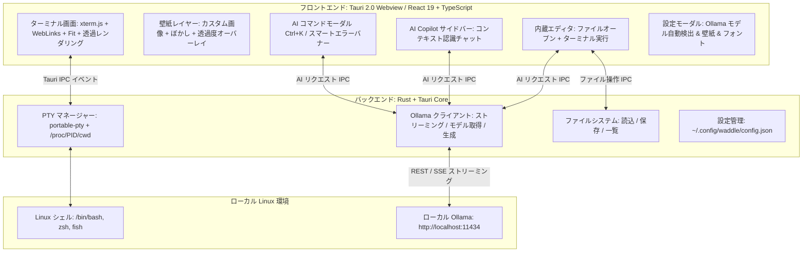

<div align="center">

# 🐧⚡ Waddle
### 完全ローカルAI統合型 次世代 Linux ターミナルエミュレータ


[](https://tauri.app/)
[](https://www.rust-lang.org/)
[](https://react.dev/)
[](https://ollama.com/)
[-FCC624?style=for-the-badge&logo=linux&logoColor=black)](https://www.kernel.org/)
[](#-このプロジェクトについて--ai-vibe-coding)
[](LICENSE)

<p align="center">
  <strong>超高速 PTY ターミナル × 完全ローカル AI（Ollama） × 簡易内蔵エディタ × 背景壁紙カスタマイズ</strong><br>
  外部クラウドにデータを一切送信しない、プライベートかつインテリジェントな Linux 向けターミナルエミュレータ
</p>

<p align="center">
  <a href="README.md">English</a> | <a href="README.ja.md">日本語</a>
</p>

</div>

---

## 🤖 このプロジェクトについて (AI Vibe Coding)

> [!IMPORTANT]
> ### 💡 AI Vibe Coding による開発
> **Waddle** は、**Google DeepMind の Antigravity (Gemini)** との対話的ペアプログラミング（AI Vibe Coding）によって作成されたプロジェクトです。
> 人間による設計方針・アイデアの提示と、AI による実装・デバッグ・最適化のフローを組み合わせ、低レイヤの Rust PTY プロセス管理、Linux `/proc/<pid>/cwd` によるリアルタイムパス追跡、WebKitGTK 最適化、React 19 フロントエンド、透明 xterm.js レンダリング、ローカル Ollama ストリーミングクライアント、簡易コードエディタに至るまでフルスクラッチで実装されました。

---

## 🌟 主な機能

### 1. 🤖 自然言語からのコマンド自動生成 (`Ctrl + K`)
- 「ポート8080を使っているプロセスを終了したい」「過去3日間に更新されたログを検索」といった自然言語の指示から、ローカル AI が即座に正確な Linux コマンドと解説を生成します。
- 危険な破壊的コマンド（`rm -rf` やパーティション操作等）は、AI が自動で警告タグを表示します。
- `Enter` でターミナルへ入力挿入、`Ctrl + Enter` で即座に実行できます。

### 2. 🖼️ 背景画像・壁紙の自由なカスタマイズ (`Ctrl + ,`)
- **公式プリセット**: ワンクリックで適用できる **Waddle Official Cyberpunk** 壁紙。
- **カスタム画像・ファイル参照**: ファイル選択ピッカーボタン（📁 参照...）からローカルの画像（PNG, JPG, SVG, WebP）を即座に適用、またはパス・Web 画像 URL を直接指定可能。
- **透過度 & すりガラスぼかし調整**: 画像不透明度（10%〜100%）とぼかし（0〜20px）をスライダーで直感的に調整。ターミナル文字のコントラストを維持するオーバーレイも完備。

### 3. 📝 簡易内蔵エディタ & AI コード支援 (`Ctrl + E`)
- ターミナルとシームレスに切り替えられるスライドイン型コードエディタを内蔵。
- **クイックオープン & 保存**: カレントディレクトリのファイル一覧表示、ファイル名での直接オープン、`Ctrl + S` による保存。
- **Run in Terminal**: ワンクリックで開いているスクリプト（Python, Bash, JS/TS, Rust 等）をアクティブなターミナルで実行。
- **AI リファクタリング (`Ctrl + Shift + K`)**: エディタ内のコードに対して、ローカル AI に修正・機能追加・エラーハンドリングの挿入を直接指示可能。

### 4. 🚨 コマンドエラーの自動診断 & ワンクリック修復
- ターミナル上でコマンドが失敗（非ゼロ終了コードや stderr エラー）すると、スマートエラーバナーが自動出現。
- ワンクリックで「なぜ失敗したのか」をローカル AI が分析し、修復用コマンドを提案・即実行できます。

### 5. 💬 コンテキスト認識型 AI Copilot サイドバー
- ターミナルの状態（カレントディレクトリ、Git ブランチ、変更ファイル数、直前のコマンド履歴）を自動的に把握した対話型 AI アシスタント。
- AI の回答に含まれるコードブロックはワンクリックでターミナルへの挿入・実行・コピーが可能。

### 6. 🦙 ローカル Ollama モデルの自動検出 (完全プライベート & オフライン)
- マシンにインストールされている Ollama モデル（`llama3.2`, `deepseek-r1`, `qwen2.5-coder`, `codellama` 等）を自動取得・一覧表示。
- 設定画面（`Ctrl + ,`）からいつでもモデルを切り替え可能。
- **API キー不要、クラウドレス、データ流出の心配ゼロ。**

### 7. ⚡ 高性能 PTY & xterm.js ターミナル
- Rust ネイティブの疑似端末マネージャー（`portable-pty`）による極小レイテンシ。
- Linux `/proc/<pid>/cwd` を監視し、`cd` 移動を正確にリアルタイム追跡。
- TrueColor（24-bit カラー）、Nerd Fonts・Powerline 記号の完全描画に対応。

### 8. 🎨 テーマ & Nerd Fonts カスタマイズ
- プリセットテーマ: **Waddle Cyber Dark** (標準), **Tokyo Night**, **Catppuccin Mocha**, **Dracula**。
- **JetBrainsMono Nerd Font**, **MesloLGS NF**, **FiraCode Nerd Font**, **Hack Nerd Font** などのプリセット選択およびカスタムフォント指定に対応（Webフォントによる自動記号フォールバック付き）。

---

## ⌨️ ショートカットキー一覧

| ショートカット | 動作 |
| :--- | :--- |
| `Ctrl + K` | **AI コマンド生成モーダル** を開く |
| `Ctrl + E` | **簡易内蔵エディタ** の表示/非表示を切り替え |
| `Ctrl + S` *(エディタ内)* | ファイルを保存 |
| `Ctrl + Shift + K` *(エディタ内)* | **AI コード編集・リファクタリング** を開く |
| `Ctrl + T` | 新規ターミナルタブを開く |
| `Ctrl + W` | 現在のターミナルタブを閉じる |
| `Ctrl + ,` | **設定画面**（Ollama モデル、壁紙、テーマ、フォント）を開く |
| `Enter` *(AIモーダル内)* | 生成されたコマンドをターミナルに入力挿入 |
| `Ctrl + Enter` *(AIモーダル内)* | 生成されたコマンドをターミナルで即時実行 |
| `Esc` | 開いているモーダルやポップアップを閉じる |

---

## 🏗️ アーキテクチャ



---

## 🚀 クイックスタート

### 1. 必要環境

- [Rust (Cargo)](https://rustup.rs/) (1.70 以上)
- [Node.js & npm](https://nodejs.org/) (Node 18 以上)
- [Ollama](https://ollama.com/) (ローカル AI エンジン)

### 2. Ollama のセットアップ

```bash
# Ollama サーバーを起動
ollama serve

# モデルをダウンロード（軽量モデル推奨）
ollama pull llama3.2
# またはコーディング特化モデル
ollama pull qwen2.5-coder
# または推論特化モデル
ollama pull deepseek-r1
```

### 3. 開発モードでの起動

```bash
# リポジトリのクローン
git clone https://github.com/your-username/Waddle.git
cd Waddle

# 依存パッケージのインストール
npm install

# 開発サーバー起動
npm run tauri dev
```

---

## 📦 プロダクションビルド（スタンドアロンバイナリ作成）

Waddle を最適化された単一バイナリやパッケージとしてビルドする場合：

```bash
npm run tauri build
```

### 生成される成果物:
- **スタンドアロン実行ファイル (~12–19 MB)**: `src-tauri/target/release/waddle`
- **AppImage パッケージ**: `src-tauri/target/release/bundle/appimage/`
- **Debian/Ubuntu パッケージ**: `src-tauri/target/release/bundle/deb/`

### システムへのインストール例:
```bash
sudo cp src-tauri/target/release/waddle /usr/local/bin/
```

---

## 💻 技術スタック

| レイヤー | 使用技術 |
| :--- | :--- |
| **フレームワーク** | [Tauri 2.0](https://tauri.app/) |
| **バックエンド** | Rust, `portable-pty`, `tokio`, `reqwest`, `serde` |
| **フロントエンド** | React 19, TypeScript, Vite, Vanilla CSS |
| **ターミナルコア** | `@xterm/xterm`, `@xterm/addon-fit`, `@xterm/addon-web-links` |
| **ローカル AI エンジン** | [Ollama](https://ollama.com/) (`/api/generate`, `/api/chat`, `/api/tags`) |
| **アイコン・マークダウン** | `lucide-react`, `react-markdown`, `remark-gfm` |

---

## 🔒 プライバシー & セキュリティ

- **完全オフライン & ローカル完結**: テレメトリ（利用状況送信）や外部クラウド API との通信は一切ありません。入力したコマンドやログが外部に送信されることはありません。
- **データ主権の保証**: 機密データを扱う企業環境や、エアギャップ（閉域網）環境でも安心してご利用いただけます。

---

## 📄 ライセンス

本プロジェクトは [MIT License](LICENSE) のもとで公開されています。

---

<p align="center">
  Crafted via <strong>AI Vibe Coding</strong> 🐧⚡<br>
  Built with ❤️ for Linux Developers
</p>
