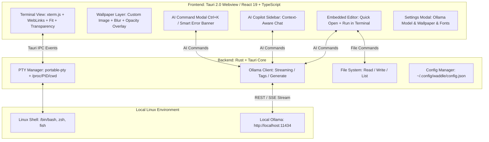

<div align="center">

# 🐧⚡ Waddle
### AI-Integrated Next-Generation Linux Terminal Emulator


[](https://tauri.app/)
[](https://www.rust-lang.org/)
[](https://react.dev/)
[](https://ollama.com/)
[-FCC624?style=for-the-badge&logo=linux&logoColor=black)](https://www.kernel.org/)
[](#-about-this-project--ai-vibe-coding)
[](LICENSE)

<p align="center">
  <strong>Ultra-Fast PTY Terminal × 100% Local AI (Ollama) × Embedded Lightweight Editor × Custom Wallpapers</strong><br>
  A private, intelligent, and customizable terminal emulator for Linux that never sends your data to the cloud.
</p>

<p align="center">
  <a href="README.md">English</a> | <a href="README.ja.md">日本語</a>
</p>

</div>

---

## 📸 Screenshots

| 🐧 Ultra-Fast Terminal with Custom Wallpaper | 🤖 AI Command Generator (`Ctrl + K`) |
| :---: | :---: |
|  |  |
| *CachyOS, Fish Shell, Powerline Nerd Fonts & Transparent Cyberpunk Wallpaper* | *Natural language command generation with safety tags and instant execution* |

| 📝 Embedded Code Editor (`Ctrl + E`) | 💬 Context-Aware AI Copilot Sidebar |
| :---: | :---: |
|  |  |
| *Side-by-side editing, Quick Open, AI Refactor (`Ctrl + Shift + K`), Run in Terminal* | *Interactive chat assistant with live CWD, Git branch, and command context* |

---

## 🤖 About This Project (AI Vibe Coding)

> [!IMPORTANT]
> ### 💡 AI Vibe Coding Project
> **Waddle** is an **AI Vibe Coding** project created through real-time interactive pair programming with **Google DeepMind's Antigravity (Gemini)**.
> Combining human architectural design with agentic AI pair-programming, the entire project—from low-level Rust PTY management, Linux `/proc/<pid>/cwd` tracking, WebKitGTK Wayland optimization, React 19 UI, transparent xterm.js rendering, local Ollama streaming client, to the embedded code editor—was designed and implemented in full flow.

---

## 🌟 Key Features

### 1. 🤖 Natural Language Command Generator (`Ctrl + K`)
- Type your intent in natural language (English, Japanese, etc.), and local Ollama models instantly generate the exact Linux command with clear explanations.
- Destructive commands (e.g., `rm -rf`, disk partitioning) are automatically flagged with danger warning badges.
- Press `Enter` to insert into the terminal, or `Ctrl + Enter` to execute immediately.

### 2. 🖼️ Custom Background Images & Wallpapers (`Ctrl + ,`)
- **Built-in Presets**: One-click apply **Waddle Official Cyberpunk** wallpaper.
- **Custom Local Images & URLs**: Choose local images (PNG, JPG, SVG, WebP) with the built-in file picker or enter local file paths / web URLs.
- **Opacity & Blur Controls**: Real-time slider adjustments for image opacity (10%–100%) and frosted glass blur (0–20px) with automatic contrast overlay for crystal-clear terminal text readability.

### 3. 📝 Embedded Lightweight Editor & AI Code Assistant (`Ctrl + E`)
- Seamlessly toggle a side-by-side code editor right inside your terminal.
- **Quick Open & Save**: Browse files in the current working directory, open by path, and save changes (`Ctrl + S`).
- **Run in Terminal**: Send scripts (Python, Bash, JS/TS, Rust, etc.) directly into the active shell with one click.
- **AI Edit (`Ctrl + Shift + K`)**: Instruct Ollama to refactor, add error handling, or generate code directly inside the editor.

### 4. 🚨 Intelligent Error Diagnosis & One-Click Fixes
- Automatically detects failed commands (non-zero exit codes or stderr keywords) and displays an actionable smart banner.
- With one click, local AI analyzes why the command failed and suggests a verified remedy command you can run instantly.

### 5. 💬 Context-Aware AI Copilot Sidebar
- Interactive chat assistant with real-time awareness of your terminal context: CWD (`pwd`), Git branch & dirty status, and recent command history.
- Run, insert, or copy code snippets directly from Markdown response blocks.

### 6. 🦙 Auto-Discovery of Local Ollama Models (100% Private & Offline)
- Automatically detects installed Ollama models (`llama3.2`, `deepseek-r1`, `qwen2.5-coder`, `codellama`, `mistral`, etc.).
- Switch models on the fly from the Settings modal (`Ctrl + ,`).
- **Zero API keys, zero cloud dependencies, zero data leakage.**

### 7. ⚡ High-Performance PTY & xterm.js Rendering
- Native Rust pseudo-terminal manager (`portable-pty`) with sub-millisecond latency.
- Accurate real-time directory tracking via Linux `/proc/<pid>/cwd`.
- TrueColor (24-bit), WebGL/Canvas acceleration, and full Nerd Fonts & Powerline glyph support.

### 8. 🎨 Themes & Nerd Fonts Customization
- Built-in themes: **Waddle Cyber Dark** (Default), **Tokyo Night**, **Catppuccin Mocha**, **Dracula**.
- Curated presets for **JetBrainsMono Nerd Font**, **MesloLGS NF**, **FiraCode Nerd Font**, **Hack Nerd Font**, or custom local fonts with automatic glyph fallback.

---

## ⌨️ Keybindings

| Shortcut | Action |
| :--- | :--- |
| `Ctrl + K` | Open **AI Command Generator** |
| `Ctrl + E` | Toggle **Embedded Code Editor** |
| `Ctrl + S` *(in editor)* | Save file |
| `Ctrl + Shift + K` *(in editor)* | Open **AI Code Edit / Refactor** |
| `Ctrl + T` | Open new terminal tab |
| `Ctrl + W` | Close current terminal tab |
| `Ctrl + ,` | Open **Settings** (Ollama model, wallpaper, themes, fonts) |
| `Enter` *(in AI modal)* | Insert generated command into terminal |
| `Ctrl + Enter` *(in AI modal)* | Execute generated command immediately |
| `Esc` | Close active modal / popup |

---

## 🏗️ Architecture



---

## 🚀 Quick Start

### 1. Prerequisites

- [Rust (Cargo)](https://rustup.rs/) (1.70+)
- [Node.js & npm](https://nodejs.org/) (Node 18+)
- [Ollama](https://ollama.com/) (Local AI engine)

### 2. Set Up Ollama

```bash
# Start Ollama server
ollama serve

# Pull your preferred local model(s)
ollama pull llama3.2
# Or coding-specialized model
ollama pull qwen2.5-coder
# Or reasoning model
ollama pull deepseek-r1
```

### 3. Run in Development Mode

```bash
# Clone the repository
git clone https://github.com/your-username/Waddle.git
cd Waddle

# Install dependencies
npm install

# Start development server
npm run tauri dev
```

---

## 📦 Production Build

To package Waddle into an optimized standalone binary or Linux bundle:

```bash
npm run tauri build
```

### Output Artifacts:
- **Standalone Binary (~12–19 MB)**: `src-tauri/target/release/waddle`
- **AppImage Package**: `src-tauri/target/release/bundle/appimage/`
- **Debian/Ubuntu Package**: `src-tauri/target/release/bundle/deb/`

### System Installation Example:
```bash
sudo cp src-tauri/target/release/waddle /usr/local/bin/
```

---

## 💻 Tech Stack

| Layer | Technologies |
| :--- | :--- |
| **Framework** | [Tauri 2.0](https://tauri.app/) |
| **Backend** | Rust, `portable-pty`, `tokio`, `reqwest`, `serde` |
| **Frontend** | React 19, TypeScript, Vite, Vanilla CSS |
| **Terminal Core** | `@xterm/xterm`, `@xterm/addon-fit`, `@xterm/addon-web-links` |
| **Local AI Engine** | [Ollama](https://ollama.com/) (`/api/generate`, `/api/chat`, `/api/tags`) |
| **Icons & Markdown** | `lucide-react`, `react-markdown`, `remark-gfm` |

---

## 🔒 Privacy & Security

- **100% Offline & Local**: No telemetry, no third-party cloud API keys, and no command/log transmissions over the internet.
- **Complete Data Sovereignty**: Safe to use in enterprise, air-gapped, or sensitive internal networks.

---

## 📄 License

This project is licensed under the [MIT License](LICENSE).

---

<p align="center">
  Crafted via <strong>AI Vibe Coding</strong> 🐧⚡<br>
  Built with ❤️ for Linux Developers
</p>
