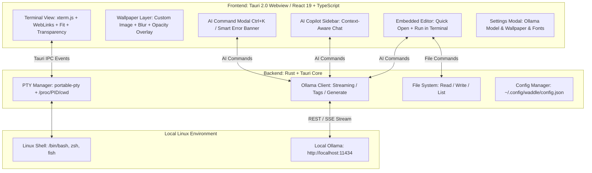

<div align="center">

# 🐧⚡ Waddle
### AI-Integrated Next-Generation Linux Terminal Emulator


[](https://tauri.app/)
[](https://www.rust-lang.org/)
[](https://react.dev/)
[](https://ollama.com/)
[-FCC624?style=for-the-badge&logo=linux&logoColor=black)](https://www.kernel.org/)
[](#-about-this-project--ai-vibe-coding)
[](LICENSE)

<p align="center">
  <strong>Ultra-Fast PTY Terminal × 100% Local AI (Ollama) × Embedded Lightweight Editor × Custom Wallpapers</strong><br>
  A private, intelligent, and customizable terminal emulator for Linux that never sends your data to the cloud.
</p>

<p align="center">
  <a href="README.md">English</a> | <a href="README.ja.md">日本語</a>
</p>

</div>

---

## 📸 Screenshots

| 🐧 Ultra-Fast Terminal with Custom Wallpaper | 🤖 AI Command Generator (`Ctrl + K`) |
| :---: | :---: |
|  |  |
| *CachyOS, Fish Shell, Powerline Nerd Fonts & Transparent Cyberpunk Wallpaper* | *Natural language command generation with safety tags and instant execution* |

| 📝 Embedded Code Editor (`Ctrl + E`) | 💬 Context-Aware AI Copilot Sidebar |
| :---: | :---: |
|  |  |
| *Side-by-side editing, Quick Open, AI Refactor (`Ctrl + Shift + K`), Run in Terminal* | *Interactive chat assistant with live CWD, Git branch, and command context* |

---

## 🤖 About This Project (AI Vibe Coding)

> [!IMPORTANT]
> ### 💡 AI Vibe Coding Project
> **Waddle** is an **AI Vibe Coding** project created through real-time interactive pair programming with **Google DeepMind's Antigravity (Gemini)**.
> Combining human architectural design with agentic AI pair-programming, the entire project—from low-level Rust PTY management, Linux `/proc/<pid>/cwd` tracking, WebKitGTK Wayland optimization, React 19 UI, transparent xterm.js rendering, local Ollama streaming client, to the embedded code editor—was designed and implemented in full flow.

---

## 🌟 Key Features

### 1. 🤖 Natural Language Command Generator (`Ctrl + K`)
- Type your intent in natural language (English, Japanese, etc.), and local Ollama models instantly generate the exact Linux command with clear explanations.
- Destructive commands (e.g., `rm -rf`, disk partitioning) are automatically flagged with danger warning badges.
- Press `Enter` to insert into the terminal, or `Ctrl + Enter` to execute immediately.

### 2. 🖼️ Custom Background Wallpapers & Native File Picker (`Ctrl + ,`)
- **Native OS File Dialog**: Browse and pick any local image (PNG, JPG, SVG, WebP, GIF, BMP) directly using the Linux native file chooser (`zenity` / `kdialog`).
- **Optimized Asset Protocol & Dedicated Storage**: Images are saved and loaded directly from `~/.config/waddle/wallpapers/` using Tauri v2's secure `protocol-asset`, keeping `config.json` featherlight (~480 bytes).
- **Sub-Millisecond 0ms Startup**: Asynchronous image decoding (`decoding="async"`) off the main thread with GPU hardware isolation (`contain: strict`) ensures instantaneous terminal launch even with 4K wallpapers.
- **Opacity & Blur Controls**: Real-time slider adjustments for image opacity (10%–100%) and frosted glass blur (0–20px) with automatic contrast overlay for crystal-clear terminal text readability.

### 3. 📂 Left Sidebar: File Tree Explorer (`Ctrl + B`)
- **Hierarchical Directory Navigation**: Synchronizes in real time with the active terminal tab's CWD (`/proc/<pid>/cwd`), featuring lazy-loaded subfolders and file-type-specific icons.
- **Instant Search & Hidden Files Toggle**: Quickly filter files in the directory with the embedded search bar, and toggle dotfiles (`.git`, `.env`, etc.) with one click.
- **Editor & Terminal Integration**: Click any file to open it in the Embedded Editor (`Ctrl + E`), or use hover quick-actions to insert paths or run commands directly in the shell.

### 4. 📝 Embedded Lightweight Editor & AI Code Assistant (`Ctrl + E`)
- Seamlessly toggle a side-by-side code editor right inside your terminal.
- **Quick Open & Save**: Browse files in the current working directory, open by path, and save changes (`Ctrl + S`).
- **Run in Terminal**: Send scripts (Python, Bash, JS/TS, Rust, etc.) directly into the active shell with one click.
- **AI Edit (`Ctrl + Shift + K`)**: Instruct Ollama to refactor, add error handling, or generate code directly inside the editor.

### 5. 🪟 Flexible Multi-Pane Split (2, 3, 4 Panes & 10 Selectable Layouts)
- **Multi-Terminal Workflows**: Split any tab into 2, 3, or 4 independent pseudo-terminals with dedicated PTY processes, working directory inheritance, and real-time Git status.
- **10 Visual Layout Presets**:
  - **1 Pane**: Single (`single`)
  - **2 Panes**: Side by Side (`split-2-h`), Top & Bottom (`split-2-v`)
  - **3 Panes**: Left Main + 2 Right (`split-3-left-main`), Top Main + 2 Bottom (`split-3-top-main`), 3 Columns (`split-3-h`), 3 Rows (`split-3-v`)
  - **4 Panes**: 2×2 Grid (`grid-4`), Left Main + 3 Right (`split-4-left-main`), 4 Columns (`split-4-h`)
- **Visual Layout Popover**: Select your preferred layout from the TitleBar with interactive miniature diagram previews and quick layout switching.
- **Pane Zoom & Focus**: Zoom in on any active pane for full-screen focus, with a single-click restore banner. Luminous accent border highlights the currently active pane.
- **Smart Active Routing**: AI Command Generator (`Ctrl + K`), Copilot chat, embedded editor, and status bar automatically target whichever pane is focused.

### 6. 🚨 Intelligent Error Diagnosis & One-Click Fixes
- Automatically detects failed commands (non-zero exit codes or stderr keywords) and displays an actionable smart banner.
- With one click, local AI analyzes why the command failed and suggests a verified remedy command you can run instantly.

### 7. 💬 Context-Aware AI Copilot Sidebar
- Interactive chat assistant with real-time awareness of your terminal context: CWD (`pwd`), Git branch & dirty status, and recent command history.
- Run, insert, or copy code snippets directly from Markdown response blocks.

### 8. 🦙 Auto-Discovery of Local Ollama Models (100% Private & Offline)
- Automatically detects installed Ollama models (`llama3.2`, `deepseek-r1`, `qwen2.5-coder`, `codellama`, `mistral`, etc.).
- Switch models on the fly from the Settings modal (`Ctrl + ,`).
- **Zero API keys, zero cloud dependencies, zero data leakage.**

### 9. ⚡ High-Performance PTY & Hardware-Accelerated Canvas Rendering
- Native Rust pseudo-terminal manager (`portable-pty`) with sub-millisecond latency.
- Accurate real-time directory tracking via Linux `/proc/<pid>/cwd` with smart fast-path Git discovery.
- Hardware-accelerated 2D Canvas rendering (`@xterm/addon-canvas`) over transparent background, TrueColor (24-bit), and full Nerd Fonts & Powerline glyph support.
- Synchronous `localStorage` state cache for instant Frame 0 render without IPC delay.

### 10. 🎨 13 Premium Themes & Dynamic UI Color Sync
- **13 Built-in Designer Themes**:
  - **Waddle Cyber (Default)**, **Tokyo Night**, **Catppuccin Mocha**, **Dracula**
  - **Nord (Arctic)**, **Gruvbox Dark**, **One Dark Pro**, **Rosé Pine**
  - **Monokai Pro**, **Cyberpunk 2077**, **Solarized Dark**, **Synthwave '84**, **Midnight Abyss (OLED Pure Black)**
- **Full UI Synchronization**: Window titlebar, tabs, borders, status bar, and modal accents dynamically adapt to the selected theme.
- **Nerd Fonts**: Presets for **JetBrainsMono Nerd Font**, **MesloLGS NF**, **FiraCode Nerd Font**, **Hack Nerd Font**, or custom local fonts with automatic glyph fallback.

### 11. 🌐 Multi-Language Support (English US / UK, 日本語)
- **Selectable UI Language**: Switch seamlessly between **English (US)**, **English (GB / UK)**, and **Japanese (日本語)** from Settings (`Ctrl + ,`).
- **Live Preview & Persistence**: Switching languages instantly updates all dialogs, toolbars, error banners, and copilot prompts, and persists across restarts in `~/.config/waddle/config.json`.
- **Sensible Default**: Defaults to English (`en-US`) for international Linux users while providing full native Japanese support.

### 12. 🛡️ Hardened Security & AI Safety Guardrails
- **Tauri Strict CSP & Asset Isolation**: Strict Content Security Policy blocks unauthorized external network calls and script injection. The custom asset protocol is scoped strictly to wallpapers, pictures, and downloads, completely blocking renderer access to sensitive files (`~/.ssh`, `~/.gnupg`, etc.).
- **Prompt Injection Defense**: Terminal output passed to AI is length-capped and isolated inside `<untrusted_terminal_output>` delimiters, accompanied by explicit system prompt guardrails that prevent LLMs from following embedded prompt injection payloads.
- **Dangerous Command Interception (`DangerousCommandModal`)**: Deterministic Rust & React keyword detection flags destructive commands (`rm`, `dd`, `mkfs`, `sudo`, `> /dev/`, `chmod -R`, `curl | sh`, etc.) and presents a warning modal with safe terminal insertion rather than blind execution.
- **Protected File Operations**: Rust file handlers strictly prevent accidental or malicious deletion of root (`/`), the user's home directory (`$HOME`), or critical system paths (`/etc`, `/usr`, `/bin`).
- **Subprocess Hardening**: Background Git status polling executes with `--no-optional-locks` and `GIT_OPTIONAL_LOCKS=0` to prevent repository lock collisions, and native file pickers prioritize trusted `/usr/bin/` paths.

---

## ⌨️ Keybindings

| Shortcut | Action |
| :--- | :--- |
| `Ctrl + K` | Open **AI Command Generator** |
| `Ctrl + B` | Toggle **File Tree Sidebar** |
| `Ctrl + E` | Toggle **Embedded Code Editor** |
| `Ctrl + S` *(in editor)* | Save file |
| `Ctrl + Shift + K` *(in editor)* | Open **AI Code Edit / Refactor** |
| `Ctrl + T` | Open new terminal tab |
| `Ctrl + W` | Close current terminal tab |
| `Ctrl + Shift + W` | Close active split pane |
| `Alt + 1` | Switch to **Single Pane** layout |
| `Alt + 2` | Switch to **2-Split (Side by Side)** layout |
| `Alt + 3` | Switch to **3-Split (Left Main)** layout |
| `Alt + 4` | Switch to **4-Split (2×2 Grid)** layout |
| `Alt + Z` | Toggle **Zoom / Maximize active pane** |
| `Alt + ↑ / ↓ / ← / →` | Move focus between split panes |
| `Ctrl + ,` | Open **Settings** (Ollama model, wallpaper, themes, fonts, language) |
| `Enter` *(in AI modal)* | Insert generated command into terminal |
| `Ctrl + Enter` *(in AI modal)* | Execute generated command immediately |
| `Esc` | Close active modal / popup |

---

## 🏗️ Architecture



---

## 🚀 Quick Start

### 1. Prerequisites

- [Rust (Cargo)](https://rustup.rs/) (1.70+)
- [Node.js & npm](https://nodejs.org/) (Node 18+)
- [Ollama](https://ollama.com/) (Local AI engine)

### 2. Set Up Ollama

```bash
# Start Ollama server
ollama serve

# Pull your preferred local model(s)
ollama pull llama3.2
# Or coding-specialized model
ollama pull qwen2.5-coder
# Or reasoning model
ollama pull deepseek-r1
```

### 3. Run in Development Mode

```bash
# Clone the repository
git clone https://github.com/your-username/Waddle.git
cd Waddle

# Install dependencies
npm install

# Start development server
npm run tauri dev
```

---

## 📦 Production Build

To package Waddle into an optimized standalone binary or native Arch Linux package:

```bash
# Build native Arch Linux Pacman package (.pkg.tar.zst)
npm run package
# or: npm run build:pacman
```

### Install with Pacman (Arch Linux / CachyOS / Manjaro / EndeavourOS):
```bash
sudo pacman -U src-tauri/target/release/bundle/pacman/waddle-0.1.0-1-x86_64.pkg.tar.zst
```

### Output Artifacts:
- **Arch Linux Pacman Package (~6.9 MB)**: `src-tauri/target/release/bundle/pacman/waddle-0.1.0-1-x86_64.pkg.tar.zst`
- **Standalone Binary (~18 MB)**: `src-tauri/target/release/waddle`
- **PKGBUILD**: Included at repository root for `makepkg -si` support

---

## 💻 Tech Stack

| Layer | Technologies |
| :--- | :--- |
| **Framework** | [Tauri 2.0](https://tauri.app/) (with `protocol-asset`, `tray-icon`) |
| **Backend** | Rust, `portable-pty`, `tokio`, `reqwest`, `serde`, `base64` |
| **Frontend** | React 19, TypeScript, Vite, Vanilla CSS |
| **Terminal Core** | `@xterm/xterm`, `@xterm/addon-canvas`, `@xterm/addon-fit`, `@xterm/addon-web-links` |
| **Local AI Engine** | [Ollama](https://ollama.com/) (`/api/generate`, `/api/chat`, `/api/tags`) |
| **Native Integration** | GTK / Wayland Native File Chooser (`zenity` / `kdialog`), Linux `/proc` filesystem |
| **Icons & Markdown** | `lucide-react`, `react-markdown`, `remark-gfm` |

---

## 🔒 Privacy & Security

- **100% Offline & Local**: No telemetry, no third-party cloud API keys, and no command/log transmissions over the internet.
- **Complete Data Sovereignty**: Safe to use in enterprise, air-gapped, or sensitive internal networks.
- **Hardened Defense-in-Depth Architecture**:
  - **Strict Content Security Policy (CSP)**: Blocks unauthorized external network calls and arbitrary script injections into the Webview.
  - **Scoped Asset Protocol**: Confines custom asset loading to wallpaper and picture folders, strictly denying access to sensitive user files (`~/.ssh`, `~/.gnupg`, etc.).
  - **Indirect Prompt Injection Shield**: Isolates terminal output into untrusted blocks with token limits to neutralize malicious log payloads.
  - **Dangerous Command Interception**: Intercepts destructive actions (`rm -rf`, disk wipes, partition changes, elevated scripts) with interactive confirmation modals.
  - **Filesystem Deletion Protection**: Core Rust handlers block deletion of root (`/`), `$HOME`, and essential system paths.

---

## 📄 License

This project is licensed under the [MIT License](LICENSE).

---

<p align="center">
  Crafted via <strong>AI Vibe Coding</strong> 🐧⚡<br>
  Built with ❤️ for Linux Developers
</p>
