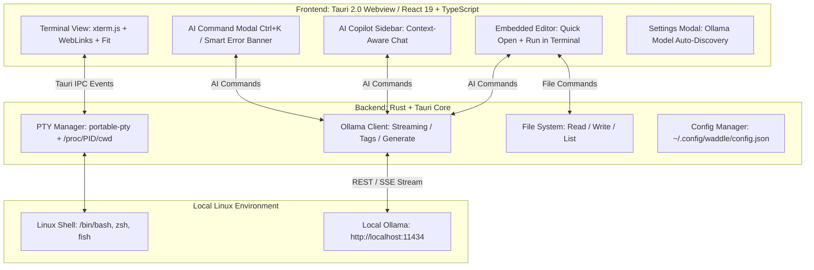

<div align="center">

# 🐧⚡ Waddle
### AI-Integrated Next-Gen Linux Terminal Emulator


[](https://tauri.app/)
[](https://www.rust-lang.org/)
[](https://react.dev/)
[](https://ollama.com/)
[-FCC624?style=for-the-badge&logo=linux&logoColor=black)](https://www.kernel.org/)
[](#-about-this-project--ai-vibe-coding)
[](LICENSE)

<p align="center">
  <strong>超高速 PTY ターミナル × 完全ローカル AI（Ollama） × 簡易内蔵エディタ</strong><br>
  外部クラウドにデータを一切送信しない、プライベートかつインテリジェントな Linux 向けターミナルエミュレータ
</p>

</div>

---

## 🤖 About This Project (AI Vibe Coding)

> [!IMPORTANT]
> ### 💡 AI Vibe Coding Project
> 本プロジェクト **Waddle** は、**AI（Google DeepMind Antigravity / Gemini）との対話を通じて構築された「AI Vibe Coding（バイブコーディング）」プロジェクト**です。
> 人間のアイデアとAIのエージェントコーディングを掛け合わせ、アーキテクチャ設計から Rust による PTY 制御、WebKitGTK 最適化、React 19 フロントエンド、Ollama 統合、内蔵エディタ実装までを一気通貫で開発しました。

---

## 🌟 主な特徴 (Features)

### 1. 🤖 自然言語コマンド生成 (`Ctrl + K`)
- やりたいことを日本語や英語で入力するだけで、ローカルの Ollama モデルが最適な Linux コマンドとその解説を瞬時に生成。
- 危険なコマンド（`rm -rf`, パーティション操作等）は警告バッジで検知。
- `Enter` でターミナルに挿入、`Ctrl + Enter` で即時実行。

### 2. 📝 簡易内蔵エディタ & AI コード支援 (`Ctrl + E`)
- ターミナル横にシームレスに開くスライドインエディタ。
- **クイックオープン & 保存**: カレントディレクトリ内のファイル選択・パス入力・保存 (`Ctrl + S`)。
- **Run in Terminal**: 編集中のスクリプト（Python, Bash, JS/TS, Rust 等）をワンクリックでターミナルに送信して即時実行。
- **AI Edit (`Ctrl + Shift + K`)**: Ollama に指示（「エラー処理を追加して」「TypeScriptに変換して」等）を与えてコードを自動置換・リファクタリング。

### 3. 🚨 インテリジェント・エラー自動診断 & ワンクリック修正
- コマンドがエラー（Exit code != 0 またはエラーログ検出）で終了した場合、スマートバナーが自動出現。
- ワンクリックで「なぜ失敗したか」「修正するための推奨コマンド」をローカル AI が分析・提示し、そのままワンクリックで修正コマンドを実行可能。

### 4. 💬 コンテキスト連動型 Copilot サイドバー
- カレントディレクトリ (`pwd`)、Git ブランチ・変更状態、直近のコマンドと実行出力を自動で把握した対話型アシスタント。
- 回答内のコードブロックから直接「ターミナルへ挿入」「即座に実行」「クリップボードにコピー」が可能。

### 5. 🦙 Ollama ローカルモデルの自動検出 & 完全プライベート
- ローカルにインストールされている Ollama モデル（`llama3.2`, `deepseek-r1`, `qwen2.5-coder`, `codellama`, `mistral` 等）を自動検出。
- 設定画面（`Ctrl + ,`）でモデル一覧をワンクリック再取得・ドロップダウン切り替え。
- クラウド API や API キーへの依存はゼロ。すべてのデータはお手元の PC 内で安全に処理されます。

### 6. ⚡ 超高速 PTY & xterm.js レンダリング
- Rust 製 PTY マネージャー (`portable-pty`) による低レイテンシ・高信頼な疑似端末。
- Linux `/proc/<pid>/cwd` によるリアルタイムなカレントディレクトリ追跡。
- WebGL / Canvas 加速、TrueColor (24bit)、Nerd Fonts 対応。

### 7. 🎨 4種類の洗練されたモダンテーマ
- **Waddle Cyber Dark** (Default)
- **Tokyo Night**
- **Catppuccin Mocha**
- **Dracula**

---

## ⌨️ キーボードショートカット (Keybindings)

| ショートカット | 機能 |
| :--- | :--- |
| `Ctrl + K` | **AI Command Generator** を開く |
| `Ctrl + E` | **簡易内蔵エディタ** の開閉トグル |
| `Ctrl + S` (エディタ内) | ファイルの保存 |
| `Ctrl + Shift + K` (エディタ内) | **AI コード編集・自動生成** を開く |
| `Ctrl + T` | 新しいターミナルタブを開く |
| `Ctrl + W` | 現在のタブを閉じる |
| `Ctrl + ,` | 設定画面（Ollama モデル選択・テーマ・フォント設定）を開く |
| `Enter` (AI Modal内) | 生成されたコマンドをターミナルに挿入 |
| `Ctrl + Enter` (AI Modal内) | 生成されたコマンドを即時実行 |
| `Esc` | モーダルを閉じる |

---

## 🏗️ アーキテクチャ (Architecture)



---

## 🚀 クイックスタート (Quick Start)

### 1. 前提条件のインストール

- [Rust (Cargo)](https://rustup.rs/) (1.70 以上)
- [Node.js & npm](https://nodejs.org/) (Node 18 以上)
- [Ollama](https://ollama.com/) (ローカル AI 実行エンジン)

### 2. Ollama の準備

```bash
# Ollama サーバーを起動
ollama serve

# お好みのローカルモデルをダウンロード
ollama pull llama3.2
# またはコード特化モデル
ollama pull qwen2.5-coder
# または推論モデル
ollama pull deepseek-r1
```

### 3. 開発モードでの起動

```bash
# リポジトリのクローン
git clone https://github.com/your-username/Waddle.git
cd Waddle

# 依存パッケージのインストール
npm install

# 開発サーバー起動
npm run tauri dev
```

---

## 📦 プロダクションビルド (Production Build)

単一バイナリおよび Linux 配布用パッケージ（`.AppImage` / `.deb`）を生成する場合：

```bash
npm run tauri build
```

### 成果物の出力先
- **単一バイナリ (約 12〜19 MB)**: `src-tauri/target/release/waddle`
- **AppImage パッケージ**: `src-tauri/target/release/bundle/appimage/`
- **deb パッケージ**: `src-tauri/target/release/bundle/deb/`

### システムへのインストール例
```bash
sudo cp src-tauri/target/release/waddle /usr/local/bin/
```

---

## 💻 技術スタック (Tech Stack)

| レイヤー | 使用技術 |
| :--- | :--- |
| **Framework** | [Tauri 2.0](https://tauri.app/) |
| **Backend** | Rust, `portable-pty`, `tokio`, `reqwest`, `serde` |
| **Frontend** | React 19, TypeScript, Vite, Vanilla CSS |
| **Terminal Core** | `@xterm/xterm`, `@xterm/addon-fit`, `@xterm/addon-web-links` |
| **Local AI Engine** | [Ollama](https://ollama.com/) (`/api/generate`, `/api/chat`, `/api/tags`) |
| **Icons & Markdown** | `lucide-react`, `react-markdown`, `remark-gfm` |

---

## 🔒 プライバシー & セキュリティ (Privacy & Security)

- **100% オフライン & ローカル完結**: 入力したコマンド、ファイル内容、プロンプト、実行ログは一切外部インターネットやサードパーティAPIへ送信されません。
- **データ主権**: 自宅・社内ネットワーク等のプライベート環境でも安全に活用できます。

---

## 📄 ライセンス (License)

本プロジェクトは [MIT License](LICENSE) のもとで公開されています。

---

<p align="center">
  Crafted via <strong>AI Vibe Coding</strong> 🐧⚡<br>
  Built with ❤️ for Linux Developers
</p>
