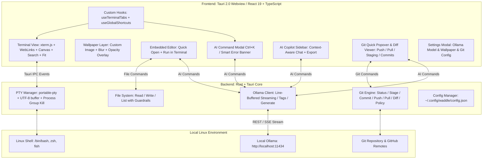

<div align="center">

# 🐧⚡ Waddle
### AI-Integrated Next-Generation Linux Terminal Emulator


[](https://tauri.app/)
[](https://www.rust-lang.org/)
[](https://react.dev/)
[](https://ollama.com/)
[-FCC624?style=for-the-badge&logo=linux&logoColor=black)](https://www.kernel.org/)
[](#-about-this-project--ai-vibe-coding)
[](LICENSE)

<p align="center">
  <strong>Ultra-Fast PTY Terminal × 100% Local AI (Ollama) × Embedded Lightweight Editor × Custom Wallpapers</strong><br>
  A private, intelligent, and customizable terminal emulator for Linux that never sends your data to the cloud.
</p>

<p align="center">
  <a href="README.md">English</a> | <a href="README.ja.md">日本語</a>
</p>

</div>

---

## 📸 Screenshots

| 🐧 Ultra-Fast Terminal with Custom Wallpaper | 🤖 AI Command Generator (`Ctrl + K`) |
| :---: | :---: |
|  |  |
| *CachyOS, Fish Shell, Powerline Nerd Fonts & Transparent Cyberpunk Wallpaper* | *Natural language command generation with safety tags and instant execution* |

| 📝 Embedded Code Editor (`Ctrl + E`) | 💬 Context-Aware AI Copilot Sidebar |
| :---: | :---: |
|  |  |
| *Side-by-side editing, Quick Open, AI Refactor (`Ctrl + Shift + K`), Run in Terminal* | *Interactive chat assistant with live CWD, Git branch, and command context* |

---

## 🤖 About This Project (AI Vibe Coding)

> [!IMPORTANT]
> ### 💡 AI Vibe Coding Project
> **Waddle** is an **AI Vibe Coding** project created through real-time interactive pair programming with **Google DeepMind's Antigravity (Gemini)**.
> Combining human architectural design with agentic AI pair-programming, the entire project—from low-level Rust PTY management, Linux `/proc/<pid>/cwd` tracking, WebKitGTK Wayland optimization, React 19 UI, transparent xterm.js rendering, local Ollama streaming client, to the embedded code editor—was designed and implemented in full flow.

---

## 🌟 Key Features

### 1. 🤖 Natural Language Command Generator (`Ctrl + K`)
- Type your intent in natural language (English, Japanese, etc.), and local Ollama models instantly generate the exact Linux command with clear explanations.
- Destructive commands (e.g., `rm -rf`, disk partitioning) are automatically flagged with danger warning badges.
- Press `Enter` to insert into the terminal, or `Ctrl + Enter` to execute immediately.

### 2. 🖼️ Custom Background Wallpapers & Native File Picker (`Ctrl + ,`)
- **Native OS File Dialog**: Browse and pick any local image (PNG, JPG, SVG, WebP, GIF, BMP) directly from your pictures or filesystem using the Linux native file chooser (`zenity` / `kdialog`).
- **Binary Header & Magic Byte Validation**: Uploaded wallpapers are strictly verified against image magic bytes (PNG, JPEG, WebP, GIF, BMP, SVG) and allowed extensions, blocking disguised scripts or malicious binaries.
- **Optimized Asset Protocol & Dedicated Storage**: Images are saved and loaded directly from `~/.config/waddle/wallpapers/` using Tauri v2's secure `protocol-asset`, keeping `config.json` featherlight (~480 bytes) with automatic migration from legacy Base64.
- **Sub-Millisecond 0ms Startup**: Asynchronous image decoding (`decoding="async"`) off the main thread with GPU hardware isolation (`contain: strict`) ensures instantaneous terminal launch even with 4K wallpapers.
- **Opacity & Blur Controls**: Real-time slider adjustments for image opacity (10%–100%) and frosted glass blur (0–20px) with automatic contrast overlay for crystal-clear terminal text readability.

### 3. 📂 Left Sidebar: File Tree Explorer (`Ctrl + B`)
- **Hierarchical Directory Navigation**: Synchronizes in real time with the active terminal tab's CWD (`/proc/<pid>/cwd`), featuring lazy-loaded subfolders and file-type-specific icons.
- **Instant Search & Hidden Files Toggle**: Quickly filter files in the directory with the embedded search bar, and toggle dotfiles (`.git`, `.env`, etc.) with one click.
- **Editor & Terminal Integration**: Click any file to open it in the Embedded Editor (`Ctrl + E`), or use hover quick-actions to insert paths or run commands directly in the shell.

### 4. 📝 Embedded Lightweight Editor & AI Code Assistant (`Ctrl + E`)
- Seamlessly toggle a side-by-side code editor right inside your terminal.
- **Quick Open & Save**: Browse files in the current working directory, open by path, and save changes (`Ctrl + S`).
- **Run in Terminal with Safety Interception**: Send scripts (Python, Bash, JS/TS, Rust, or raw buffer) directly into the active shell with one click. If the script contains dangerous operations, it is intercepted by `DangerousCommandModal` before execution.
- **AI Edit (`Ctrl + Shift + K`)**: Instruct Ollama to refactor, add error handling, or generate code directly inside the editor.

### 5. 🪟 Flexible Multi-Pane Split & Draggable Resizing (2, 3, 4 Panes)
- **Multi-Terminal Workflows**: Split any tab into 2, 3, or 4 independent pseudo-terminals with dedicated PTY processes, working directory inheritance, and real-time Git status.
- **10 Visual Layout Presets**:
  - **1 Pane**: Single (`single`)
  - **2 Panes**: Side by Side (`split-2-h`), Top & Bottom (`split-2-v`)
  - **3 Panes**: Left Main + 2 Right (`split-3-left-main`), Top Main + 2 Bottom (`split-3-top-main`), 3 Columns (`split-3-h`), 3 Rows (`split-3-v`)
  - **4 Panes**: 2×2 Grid (`grid-4`), Left Main + 3 Right (`split-4-left-main`), 4 Columns (`split-4-h`)
- **Interactive Draggable Dividers**: Hover over any split divider to reveal a neon glowing handle (`col-resize` / `row-resize`), then drag to dynamically adjust pane ratios (15% to 85%).
- **Automatic Layout Re-fitting**: Releasing the divider automatically recalculates character rows and columns via `@xterm/addon-fit`, instantly adjusting text wrap.
- **Pane Zoom & Focus**: Zoom in on any active pane for full-screen focus, with a single-click restore banner. Luminous accent border highlights the currently active pane.

### 6. 🔎 In-Terminal Log Search (`Ctrl + Shift + F` / `Ctrl + F`)
- **Full Scrollback Search**: Fast, hardware-accelerated text search across all terminal scrollback lines powered by `@xterm/addon-search`.
- **Floating Search Overlay**: Sleek dark-glass search bar with match navigation (`Enter` / `Shift + Enter` or Previous/Next buttons).
- **Match Controls**: Toggle case-sensitive search (`Aa`) and regular expression matching (`.*`) with real-time highlighted matches. Close instantly with `Esc`.

### 7. 🚨 Intelligent Error Diagnosis & Smart False-Positive Suppression
- Automatically detects failed commands (non-zero exit codes or standard shell error signatures) and displays an actionable smart banner.
- **Noise Suppression**: Excludes common inspection commands (`grep`, `find`, `cat`, `echo`, `diff`, `git log`) and prevents repeated error alerts for the same command output.
- With one click, local AI analyzes why the command failed and suggests a verified remedy command you can run instantly.

### 8. 💬 Context-Aware AI Copilot Sidebar & Chat Export
- Interactive chat assistant with real-time awareness of your terminal context: CWD (`pwd`), Git branch & dirty status, and recent command history.
- Run, insert, or copy code snippets directly from Markdown response blocks.
- **Conversation Export**: Export chat sessions directly to structured **Markdown (`.md`)** or machine-readable **JSON (`.json`)** with one click, preserving timestamps, shell info, and command suggestions.

### 9. 🦙 Auto-Discovery of Local Ollama Models & Robust Line-Buffered Streaming
- Automatically detects installed Ollama models (`llama3.2`, `deepseek-r1`, `qwen2.5-coder`, `codellama`, `mistral`, etc.).
- **Line-Buffered Streaming**: Incoming HTTP chunk streams are reassembled across packet boundaries before JSON deserialization, preventing dropped tokens or corrupted responses.
- Switch models on the fly from the Settings modal (`Ctrl + ,`).
- **Zero API keys, zero cloud dependencies, zero data leakage.**

### 10. ⚡ High-Performance PTY & Zero-Lag 2D Canvas Acceleration
- **Native Rust PTY Core**: `portable-pty` pseudo-terminal manager with sub-millisecond I/O latency.
- **Multi-Byte UTF-8 Boundary Protection**: Buffers incomplete UTF-8 codepoint bytes across the 8192-byte read buffer boundary, completely preventing `\u{FFFD}` character corruption for Japanese, CJK characters, and emojis.
- **Process Group Termination & Zombie Prevention**: Closing a tab or pane signals the entire process group (`-pid`) with `SIGHUP` and `SIGTERM`/`SIGKILL`, ensuring no orphan subshells or runaway pipeline commands persist.
- **Sub-Millisecond 0ms Startup**: High-efficiency 2D Canvas rendering (`@xterm/addon-canvas`) over transparent background without GPU driver stalls, ensuring immediate terminal readiness and keyboard input acceptance from Frame 0.
- **Smart Git & CWD Polling**: Automatically pauses polling when the window is hidden (`document.hidden`) or inactive, and updates immediately upon command submission.

### 11. 🎨 22 Premium Themes & High-Voltage Neon Collection
- **22 Built-in Designer Themes (Categorized into Neon & Classic Groups)**:
  - **⚡ High-Voltage Neon Collection (11 Themes)**:
    - **Neon Overdrive** (Laser Pink & Electric Cyan), **Toxic Matrix** (Fluorescent Biohazard Lime)
    - **Outrun Sunset** (Blazing Orange & Gold), **Electric Violet** (Ultraviolet & Screaming Magenta)
    - **Neo Tokyo 2099** (Laser Red & Gold), **Acid Cyber** (Highlighter Acid Yellow)
    - **Miami Vice Neon** (Turquoise & Flamingo Pink), **Laser Glitch** (Glitch Magenta & White Strobe)
    - **Plasma Cyan** (Extreme Plasma Cyan & Sapphire), **Cyberpunk 2077**, **Synthwave '84**
  - **Classic & Pro Collection (11 Themes)**:
    - **Waddle Cyber (Default)**, **Tokyo Night**, **Catppuccin Mocha**, **Dracula**
    - **Nord (Arctic)**, **Gruvbox Dark**, **One Dark Pro**, **Rosé Pine**
    - **Monokai Pro**, **Solarized Dark**, **Midnight Abyss (OLED Pure Black)**
- **Full UI Glow Synchronization**: Window titlebar, tabs, active border, status bar, and modal glow auras dynamically synchronize with the selected theme's RGB accent.
- **Live Preview in Settings**: Grouped selector (`<optgroup>`), animated `⚡ NEON` badge, accent/cursor/ANSI swatches, and simulated terminal prompt preview.
- **Nerd Fonts**: Presets for **JetBrainsMono Nerd Font**, **MesloLGS NF**, **FiraCode Nerd Font**, **Hack Nerd Font**, or custom local fonts with automatic glyph fallback.

### 12. 🌐 Multi-Language Support (English US / UK, 日本語)
- **Selectable UI Language**: Switch seamlessly between **English (US)**, **English (GB / UK)**, and **Japanese (日本語)** from Settings (`Ctrl + ,`).
- **Live Preview & Persistence**: Switching languages instantly updates all dialogs, toolbars, error banners, search bars, and copilot prompts, and persists across restarts in `~/.config/waddle/config.json`.
- **Sensible Default**: Defaults to English (`en-US`) for international Linux users while providing full native Japanese support.

### 13. 🛡️ Hardened Multi-Layer Security & AI Safety Guardrails
- **Protected File Operations & Guardrails**:
  - **Prefix-Matched System Deletion Guard**: System directory protection (`/etc`, `/usr`, `/bin`, `/sbin`, `/boot`, `/lib`, `/sys`, `/proc`, `/dev`, `/root`, `/run`) uses prefix matching (`canonical.starts_with(sys_path)`), blocking deletion of subdirectories and files like `/etc/nginx` or `/usr/bin/local`.
  - **Sensitive User Credential Protection**: Completely blocks reading, writing, and deletion of user secrets, including SSH private keys (`id_rsa`, `id_ed25519`, `id_ecdsa`, `id_dsa`), GPG private keys (`~/.gnupg/private-keys-v1.d`), and system keyrings (`~/.local/share/keyrings`). Prevents deletion of `~/.config` root directory.
  - **Safe Write Validation**: `create_file` and `write_file` enforce canonical path validation before writing, preventing system file overwrite or persistence exploits.
  - **Advance Path Verification**: Performs path validation before existence checks to eliminate file probing and information leakage.
- **AI Indirect Prompt Injection Defense**:
  - Delimiter escaping: XML tags (`<untrusted_terminal_output>` and `</untrusted_terminal_output>`) within terminal output are sanitized and escaped, neutralizing tag breakout attacks.
  - Context sanitization: Git branch names, recent commands, and CWD inputs are sanitized to strip control characters and prompt breakout delimiters.
- **Word-Boundary Dangerous Command Interception (`DangerousCommandModal`)**:
  - Synchronized deterministic keyword matching with word boundary checks (`\b`) across Rust backend and React frontend.
  - Avoids false positives on harmless commands and variable names (e.g., `echo 'imparted wisdom'`).
  - Detects destructive operations:
    - Filesystem deletion: `rm`, `rmdir`, `find -delete`, `find -exec rm`, `truncate -s 0`, `shutil.rmtree`
    - Destructive Git operations: `git clean -f`, `git clean -fdx`, `git reset --hard`, `git push --force`
    - Process substitution & dynamic eval: `bash <(`, `sh <(`, `zsh <(`, `eval "$(`
    - Partition & disk tools: `mkfs`, `dd if=`, `fdisk`, `parted`, `gdisk`, `wipefs`, `shred`
    - Dangerous redirections & permissions: `> /dev/`, `> /etc/`, `> /boot/`, `chmod -R`, `chmod 777`, `chown -R`
    - System halt & fork bombs: `reboot`, `shutdown`, `poweroff`, `init 0`, `init 6`, `:(){ :|:& };:`
  - Prompts users with an interactive modal: "Confirm and Execute", "Safe Insert into Terminal (without Enter)", or "Cancel".
- **Editor Execution Protection**: Running scripts from the embedded editor (`Ctrl + E` -> Run) checks for dangerous commands, preventing blind execution of untrusted scripts.
- **Scoped Asset Protocol**: Tauri `assetProtocol.scope` is restricted to `$CONFIG/waddle/**/*`, `$PICTURE/**/*`, and `$DOWNLOAD/**/*`. Broad `$CONFIG/**/*` access is completely removed, protecting browser cookies, Slack/GitHub tokens, and application secrets in `~/.config`.
- **Wallpaper Binary Header Verification**: Uploaded images are validated against magic header bytes (PNG, JPEG, WebP, GIF, BMP, SVG), preventing disguised scripts or binary uploads.
- **Remote Ollama Warning Banner**: Real-time warning badge in Settings alerts users when an external/remote Ollama endpoint is configured, advising on network data transmission risks.
- **Subprocess Hardening**: Background Git status polling executes with `--no-optional-locks` and `GIT_OPTIONAL_LOCKS=0` to prevent repository lock collisions, and native file pickers prioritize trusted `/usr/bin/` paths.

### 14. 🐙 Git & GitHub Integration, Local AI Commits & Push/Pull Policy
- **Quick Git Popover**: Click the Git branch badge in the status bar to open an interactive floating panel with branch checkout, ahead/behind tracking, staged/unstaged/untracked file grouping, and instant diff viewing.
- **One-Click Push & Pull (`git push` / `git pull`)**: Push local commits or pull remote updates directly from the popover. Features animated count badges (`↑ahead` / `↓behind`), progress spinners, and background non-blocking execution (`spawn_blocking`) with `GIT_TERMINAL_PROMPT=0` to prevent UI freezing.
- **Local AI Conventional Commit Generator**: One-click generation of semantic commit messages (`feat: ...`, `fix: ...`, `refactor: ...`) powered completely by your local Ollama instance—no code or diffs ever leave your machine.
- **Built-in Syntax-Highlighted Diff Viewer**: Inspect unified diffs within Waddle, view side-by-side additions and deletions, review untracked files as synthetic diffs, and stage or discard changes directly.
- **File Tree Git Status Badges**: Visual state decorations (`M` for Modified, `U` for Untracked, `S` for Staged, `C` for Conflicted) and folder indicator dots showing where changes reside in your project tree.
- **Settings Toggle & GitHub Privacy Shield**:
  - **Git Integration Toggle**: Toggle Git integration completely ON/OFF in Settings (`Ctrl + ,`) for a pure lightweight terminal experience with zero Git subprocess polling.
  - **GitHub Restriction Policy**: Automatically inspects `git remote -v` and blocks push/pull operations to non-GitHub remotes (e.g. GitLab, Bitbucket, custom servers), alerting users in the UI.
### 15. 🔄 One-Click Workspace Refresh & Safe Confirmation Dialog
- **Direct Titlebar Refresh Button**: A prominent `RotateCcw` button positioned in the titlebar between Layout selection and Settings.
- **Safe Modal Confirmation Dialog**: Clicking opens a full-window modal clearly summarizing the reset action: closing all open tabs and split panes, terminating running processes, clearing persisted session storage, and returning to a fresh terminal in your home directory.
- **Thorough Cleanup**: Safely closes all PTY process groups, clears `waddle_session_state` from `localStorage`, resets active directory, and completely re-initializes the file tree sidebar cache and open editors.

---

## ⌨️ Keybindings

| Shortcut | Action |
| :--- | :--- |
| `Ctrl + K` | Open **AI Command Generator** |
| `Ctrl + B` | Toggle **File Tree Sidebar** |
| `Ctrl + E` | Toggle **Embedded Code Editor** |
| `Ctrl + S` *(in editor)* | Save file |
| `Ctrl + Shift + K` *(in editor)* | Open **AI Code Edit / Refactor** |
| `Ctrl + Shift + F` / `Ctrl + F` | Toggle **Terminal In-Log Search** |
| `Ctrl + T` | Open new terminal tab |
| `Ctrl + W` | Close current terminal tab |
| `Ctrl + Shift + W` | Close active split pane |
| `Ctrl + Shift + S` | **Swap panes** in current split tab |
| `Ctrl + Alt + ↑ / ↓ / ← / →` | **Resize active split ratio** via keyboard (5% steps) |
| `Alt + 1` | Switch to **Single Pane** layout |
| `Alt + 2` | Switch to **2-Split (Side by Side)** layout |
| `Alt + 3` | Switch to **3-Split (Left Main)** layout |
| `Alt + 4` | Switch to **4-Split (2×2 Grid)** layout |
| `Alt + Z` | Toggle **Zoom / Maximize active pane** |
| `Alt + ↑ / ↓ / ← / →` | Move focus between split panes |
| `Ctrl + ,` | Open **Settings** (Ollama model, wallpaper, themes, fonts, language, Git toggle) |
| `Status Bar Git Badge` | Open **Git Quick Popover** (Branch, Stage, Commit, Push, Pull, Diff) |
| `Ctrl + Enter` *(in Git commit)* | Commit staged changes |
| `Enter` *(in AI modal)* | Insert generated command into terminal |
| `Ctrl + Enter` *(in AI modal)* | Execute generated command immediately |
| `Enter` / `Shift + Enter` *(in search)* | Find next / previous match in terminal |
| `Esc` | Close active modal / search bar / popup |

---

## 🏗️ Architecture



---

## 🚀 Quick Start

### 1. Prerequisites

- [Rust (Cargo)](https://rustup.rs/) (1.70+)
- [Node.js & npm](https://nodejs.org/) (Node 18+)
- [Ollama](https://ollama.com/) (Local AI engine)

### 2. Set Up Ollama

```bash
# Start Ollama server
ollama serve

# Pull your preferred local model(s)
ollama pull llama3.2
# Or coding-specialized model
ollama pull qwen2.5-coder
# Or reasoning model
ollama pull deepseek-r1
```

### 3. Run in Development Mode

```bash
# Clone the repository
git clone https://github.com/your-username/Waddle.git
cd Waddle

# Install dependencies
npm install

# Start development server
npm run tauri dev
```

---

## 📦 Production Build

To package Waddle into an optimized standalone binary or native Arch Linux package:

```bash
# Build native Arch Linux Pacman package (.pkg.tar.zst)
npm run package
# or: npm run build:pacman
```

### Install with Pacman (Arch Linux / CachyOS / Manjaro / EndeavourOS):
```bash
sudo pacman -U src-tauri/target/release/bundle/pacman/waddle-0.1.0-1-x86_64.pkg.tar.zst
```

### Output Artifacts:
- **Arch Linux Pacman Package (~7.9 MB)**: `src-tauri/target/release/bundle/pacman/waddle-0.1.0-1-x86_64.pkg.tar.zst`
- **Standalone Binary (~18 MB)**: `src-tauri/target/release/waddle`
- **PKGBUILD**: Included at repository root for `makepkg -si` support

---

## 💻 Tech Stack

| Layer | Technologies |
| :--- | :--- |
| **Framework** | [Tauri 2.0](https://tauri.app/) (with `protocol-asset`, `tray-icon`) |
| **Backend** | Rust, `portable-pty`, `tokio`, `reqwest`, `serde`, `base64`, `libc` |
| **Frontend** | React 19, TypeScript, Vite, Vanilla CSS |
| **Terminal Core** | `@xterm/xterm`, `@xterm/addon-canvas`, `@xterm/addon-search`, `@xterm/addon-fit`, `@xterm/addon-web-links` |
| **Local AI Engine** | [Ollama](https://ollama.com/) (`/api/generate`, `/api/chat`, `/api/tags`) |
| **Native Integration** | GTK / Wayland Native File Chooser (`zenity` / `kdialog`), Linux `/proc` filesystem |
| **Icons & Markdown** | `lucide-react`, `react-markdown`, `remark-gfm` |

---

## 🔒 Privacy & Security

- **100% Offline & Local**: No telemetry, no third-party cloud API keys, and no command/log transmissions over the internet.
- **Complete Data Sovereignty**: Safe to use in enterprise, air-gapped, or sensitive internal networks.
- **Multi-Layer Defense-in-Depth Architecture**:
  - **Strict Content Security Policy (CSP)**: Blocks unauthorized external network calls and arbitrary script injections into the Webview.
  - **Scoped Asset Protocol**: Confines custom asset loading to `$CONFIG/waddle/**/*` and user pictures/downloads, shielding sensitive configuration files and cookies in `~/.config`.
  - **Protected File Operations**: Rust handlers enforce prefix matching to protect all system directories (`/etc`, `/usr`, `/bin`, etc.) and block reading/writing/deletion of credential stores (`~/.ssh`, `~/.gnupg`, keyrings).
  - **Indirect Prompt Injection Shield**: Delimiter escaping (`</untrusted_terminal_output>`) and system prompt guardrails neutralize malicious log payloads.
  - **Word-Boundary Dangerous Command Interception**: Intercepts destructive actions (`rm -rf`, `git clean -fdx`, `git reset --hard`, process substitutions, disk tools) with precision word boundaries.
  - **Wallpaper Integrity Validation**: Magic byte checks ensure only genuine image files are stored.
  - **Remote Endpoint Warning**: Alerts users when a non-localhost Ollama endpoint is configured.
  - **Git Privacy & GitHub-Only Policy**: Git integration can be toggled off at will in Settings to completely disable background Git subprocess polling. When enabled, Waddle inspects remotes and prevents push/pull data transmission to non-GitHub destinations, locked down by Webview CSP.

---

## 📄 License

This project is licensed under the [MIT License](LICENSE).

---

<p align="center">
  Crafted via <strong>AI Vibe Coding</strong> 🐧⚡<br>
  Built with ❤️ for Linux Developers
</p>
