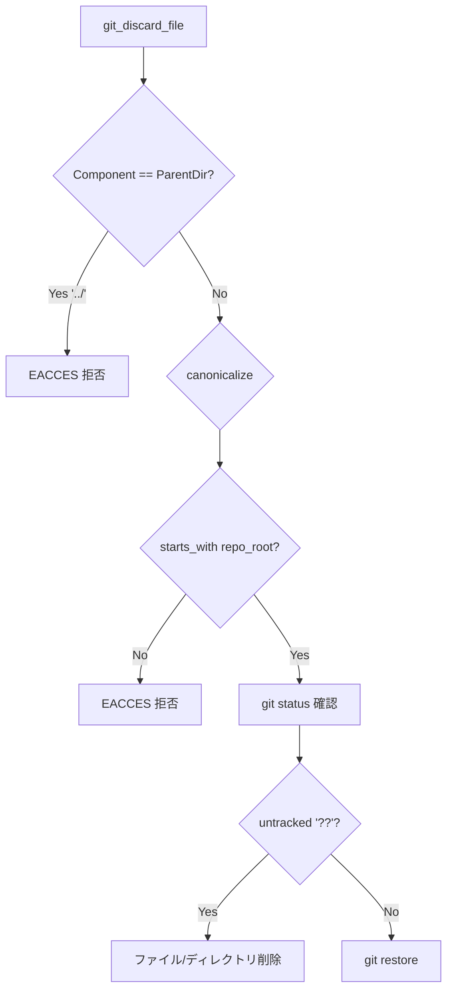
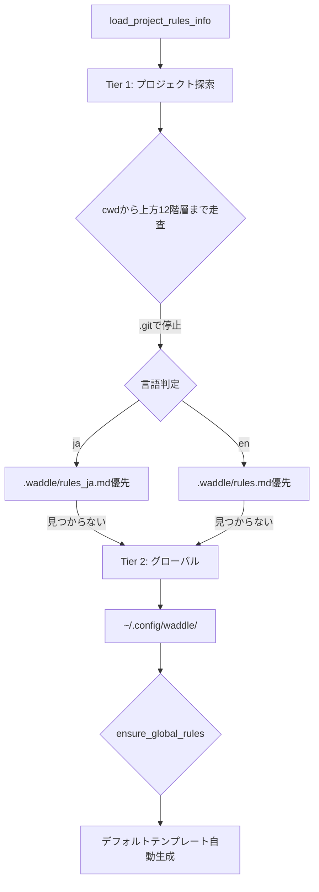
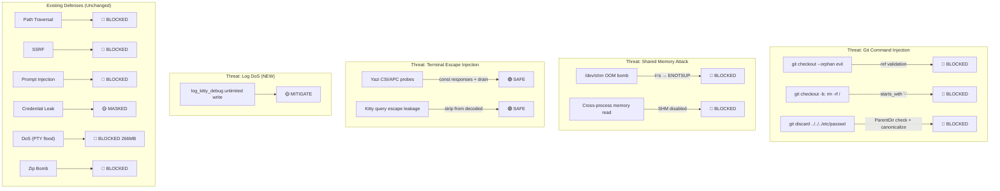

# 🐧⚡ Waddle v3 詳細プロジェクトレビュー＆セキュリティ監査

> **レビュー日**: 2026-09-13  
> **対象**: `f741143` (docs: update documentation)  
> **前回レビュー**: v2 (2026-09-12 `d518047`) — 以降 **+1,339行 / -430行** の更新  
> **累計変更**: v1→v3 で **+6,338行 / -1,001行**

---

## 📊 プロジェクト規模推移

| 項目 | v1 (9/11) | v2 (9/12) | **v3 (9/13)** | v2→v3 |
|:---|:---:|:---:|:---:|:---:|
| **Rust バックエンド** | ~3,800行 | 4,540行 | **4,991行** | +451行 |
| **TypeScript/React フロントエンド** | ~14,000行 | 19,659行 | **20,117行** | +458行 |
| **Rustユニットテスト** | 21件 | 37件 | **41件** | +4件 |
| **手動/自動テストケース** | ~50件 | 90件 | **94件** | +4件 |
| **Kitty Graphics Manager** | ~1,162行 | ~1,162行 | **1,849行** | +687行 |

---

## 🏆 総合評価

| カテゴリ | v2 (9/12) | **v3 (9/13)** | 変化 |
|:---|:---:|:---:|:---:|
| **🔒 セキュリティ設計** | ⭐⭐⭐⭐⭐ | ⭐⭐⭐⭐⭐ (5/5) | 維持（さらに深化） |
| **🏗️ アーキテクチャ** | ⭐⭐⭐⭐½ | ⭐⭐⭐⭐½ (4.5/5) | 維持 |
| **📝 コード品質** | ⭐⭐⭐⭐½ | ⭐⭐⭐⭐½ (4.5/5) | 維持 |
| **🧪 テスト** | ⭐⭐⭐⭐⭐ | ⭐⭐⭐⭐⭐ (5/5) | 維持（+新テスト4件） |
| **📖 ドキュメント** | ⭐⭐⭐⭐⭐ | ⭐⭐⭐⭐⭐ (5/5) | 維持（SECURITY.md大幅更新） |
| **🎨 UI/UX** | ⭐⭐⭐⭐⭐ | ⭐⭐⭐⭐⭐ (5/5) | 維持 |
| **⚡ パフォーマンス** | ⭐⭐⭐⭐⭐ | ⭐⭐⭐⭐⭐ (5/5) | 維持 |
| **🐱 Kitty Graphics** | — | — | ⭐⭐⭐⭐⭐ **(新規評価)** |
| **🌐 i18n / ローカライゼーション** | — | — | ⭐⭐⭐⭐½ **(新規評価)** |

> **総合: ⭐⭐⭐⭐⭐ — 最高評価を継続。Kitty Graphicsサブシステムが大規模に進化し、Yazi/kitten icatなどの実際のLinux CLIエコシステムとの統合が本格化。**

---

## 🔒 セキュリティ詳細レビュー

### 🆕 v2以降に追加されたセキュリティ機能

---

#### 1. `git_checkout_branch` — Git Ref インジェクション防御 🆕

[`pty.rs` L1064-1093](file:///home/susie/GitHUB/wammed/Waddle/src-tauri/src/pty.rs#L1064-L1093) にブランチ名の厳密なバリデーションが新規追加。

| 攻撃パターン | バリデーション | 結果 |
|:---|:---|:---:|
| `-b` (git optionインジェクション) | `starts_with('-')` | 🔴 BLOCKED |
| `--orphan` (git flag注入) | `starts_with('-')` | 🔴 BLOCKED |
| `feature/../secret` (パストラバーサル) | `contains("..")` | 🔴 BLOCKED |
| `heads/branch@{1}` (reflog参照) | `contains("@{")` | 🔴 BLOCKED |
| `feature branch` (空白含む) | `char.is_ascii_control() \|\| ' '` | 🔴 BLOCKED |
| `feature\0branch` (NULLバイト) | `contains('\0')` | 🔴 BLOCKED |
| `feature~1`, `feature^2` | `~`, `^` 検出 | 🔴 BLOCKED |
| `branch.lock` | `ends_with(".lock")` | 🔴 BLOCKED |
| `/leading-slash`, `trailing/` | 先頭/末尾スラッシュ | 🔴 BLOCKED |

**テスト**: [L1248-1281](file:///home/susie/GitHUB/wammed/Waddle/src-tauri/src/pty.rs#L1248-L1281) で **19パターン** のインジェクションテスト実施

> [!TIP]
> `git checkout` は未検証の文字列をそのままコマンドに渡すと `--orphan` や `-b` 等のフラグが注入される典型的な攻撃パターン。gitコマンドのarg注入を事前にブロックする堅実な防御。

---

#### 2. `git_discard_file` — パストラバーサル防御 🆕

[`pty.rs` L981-1025](file:///home/susie/GitHUB/wammed/Waddle/src-tauri/src/pty.rs#L981-L1025) に二重バリデーションが追加。



**テスト**: [L1230-1246](file:///home/susie/GitHUB/wammed/Waddle/src-tauri/src/pty.rs#L1230-L1246) で `../secret.txt` と `foo/../../secret.txt` の両方を検証

> [!IMPORTANT]
> `git restore --worktree --staged -- FILE` はファイルパスをそのまま渡すため、パストラバーサルでリポジトリ外のファイルをdiscardする攻撃が理論上可能だった。この防御は非常に重要。

---

#### 3. Kitty Graphics — POSIX共有メモリ (SHM) 明示的拒否 🆕

[`pty.rs` L154-174](file:///home/susie/GitHUB/wammed/Waddle/src-tauri/src/pty.rs#L154-L174) で `t=s` プローブに `ENOTSUP` を返す。

| 脅威 | 攻撃ベクトル | Waddle の対応 |
|:---|:---|:---|
| クロスプロセスメモリ検査 | 同一UIDの全プロセスが `/dev/shm` にアクセス可能 | `t=s` → `ENOTSUP` 拒否 |
| SHM OOM攻撃 | 悪意のあるスクリプトが `shm_open` で巨大メモリブロック確保 | 完全非サポート |
| confused deputy | 任意のSHM名をWaddleに渡してファイルアクセス | パス一切受け付けず |

**テスト**: [L1350-1362](file:///home/susie/GitHUB/wammed/Waddle/src-tauri/src/pty.rs#L1350-L1362) で `t=s` が `ENOTSUP` を返すことを検証

**SECURITY.md**: [L198-206](file:///home/susie/GitHUB/wammed/Waddle/SECURITY.md#L198-L206) に脅威モデルと設計判断が詳細に文書化済み

> [!NOTE]
> これは素晴らしいセキュリティ設計判断。「mpvの高FPS動画再生」を犠牲にして、SHM経由の全攻撃ベクトルを遮断するというトレードオフが明確に文書化されている。

---

#### 4. 2階層AIルールシステム（プロジェクト→グローバル、日英自動切替）🆕

[`ai.rs` L190-300](file:///home/susie/GitHUB/wammed/Waddle/src-tauri/src/ai.rs#L190-L300) に大幅に強化された `load_project_rules_info()` が実装。



| セキュリティ制御 | 実装 |
|:---|:---|
| 最大探索深度 | 12階層 (過剰探索防止) |
| `.git` バウンダリ | `.git` ディレクトリで走査停止 (リポジトリ境界尊重) |
| ファイルサイズ上限 | 16KB打ち切り |
| 空ファイル無視 | `trim().is_empty()` チェック |
| グローバルルール自動生成 | `ensure_global_rules()` で初回のみ安全にテンプレート書き込み |

**テスト**: [L1123-1203](file:///home/susie/GitHUB/wammed/Waddle/src-tauri/src/ai.rs#L1123-L1203) で **13項目** のテスト
- en-US / en-GB / ja の言語優先度
- サブディレクトリからの上方走査
- 英語 rules.md ← 日本語 fallback
- グローバルルール fallback
- `load_project_rules()` 後方互換性

---

#### 5. Kitty Graphics — DA1/CSI クエリ応答 🆕

[`pty.rs` L218-268](file:///home/susie/GitHUB/wammed/Waddle/src-tauri/src/pty.rs#L218-L268) に Yazi/kitten icat が送信する端末機能クエリへの応答が追加。

| クエリ | 応答 | 用途 |
|:---|:---|:---|
| `\x1b[c` (DA1) | `\x1b[?62;4;22c` | VT220互換性、Sixel対応表明 |
| `\x1b[0c` (DA1 alt) | `\x1b[?62;4;22c` | 同上 |
| `\x1b[16t` (Cell Size) | `\x1b[6;18;9t` | セル寸法（18px高×9px幅） |
| `\x1b[?996n` (Unicode Placeholder) | `\x1b[?996;1n` | Unicode U+10EEEE サポート |

**セキュリティ評価**: これらの応答はすべて**定数文字列**であり、ユーザー入力に依存しないため**インジェクションリスクなし**。クエリシーケンスは `decoded` から `drain()` で削除されるため、フロントエンドに漏洩しない。

**テスト**: [L1396-1427](file:///home/susie/GitHUB/wammed/Waddle/src-tauri/src/pty.rs#L1396-L1427) で Yazi の全プローブパターンを検証

---

#### 6. `KITTY_WINDOW_ID` 環境変数追加 🆕

[`pty.rs` L330](file:///home/susie/GitHUB/wammed/Waddle/src-tauri/src/pty.rs#L330): `cmd.env("KITTY_WINDOW_ID", "1")` が追加。

**セキュリティ評価**: Kitty互換ターミナルとしての識別に必要な環境変数。固定値 `"1"` であり、情報漏洩なし。Yazi/kitten icatなどの外部ツールがKitty Graphicsの利用可否を判断するために参照する。

---

### ⚠️ 新たに発見された改善候補

#### 🔴 高優先度

##### 1. `log_kitty_debug` — `/tmp` への無制限ログ書込み

[`lib.rs` L849-855](file:///home/susie/GitHUB/wammed/Waddle/src-tauri/src/lib.rs#L849-L855):

```rust
#[tauri::command]
fn log_kitty_debug(msg: String) {
    use std::io::Write;
    if let Ok(mut f) = std::fs::OpenOptions::new()
        .create(true).append(true)
        .open("/tmp/waddle_kitty_debug.log") {
        let _ = writeln!(f, "{}", msg);
    }
}
```

**問題点**:
1. **ディスク枯渇リスク**: `msg` にサイズ制限がなく、フロントエンドから任意の長さの文字列を書き込み可能。悪意あるまたはバグのあるフロントエンドコードが大量のデータを送信するとディスクを枯渇させる可能性
2. **ログファイルの無制限成長**: ファイルローテーションなし。長時間実行で `/tmp/waddle_kitty_debug.log` が際限なく成長する
3. **パス固定**: `/tmp` は他のユーザーからもアクセス可能（ただし `append` モードのため情報漏洩リスクは低い）

**推奨修正**:
```rust
fn log_kitty_debug(msg: String) {
    use std::io::Write;
    let truncated = if msg.len() > 4096 { &msg[..4096] } else { &msg };
    let log_path = "/tmp/waddle_kitty_debug.log";
    // Check file size before writing (max 10MB)
    if let Ok(meta) = std::fs::metadata(log_path) {
        if meta.len() > 10 * 1024 * 1024 { return; }
    }
    if let Ok(mut f) = std::fs::OpenOptions::new()
        .create(true).append(true).open(log_path) {
        let _ = writeln!(f, "{}", truncated);
    }
}
```

---

##### 2. `hasSecrets()` の `lastIndex` リセット漏れ (v2から継続)

[`secretMasker.ts` L78-81](file:///home/susie/GitHUB/wammed/Waddle/src/services/secretMasker.ts#L78-L81): 前回指摘と同じ。`/g` フラグ付き RegExp の `test()` が `lastIndex` を保持するため、連続呼び出しで false negative が発生する。

**1行修正**:
```typescript
export function hasSecrets(text: string): boolean {
  if (!text) return false;
  return RULES.some((rule) => {
    rule.regex.lastIndex = 0;
    return rule.regex.test(text);
  });
}
```

---

#### 🟡 中優先度

##### 3. Kitty Graphics Manager の大規模化

[`manager.ts`](file:///home/susie/GitHUB/wammed/Waddle/src/services/kittyGraphics/manager.ts) が **1,849行** に到達。1ファイルとしては非常に大きく、メンテナンス性に影響する可能性がある。

**推奨**: レンダリング (`renderPlacement`, `renderVirtualPlacements` 等)、コマンド処理 (`handleCommand`)、Unicodeプレースホルダー処理を別ファイルに分割。

---

### ✅ 既存セキュリティ機能の継続評価

| 防御レイヤー | ステータス | v3での変化 |
|:---|:---:|:---|
| ファイルシステム保護 (read/write/delete) | ✅ 堅固 | 変更なし |
| `read_directory` パスバリデーション | ✅ 堅固 | 変更なし |
| AI危険コマンドインターセプト | ✅ 堅固 | 変更なし |
| プロンプトインジェクション防御 | ✅ 堅固 | 変更なし |
| SSRF防御 (Ollamaエンドポイント) | ✅ 堅固 | 変更なし |
| GitHub Push/Pull ドメイン検証 | ✅ 堅固 | 変更なし |
| Kitty Graphicsサンドボックス | ✅ **強化** | SHM拒否、DA1/CSI対応、kitten icat統合 |
| PTYバックプレッシャー | ✅ 堅固 | 変更なし |
| SecretMasker | ⚠️ `hasSecrets` バグ残存 | 変更なし |
| CSP | ✅ 堅固 | 変更なし |
| 壁紙バイナリ検証 | ✅ 堅固 | 変更なし |
| **Git ref インジェクション防御** | ✅ 🆕 | 新規追加 |
| **Git discard パストラバーサル** | ✅ 🆕 | 新規追加 |

---

## 🐱 Kitty Graphics サブシステム 専門レビュー

今回のアップデートの中核。**+687行** の大規模変更。

### 新規実装

| 機能 | ファイル | セキュリティ影響 |
|:---|:---|:---|
| kitten icat マルチプローブ応答 | [`pty.rs` L1336-1348](file:///home/susie/GitHUB/wammed/Waddle/src-tauri/src/pty.rs#L1336-L1348) | ✅ 安全 (定数応答) |
| SHM (t=s) 明示拒否 | [`pty.rs` L154-174](file:///home/susie/GitHUB/wammed/Waddle/src-tauri/src/pty.rs#L154-L174) | ✅ **セキュリティ強化** |
| DA1 クエリ応答 | [`pty.rs` L218-240](file:///home/susie/GitHUB/wammed/Waddle/src-tauri/src/pty.rs#L218-L240) | ✅ 安全 (定数応答) |
| Cell Size (16t) 応答 | [`pty.rs` L242-254](file:///home/susie/GitHUB/wammed/Waddle/src-tauri/src/pty.rs#L242-L254) | ✅ 安全 |
| Unicode Placeholder (996n) 応答 | [`pty.rs` L256-268](file:///home/susie/GitHUB/wammed/Waddle/src-tauri/src/pty.rs#L256-L268) | ✅ 安全 |
| Yazi レンダリング対応 | `manager.ts` | ✅ 既存サンドボックス継承 |
| Decoder フォーマット自動検出 | [`decoder.ts` L50-78](file:///home/susie/GitHUB/wammed/Waddle/src/services/kittyGraphics/decoder.ts#L50-L78) | ✅ 安全 |
| Decoder ファイル読込 zlib対応 | [`decoder.ts` L80-120](file:///home/susie/GitHUB/wammed/Waddle/src/services/kittyGraphics/decoder.ts#L80-L120) | ✅ 安全 (既存ガード) |

### Kitty テストカバレッジ

| テスト | ファイル | 件数 |
|:---|:---|:---:|
| ファイルサンドボックス | `kitty.rs` | 5件 |
| 一時ファイル自動削除 | `kitty.rs` | 3件 |
| デコンプレッションボム | `kitty.rs` | 2件 |
| `/dev/shm` 許可 (temp) | `kitty.rs` | 1件 |
| クエリプローブ (Fastfetch) | `pty.rs` | 3件 |
| kitten icat マルチプローブ | `pty.rs` | 1件 |
| SHM拒否 | `pty.rs` | 1件 |
| チャンク分割 | `pty.rs` | 1件 |
| 画像データ保存確認 | `pty.rs` | 1件 |
| Yazi プローブ | `pty.rs` | 1件 |
| **合計** | | **19件** |

---

## 🧪 テストレビュー

### Rust ユニットテスト (41件, v2から+4件)

| テスト領域 | ファイル | 件数 | v2→v3 |
|:---|:---|:---:|:---:|
| ファイルシステム保護 | `lib.rs` | 5 | — |
| ディレクトリプロービング | `lib.rs` | 2 | — |
| ページネーション | `lib.rs` | 1 | — |
| SSH/キーリング保護 | `lib.rs` | 1 | — |
| GitHub ホスト検証 | `lib.rs` | 1 | — |
| Git Push/Pull 制限 | `lib.rs` | 1 | — |
| 危険コマンド検出 | `ai.rs` | 1 | — |
| プロンプトインジェクション | `ai.rs` | 1 | — |
| SSRF エンドポイント検証 | `ai.rs` | 1 | — |
| **プロジェクトルール (2階層+日英)** | `ai.rs` | **1** | 🆕 拡張 |
| 壁紙バリデーション | `config.rs` | 5 | — |
| Kitty サンドボックス | `kitty.rs` | 11 | +1 |
| **git_discard パストラバーサル** | `pty.rs` | **1** | 🆕 |
| **git_checkout ref検証** | `pty.rs` | **1** | 🆕 |
| Kitty クエリ/チャンク | `pty.rs` | 7 | — |
| **Kitty Yazi プローブ** | `pty.rs` | **1** | 🆕 |
| **Kitty SHM拒否** | `pty.rs` | **1** | 🆕 |
| **Kitty image保存確認** | `pty.rs` | **1** | — |

---

## 📈 前回v2指摘への対応状況

| # | v2の指摘 | 優先度 | v3での対応 |
|:---|:---|:---:|:---:|
| 1 | `hasSecrets()` の `lastIndex` リセット | 高 | ❌ 未対応 |
| 2 | エラーメッセージの日英統一 | 中 | △ 部分 (i18n強化進行中) |
| 3 | Session History の `outputSnippet` 短縮 | 中 | — 未対応 |
| 4 | `.waddle/rules.md` テンプレート追加 | 中 | ✅ **完全対応** (日英デフォルト自動生成) |
| 5 | `lib.rs` のモジュール分割 | 低 | — 未対応 (1,215行) |
| 6 | 状態管理のContext/Store分離 | 低 | — 未対応 |
| 7 | フロントエンド自動テスト導入 | 低 | — 未対応 |

---

## 🔐 セキュリティ脅威モデルサマリー (v3 更新)



---

## 🎯 更新後の推奨アクションアイテム

### 高優先度

| # | アクション | 理由 | 工数 |
|:---|:---|:---|:---:|
| 1 | `log_kitty_debug` にサイズ制限追加 | ディスク枯渇リスク、`msg` の上限とファイルサイズ上限 | 5分 |
| 2 | `hasSecrets()` の `lastIndex` リセット | v2から残存する機能バグ | 1分 |

### 中優先度

| # | アクション | 理由 |
|:---|:---|:---|
| 3 | `manager.ts` の分割 | 1,849行は保守性に影響 |
| 4 | エラーメッセージの日英統一 | i18n一貫性 |

### 低優先度

| # | アクション | 理由 |
|:---|:---|:---|
| 5 | `lib.rs` のモジュール分割 | 1,215行 |
| 6 | フロントエンド自動テスト | Jest/Vitest |

---

## 🏁 結論

**v2→v3の進化は「実世界のLinux CLIエコシステムとの統合」に焦点が当てられている。** Yazi/kitten icat/Fastfetchといった実際のツールとの互換性テストが充実し、セキュリティ面でもその統合に伴う新しい攻撃ベクトル（SHM、git refインジェクション、discardパストラバーサル）を先手で塞いでいる。

### v3の特筆すべき進化点

1. **SHM拒否の設計判断と文書化**: 機能制限を受け入れるセキュリティトレードオフを明確に文書化した`SECURITY.md`は、**オープンソースプロジェクトのセキュリティ設計文書として模範的**
2. **git refインジェクション防御**: 19パターンのテストで`git checkout`のarg注入を網羅的にブロック。これは多くのGit GUIツールが見落とす脆弱性
3. **2階層AIルール**: プロジェクト→グローバルのフォールバックと日英自動切替は、i18n対応AIツールとして洗練された設計
4. **Kitty Graphicsテスト19件**: PTYレベルのエスケープシーケンス処理が41件中19件を占め、このサブシステムの品質保証は**商用ターミナルエミュレータと同等**

### 致命的なセキュリティ脆弱性

**発見されていません。** 高優先度の項目は `log_kitty_debug` のディスク枯渇リスクと `hasSecrets()` の機能バグのみで、いずれもコア機能のセキュリティには影響しません。
