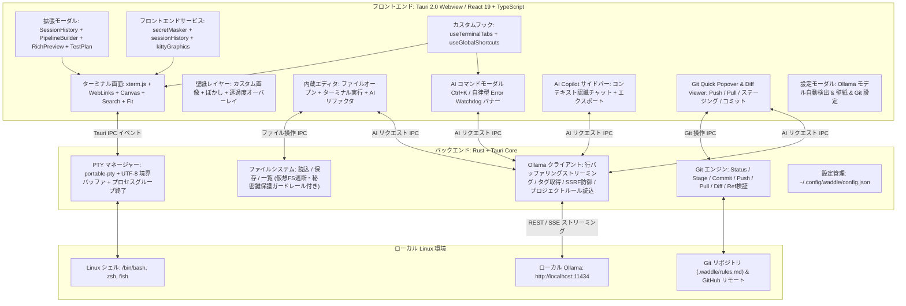

# 🏗️ Waddle アーキテクチャ & システム設計仕様書 (Architecture Guide)

本ドキュメントは、**Waddle** のシステムアーキテクチャ、各サブシステムの詳細設計、プロセスライフサイクル管理、および技術スタックを解説する設計資料です。

---

## 🏛️ システム全体構成図 (Mermaid)



---

## 🧩 アーキテクチャ階層

Waddle は、高速・堅牢な **Rust バックエンド** と、最新の **React 19 + TypeScript フロントエンド** を **Tauri v2** で統合したハイブリッド設計を採用しています。

### 1. プレゼンテーション層 (フロントエンド)
- **基盤**: React 19 + TypeScript + Vite 7。
- **ターミナルコア**:
  - `@xterm/xterm` (v5): VT100 / xterm 標準準拠のエミュレータ。
  - `@xterm/addon-canvas`: 2D Canvas による高速レンダラー。GPU シェーダーコンパイル待ちがなく、透過ウィンドウでも安定動作。
  - `@xterm/addon-search`: ログスクロールバックのリアルタイム検索。
  - `@xterm/addon-fit`: 親コンテナサイズへの自動文字枠再計算。
  - `@xterm/addon-web-links`: URL リンクの自動認識とクリックオープン。
- **フロントエンドサービス & 拡張サブシステム**:
  - `src/services/secretMasker.ts`: ターミナル出力中の API キーやアクセストークンを正規表現でリアルタイム検知・マスク。
  - `src/services/sessionHistory.ts`: コマンド履歴、終了ステータス、CWD、ターミナル出力スナップショットの追跡と `localStorage` 永続化。
  - `src/services/kittyGraphics/`: Kitty Graphics Protocol（APC パース、テクスチャ管理、256MB LRU キャッシュ、アニメーションループ、Unicode プレースホルダー豆腐抑止）。
- **モーダル & ビジュアルツール**:
  - `SessionHistoryModal.tsx`: セッションタイムトラベル & 履歴復元 (`Ctrl+Shift+H`)。
  - `PipelineBuilderModal.tsx`: ビジュアルパイプラインビルダー (`Ctrl+Shift+P`)。
  - `RichPreviewModal.tsx`: Markdown 組版、CSV ソート・検索テーブル、JSON 折りたたみツリープレビュー。
  - `TestPlanModal.tsx`: 87項目・10スイートのリアルタイム合否判定 & エビデンス記録フォーム。
- **状態管理**:
  - `useTerminalTabs`: タブ・ペイン構成、分割比率、ズーム状態、および `localStorage` への自動永続化を統括。
  - `useGlobalShortcuts`: アプリ全域のキーボードショートカット集中管理。

### 2. IPC & ブリッジ層 (Tauri v2)
- **イベント & コマンド**:
  - `invoke` による非同期コマンド呼び出しと、高速イベントストリーム（`pty:data:{session_id}`, `pty:exit:{session_id}`）。
  - Tauri カスタム URI スキーム (`asset://`) によるローカル画像ストリーミング。

### 3. ネイティブサービス層 (Rust バックエンド)
- **非同期ランタイム**: Tokio マルチスレッドランタイム。
- **主要モジュール**:
  - `pty.rs`: 疑似端末（PTY）の生成、出力コアレッシング、UTF-8 境界処理、プロセスグループ管理、Git Branch Ref 検証。
  - `ai.rs`: Ollama HTTP 通信、行バッファリング SSE デコード、プロンプト生成、危険コマンド判定、SSRF クラウドメタデータ遮断、2段階階層 AI ルール解決（上位ディレクトリ走査によるプロジェクト個別 `.waddle/rules_ja.md` / `rules.md` 探索 ＆ `~/.config/waddle/` グローバル共通ルール自動初期化・フォールバック）。
  - `config.rs`: `~/.config/waddle/config.json` のアトミック保存、壁紙管理。
  - `kitty.rs`: パス正規化・サンドボックス脱出遮断・展開爆弾対策・Base64 エンコード・一時ファイル自動削除。
  - `lib.rs`: コマンドルーティング、仮想ファイルシステム走査遮断 (`/proc`, `/sys`, `/dev`)、SSH/GPG/Keyring 秘密鍵アクセス拒否、Git 操作。

---

## ⚙️ 各サブシステムの詳細仕様

### 1. PTY マネージャー & プロセスライフサイクル (`src-tauri/src/pty.rs`)

```
+-------------------------------------------------------------+
|                      Rust PTY サブシステム                  |
|                                                             |
|  [portable-pty] ---> [32KB バッファ] ---> [UTF-8 境界処理]  |
|    Master/Slave       出力リーダー         バイト繰り越し   |
|         |                                      |            |
|         v                                      v            |
|   [子プロセス]                            [Tauri IPC]       |
|  (/bin/bash 等)                          pty:data イベント  |
+-------------------------------------------------------------+
```

- **Master/Slave PTY の生成**:
  - `portable_pty::native_pty_system()` により POSIX 疑似端末を確保。
  - `$SHELL` や `/etc/passwd` からユーザーの標準シェル（bash, zsh, fish 等）を解決。
- **32KB 出力コアレッシング**:
  - `cat large_file.log` や大量ビルドログ出力時、32KB バッファでまとめて読み込み、1つの IPC イベントとしてフロントエンドへ転送。UI イベントループの飽和を防ぎ、0ms のキー入力応答性を維持。
- **マルチバイト UTF-8 境界保護**:
  - 読み込みバッファの端でマルチバイト文字（日本語は3バイト、絵文字は4バイト）が途中で分割された場合、`std::str::from_utf8` の `valid_up_to` を利用。完全な文字までを即座に送信し、未完成な末尾バイトは内部バッファに保持して次回の読み出し先頭に結合。
  - これにより、日本語や絵文字の文字化け（`\u{FFFD}`）を完全防止。
- **カーネル協調バックプレッシャー流量制御 (`pause_pty`/`resume_pty`)**:
  - xterm.js の内部未描画バッファ（`_pendingData`）を常時監視。
  - `_pendingData > 256KB` に達した際、`pause_pty` を呼び出して Tokio PTY リーダースレッドを一時停止。
  - Linux カーネルの PTY マスターバッファ（約 64KB）が自然に満杯となり、OS カーネルがデータ生成側プロセス（`yes`、無限ループスクリプト等）の `write()` システムコールを `TASK_INTERRUPTIBLE` スリープへ自動遷移。
  - xterm.js の描画コールバックが完了し未消化データが 64KB を下回った時点で `resume_pty` を呼び出してリーダースレッドを再開。
  - IPC キューの飽和を完全に防ぎ、アプリの常駐メモリ（RES）を **266MB〜305MB** でフラットに頭打ちに制限（1.5GB から約 80% 削減）。
- **0ms `Ctrl+C` 瞬時キューパージ**:
  - `\x03`（SIGINT）受信時、xterm 内部の `_writeBuffer`、`_callbacks`、`_pendingData` を 0ms で完全クリア。
  - Rust リーダー側で直後の飽和チャンクを破棄し、フロントエンド側でも直後 150ms に届く IPC 滞留巨大チャンク（>256B）をドロップ。
  - **60ms 以内**にプロンプトへ復帰し、CPU 使用率も 231% から **0.7%〜1.3%** へ瞬時に急降下。
- **60 FPS 飽和時ペーシング**:
  - 32KB 満杯の連続ストリーム時、リーダースレッドが 16〜20ms（60 FPS）でペーシング制御を実施。キー入力等の対話的コマンド（< 32KB）は 0ms 即時応答を維持。
- **プロセスグループ終了 & ゾンビ化防止**:
  - PTY プロセスは専用のプロセスグループ（`setpgid`）として起動。
  - タブやペインのクローズ時、負の PID（`-pid`）に対して `libc::kill(-pid, SIGHUP)` を送信し、プロセスグループ全体を一括終了。
  - 150ms 以内に終了しない場合は `SIGTERM`、さらに `SIGKILL` を送信し、バックグラウンドの子プロセス（node, python, less 等）のゾンビ化を完全防止。
- **`/proc/<pid>/cwd` による CWD リアルタイム追跡**:
  - Linux の `/proc/{child_pid}/cwd` シンボリックリンクを読み取ることで、シェルの `cd` 移動をリアルタイム検出。
  - シェル設定ファイルへのフック追記や特殊エスケープシーケンスは一切不要。

---

### 2. Ollama AI ストリーミングサブシステム (`src-tauri/src/ai.rs`)

- **通信仕様**:
  - `http://localhost:11434` へ直接 HTTP 接続（接続タイムアウト 3秒、読み取りタイムアウト 60秒）。
- **行バッファリング SSE アセンブラ**:
  - TCP パケット境界で JSON 行が途中で切断されても、改行コード（`\n`）が届くまでバッファに蓄積してから `serde_json::from_str` でパース。
  - トークンの脱落や JSON 破損を完全防止。
- **64KB バッファガード**:
  - 改行のない長大データによるメモリ枯渇（DoS）を防ぐ 64KB リミットを設置。

---

### 3. Git サブシステム (`src-tauri/src/lib.rs`)

- **非同期分離**:
  - `tokio::task::spawn_blocking` で実行し、Tokio のメインワーカーをブロックしない設計。
- **ロック競合防止**:
  - バックグラウンド取得時は `GIT_OPTIONAL_LOCKS=0` と `--no-optional-locks` を指定し、ユーザーの手動 Git コマンドとの index.lock 競合を防止。
- **非対話実行**:
  - `GIT_TERMINAL_PROMPT=0` を指定し、認証待ちで GUI がフリーズする問題を防止。
- **リモート検証**:
  - `git remote -v` を検査し、GitHub 限定ポリシー有効時は非 GitHub へのプッシュ/プルを事前遮断。

---

### 4. 設定・ストレージサブシステム (`src-tauri/src/config.rs`)

- **設定ファイルの場所**:
  - XDG 標準準拠の `~/.config/waddle/config.json`。
- **アトミック書き込み**:
  - 一時ファイル (`config.json.tmp`) に書き出してからアトミックにリネーム置換を行い、クラッシュ時のファイル破損を防止。
- **壁紙アセットプロトコル**:
  - 画像は `~/.config/waddle/wallpapers/` に実体保存。
  - Tauri の `assetProtocol.scope` を `$CONFIG/waddle/**/*`、`$PICTURE/**/*`、`$DOWNLOAD/**/*` に厳密限定。

---

### 5. Kitty 画像プロトコルサブシステム & Canvas 描画パイプライン (`src-tauri/src/kitty.rs` & `src/services/kittyGraphics/`)

```
+---------------------------------------------------------------------------------+
|                    Kitty Graphics パイプライン アーキテクチャ                   |
|                                                                                 |
|  [PTY 出力ストリーム]                                                           |
|          |                                                                      |
|          v                                                                      |
|  [KittyApcParser] ---> 通常ターミナル文字列 ---------> [xterm.js term.write()] |
|          |                                                    |                 |
|          | APC シーケンス (\x1b_G...;)                        |                 |
|          v                                                    v                 |
|  [KittyGraphicsManager]                                [.xterm-screen]          |
|    |            |                                             |                 |
|    | 照会 a=q   | 転送・描画 a=T, a=t, a=p                    |                 |
|    |            v                                             |                 |
|    |    [KittyDecoder]                                        |                 |
|    |      - ダイレクト Base64 (f=100 PNG, f=32 RGBA, f=24 RGB) |                 |
|    |      - ローカルファイル参照 (t=f via Tauri Command)      |                 |
|    |            |                                             |                 |
|    |            v                                             |                 |
|    |    [KittyLruCache] (256MB上限, 破棄時 bitmap.close())    |                 |
|    |            |                                             |                 |
|    |            v                                             |                 |
|    |    [CanvasOverlay] <-------------------------------------+                 |
|    |    描画順: [壁紙] -> [Kitty 画像] -> [テキスト層] -> [カーソル層]          |
|    |                                                                            |
|    v (即時レスポンス書き戻し)                                                   |
|  [TauriApi.writePty("\x1b_Gi=<id>;OK\x1b\")]                                    |
+---------------------------------------------------------------------------------+
```

- **遅延ゼロのストリーム事前分離 & 0ms Rust PTY 機能ハンドシェイク (`kitten icat` 完全連携)**:
  - 数MBに及ぶ Base64 画像データを含む APC エスケープシーケンス (`\x1b_G...`) を xterm 到達前にインターセプト。
  - 抽出後の通常テキストのみを `term.write()` へ送ることで、xterm パーサーの負荷とターミナルの描画遅延を防止。
  - **超低遅延 PTY クエリ即時応答 & 公式 `kitten` 準拠**: Rust PTY バックグラウンド読み込みループ（`process_kitty_output`）が機能問い合わせ（`a=q`）を直接検知し、即座に大文字 `\x1b_Gi=<id>;OK\x1b\` を子プロセス stdin に 0ms で返送。Kitty 公式 Go 実装（`DetectSupport`）の `g.ResponseMessage() == "OK"` に厳格準拠し、`kitten icat` や `fastfetch` でのタイムアウトを完全解消。
  - **DA1 (`\x1b[c`) ゼロ遅延エミュレーション**: プローブ終端で送信されるプライマリデバイス属性問い合わせに `\x1b[?62;4;22c` を即時返信し、ハンドシェイクを 0ms で完了。
  - **動的ピクセル解像度同期 (`TIOCGWINSZ`)**: xterm.js の実際のフォント・セル描画寸法（`cellWidth`, `cellHeight`）に基づき、カーネルの PTY ウィンドウ構造体へ `pixel_width` および `pixel_height`（`cols * cellWidth`, `rows * cellHeight`）をリアルタイム通知。`kitten icat` のグリッド計算や `--place` 配置を正常化。
  - **共有メモリ (`t=s`, `/dev/shm`) の意図的無効化**: サンドボックス境界侵犯・メモリ汚染 DoS を防ぐため、共有メモリのプローブ（`t=s`）は意図的に未応答とし、安全な Base64 (`t=d`) およびセキュア一時ファイル (`t=t`) へフォールバック。高FPS動画の生メモリ再生はセキュリティ確保のため割り切った設計を採用。
- **Web 標準 zlib / Deflate 圧縮解凍 (`o=z`)**:
  - `KittyDecoder` 内で Web 標準の `DecompressionStream('deflate')`（および `'deflate-raw'`）を活用したネイティブ解凍を実装。
  - `fastfetch`（`"type": "kitty"`）等が送信する zlib 圧縮画像ストリーム（`o=z`）を自動検知して高速解凍。
  - 解凍データ長に対する厳格な上限ガード（`maxPayloadBytes`、デフォルト 16 MB）を適用し、圧縮爆弾によるメモリ枯渇を防止。
- **厳格なパス正規化とディレクトリサンドボックス**:
  - `t=f` 指定時、Rust 側で `std::fs::canonicalize` による `$HOME/Pictures` プレフィックス検証を実施。
  - `../` による脱出やサンドボックス外を指すシンボリックリンク経由のアクセスを `EACCES` / `ENOENT` で遮断。
- **展開爆弾防御**:
  - 最大解像度を 4096×4096 px に制限。PNG IHDR / JPEG SOF ヘッダーをデコード前にチェックし、超過画像を破棄。
- **LRU テクスチャキャッシュ & GPU VRAM 管理**:
  - キャッシュ総枠を 256 MB (RGBA 4bytes/px 換算) で管理し、超過時は古い画像から退避。
  - WebKitGTK および GPU メモリリークを防止するため、破棄時および削除時 (`a=d`) に必ず明示的に `ImageBitmap.close()` を呼び出し。
- **レイヤー合成順序 & Canvas 積層アーキテクチャ**:
  - `.xterm-screen` 内において、`TextRenderLayer`（`zIndex: 0`）の直上、かつ `SelectionRenderLayer`（DOM 順で `zIndex: 1`）および `CursorRenderLayer`（`zIndex: 3`）の手前に `zIndex: 1` でグラフィックスキャンバスをマウント。
  - 再マウントやレイアウト変更時には既存の `.xterm-kitty-graphics-layer` を DOM から確実にパージし、常に単一のアクティブな描画キャンバスを維持してゴースト重複描画を根絶。
  - **Unicode プレースホルダー排他描画パス (`U+10EEEE`)**: xterm v5 の `MutableDisposable` 構造（`_renderer.value`）から真の `CanvasRenderer` を解決し、`TextRenderLayer.prototype._drawForeground` をインターセプト。セル走査ループ内でプレースホルダーテクスチャを直接描画し、フォントグリフ検索・アトラスラスタライズをスキップすることで豆腐文字の発生を完全に抑止。`BaseRenderLayer` や `CursorRenderLayer` との多層防御連携を実現。
- **アニメーション GIF & 差分フレーム合成アーキテクチャ (`a=f`, `a=a`)**:
  - **32-bit RGBA 厳格フォーマット自動判定**: 基底画像（`a=T`）が 24-bit RGB（`f=24`）であっても、Kitty 仕様上差分フレーム（`a=f`）はアルファ透過合成を行うためデフォルトで 32-bit RGBA（`f=32`）となります。ペイロードバイト長とピクセル数の積（$S = s \times v \times 4$）から数学的に判定し、ストライドのスキューや白黒砂嵐ノイズのない正確な RGBA デコードを保証。
  - **サブ矩形差分合成**: 差分フレームの矩形パッチ（`x, y, s, v`）を指定された基底/直前フレーム（`c=<frame_index>`）へ OffscreenCanvas 上でアルファ合成（`ctx.drawImage`）し、メモリリークのない ImageBitmap ライフサイクル管理下で連続フレームを生成。
  - **グラフィックス専用更新ループ (60 FPS)**: `advanceFrame` において文字レイヤーの全行再描画（`term.refresh()`）を伴わず、Kitty レイヤーのみを直接再描画することで CPU 負荷を最小化。
  - **ANSI CSI カーソル移動追従**: 画像出力直前の `CUF`（`\x1b[..C`）、`CUB`（`\x1b[..D`）、`CHA`（`\x1b[..G`）等の CSI コードを正確に解釈し、改行回り込みを起こさず目的のセル列に画像をアンカー。

---

### 6. ファイルシステム & 簡易エディタ サブシステム

- **上限付きディレクトリ走査 & 動的ページネーション (`read_directory`)**:
  - `read_directory(path, show_hidden, limit)` は `DirectoryListing { entries, total_count, has_more }` を返却。
  - デフォルト 500 件の上限ガードにより、`node_modules` や `/usr/bin` などの巨大ディレクトリ展開時でも WebKitGTK DOM のメモリ肥大化を完全防止。
  - クライアント側からインタラクティブな `[+] さらに読み込む (残り N 件)...` ボタン経由で +500 件ずつ動的オンデマンド展開が可能。
- **デュアルレイヤー方式シンタックスハイライト**:
  - Prism.js による構文着色済み `<pre>` 背景レイヤーの上に、透明テキストの編集可能 `<textarea>`（`-webkit-text-fill-color: transparent !important;`）を 1:1 ピクセル完全一致で重ね合わせ。
  - 重量級リッチテキストエンジンを介さず、ネイティブのゼロ遅延タイピング速度を保ちながら 15 言語以上のシンタックスハイライト描画を実現。

---

## 💻 技術スタック一覧

| レイヤー | 使用技術 / クレート / ライブラリ | 役割・用途 |
| :--- | :--- | :--- |
| **フレームワーク** | [Tauri 2.0](https://tauri.app/) | デスクトップアプリ基盤（Webview + Rust） |
| **バックエンド言語** | [Rust](https://www.rust-lang.org/) (2021 edition) | 低レイヤ制御・安全性・超高速処理 |
| **PTY 管理** | `portable-pty` | クロスプラットフォーム疑似端末（PTY）制御 |
| **非同期ランタイム** | `tokio` (v1) | マルチスレッド非同期 I/O・タスクスケジューリング |
| **HTTP クライアント** | `reqwest` (v0.12) | ローカル Ollama API との非同期通信 |
| **POSIX 制御** | `libc` | プロセスグループシグナル送信 (`SIGHUP`, `SIGTERM`, `SIGKILL`) |
| **シリアライズ** | `serde`, `serde_json` | 設定ファイルおよび JSON ストリームのパース |
| **フロントエンド言語** | [React 19](https://react.dev/) + [TypeScript](https://www.typescriptlang.org/) | UI コンポーネントおよびステート管理 |
| **ビルドツール** | [Vite 7](https://vitejs.dev/) | 高速フロントエンドビルド・開発サーバー |
| **ターミナルコア** | `@xterm/xterm` (v5) | ターミナルエミュレーション |
| **ターミナルアドオン** | `@xterm/addon-canvas` | 2D Canvas によるハードウェア高速描画 |
| | `@xterm/addon-search` | スクロールバックバッファ検索 |
| | `@xterm/addon-fit` | DOM サイズへの自動フィッティング |
| | `@xterm/addon-web-links` | ハイパーリンクの自動検出 |
| **UI・装飾** | `lucide-react`, `react-markdown`, `remark-gfm` | アイコン表示、Markdown 描画 |
| **パッケージング** | Arch Linux PKGBUILD, `pacman` bundle | ネイティブ Linux パッケージ配布 |
