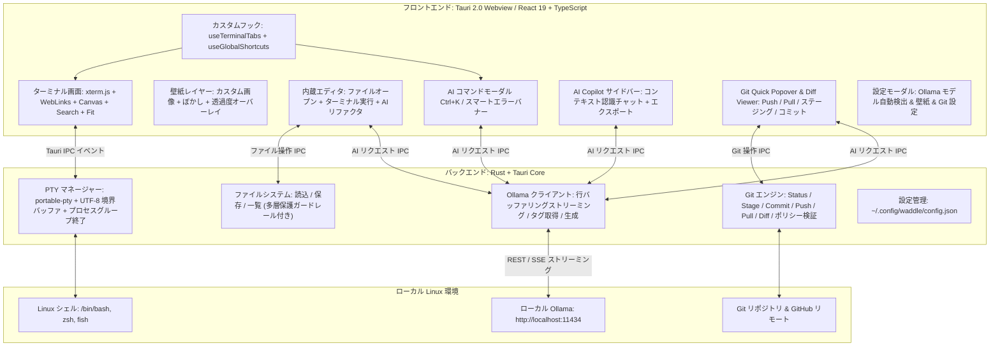

# 🏗️ Waddle アーキテクチャ & システム設計仕様書 (Architecture Guide)

本ドキュメントは、**Waddle** のシステムアーキテクチャ、各サブシステムの詳細設計、プロセスライフサイクル管理、および技術スタックを解説する設計資料です。

---

## 🏛️ システム全体構成図 (Mermaid)



---

## 🧩 アーキテクチャ階層

Waddle は、高速・堅牢な **Rust バックエンド** と、最新の **React 19 + TypeScript フロントエンド** を **Tauri v2** で統合したハイブリッド設計を採用しています。

### 1. プレゼンテーション層 (フロントエンド)
- **基盤**: React 19 + TypeScript + Vite 7。
- **ターミナルコア**:
  - `@xterm/xterm` (v5): VT100 / xterm 標準準拠のエミュレータ。
  - `@xterm/addon-canvas`: 2D Canvas による高速レンダラー。GPU シェーダーコンパイル待ちがなく、透過ウィンドウでも安定動作。
  - `@xterm/addon-search`: ログスクロールバックのリアルタイム検索。
  - `@xterm/addon-fit`: 親コンテナサイズへの自動文字枠再計算。
  - `@xterm/addon-web-links`: URL リンクの自動認識とクリックオープン。
- **状態管理**:
  - `useTerminalTabs`: タブ・ペイン構成、分割比率、ズーム状態、および `localStorage` への自動永続化を統括。
  - `useGlobalShortcuts`: アプリ全域のキーボードショートカット集中管理。

### 2. IPC & ブリッジ層 (Tauri v2)
- **イベント & コマンド**:
  - `invoke` による非同期コマンド呼び出しと、高速イベントストリーム（`pty:data:{session_id}`, `pty:exit:{session_id}`）。
  - Tauri カスタム URI スキーム (`asset://`) によるローカル画像ストリーミング。

### 3. ネイティブサービス層 (Rust バックエンド)
- **非同期ランタイム**: Tokio マルチスレッドランタイム。
- **主要モジュール**:
  - `pty.rs`: 疑似端末（PTY）の生成、出力コアレッシング、UTF-8 境界処理、プロセスグループ管理。
  - `ai.rs`: Ollama HTTP 通信、行バッファリング SSE デコード、プロンプト生成、危険コマンド判定。
  - `config.rs`: `~/.config/waddle/config.json` のアトミック保存、壁紙管理。
  - `kitty.rs`: パス正規化・サンドボックス脱出遮断・展開爆弾対策・Base64 エンコードを備えた安全なローカル画像リーダー。
  - `lib.rs`: コマンドルーティング、ファイル操作ガードレール、Git 操作。

---

## ⚙️ 各サブシステムの詳細仕様

### 1. PTY マネージャー & プロセスライフサイクル (`src-tauri/src/pty.rs`)

```
+-------------------------------------------------------------+
|                      Rust PTY サブシステム                  |
|                                                             |
|  [portable-pty] ---> [32KB バッファ] ---> [UTF-8 境界処理]  |
|    Master/Slave       出力リーダー         バイト繰り越し   |
|         |                                      |            |
|         v                                      v            |
|   [子プロセス]                            [Tauri IPC]       |
|  (/bin/bash 等)                          pty:data イベント  |
+-------------------------------------------------------------+
```

- **Master/Slave PTY の生成**:
  - `portable_pty::native_pty_system()` により POSIX 疑似端末を確保。
  - `$SHELL` や `/etc/passwd` からユーザーの標準シェル（bash, zsh, fish 等）を解決。
- **32KB 出力コアレッシング**:
  - `cat large_file.log` や大量ビルドログ出力時、32KB バッファでまとめて読み込み、1つの IPC イベントとしてフロントエンドへ転送。UI イベントループの飽和を防ぎ、0ms のキー入力応答性を維持。
- **マルチバイト UTF-8 境界保護**:
  - 読み込みバッファの端でマルチバイト文字（日本語は3バイト、絵文字は4バイト）が途中で分割された場合、`std::str::from_utf8` の `valid_up_to` を利用。完全な文字までを即座に送信し、未完成な末尾バイトは内部バッファに保持して次回の読み出し先頭に結合。
  - これにより、日本語や絵文字の文字化け（`\u{FFFD}`）を完全防止。
- **プロセスグループ終了 & ゾンビ化防止**:
  - PTY プロセスは専用のプロセスグループ（`setpgid`）として起動。
  - タブやペインのクローズ時、負の PID（`-pid`）に対して `libc::kill(-pid, SIGHUP)` を送信し、プロセスグループ全体を一括終了。
  - 150ms 以内に終了しない場合は `SIGTERM`、さらに `SIGKILL` を送信し、バックグラウンドの子プロセス（node, python, less 等）のゾンビ化を完全防止。
- **`/proc/<pid>/cwd` による CWD リアルタイム追跡**:
  - Linux の `/proc/{child_pid}/cwd` シンボリックリンクを読み取ることで、シェルの `cd` 移動をリアルタイム検出。
  - シェル設定ファイルへのフック追記や特殊エスケープシーケンスは一切不要。

---

### 2. Ollama AI ストリーミングサブシステム (`src-tauri/src/ai.rs`)

- **通信仕様**:
  - `http://localhost:11434` へ直接 HTTP 接続（接続タイムアウト 3秒、読み取りタイムアウト 60秒）。
- **行バッファリング SSE アセンブラ**:
  - TCP パケット境界で JSON 行が途中で切断されても、改行コード（`\n`）が届くまでバッファに蓄積してから `serde_json::from_str` でパース。
  - トークンの脱落や JSON 破損を完全防止。
- **64KB バッファガード**:
  - 改行のない長大データによるメモリ枯渇（DoS）を防ぐ 64KB リミットを設置。

---

### 3. Git サブシステム (`src-tauri/src/lib.rs`)

- **非同期分離**:
  - `tokio::task::spawn_blocking` で実行し、Tokio のメインワーカーをブロックしない設計。
- **ロック競合防止**:
  - バックグラウンド取得時は `GIT_OPTIONAL_LOCKS=0` と `--no-optional-locks` を指定し、ユーザーの手動 Git コマンドとの index.lock 競合を防止。
- **非対話実行**:
  - `GIT_TERMINAL_PROMPT=0` を指定し、認証待ちで GUI がフリーズする問題を防止。
- **リモート検証**:
  - `git remote -v` を検査し、GitHub 限定ポリシー有効時は非 GitHub へのプッシュ/プルを事前遮断。

---

### 4. 設定・ストレージサブシステム (`src-tauri/src/config.rs`)

- **設定ファイルの場所**:
  - XDG 標準準拠の `~/.config/waddle/config.json`。
- **アトミック書き込み**:
  - 一時ファイル (`config.json.tmp`) に書き出してからアトミックにリネーム置換を行い、クラッシュ時のファイル破損を防止。
- **壁紙アセットプロトコル**:
  - 画像は `~/.config/waddle/wallpapers/` に実体保存。
  - Tauri の `assetProtocol.scope` を `$CONFIG/waddle/**/*`、`$PICTURE/**/*`、`$DOWNLOAD/**/*` に厳密限定。

---

### 5. Kitty 画像プロトコルサブシステム & Canvas 描画パイプライン (`src-tauri/src/kitty.rs` & `src/services/kittyGraphics/`)

```
+---------------------------------------------------------------------------------+
|                    Kitty Graphics パイプライン アーキテクチャ                   |
|                                                                                 |
|  [PTY 出力ストリーム]                                                           |
|          |                                                                      |
|          v                                                                      |
|  [KittyApcParser] ---> 通常ターミナル文字列 ---------> [xterm.js term.write()] |
|          |                                                    |                 |
|          | APC シーケンス (\x1b_G...;)                        |                 |
|          v                                                    v                 |
|  [KittyGraphicsManager]                                [.xterm-screen]          |
|    |            |                                             |                 |
|    | 照会 a=q   | 転送・描画 a=T, a=t, a=p                    |                 |
|    |            v                                             |                 |
|    |    [KittyDecoder]                                        |                 |
|    |      - ダイレクト Base64 (f=100 PNG, f=32 RGBA, f=24 RGB) |                 |
|    |      - ローカルファイル参照 (t=f via Tauri Command)      |                 |
|    |            |                                             |                 |
|    |            v                                             |                 |
|    |    [KittyLruCache] (256MB上限, 破棄時 bitmap.close())    |                 |
|    |            |                                             |                 |
|    |            v                                             |                 |
|    |    [CanvasOverlay] <-------------------------------------+                 |
|    |    描画順: [壁紙] -> [Kitty 画像] -> [テキスト層] -> [カーソル層]          |
|    |                                                                            |
|    v (即時レスポンス書き戻し)                                                   |
|  [TauriApi.writePty("\x1b_Gi=<id>;OK\x1b\")]                                    |
+---------------------------------------------------------------------------------+
```

- **遅延ゼロのストリーム事前分離**:
  - 数MBに及ぶ Base64 画像データを含む APC エスケープシーケンス (`\x1b_G...`) を xterm 到達前にインターセプト。
  - 抽出後の通常テキストのみを `term.write()` へ送ることで、xterm パーサーの負荷とターミナルの描画遅延を防止。
- **厳格なパス正規化とディレクトリサンドボックス**:
  - `t=f` 指定時、Rust 側で `std::fs::canonicalize` による `$HOME/Pictures` プレフィックス検証を実施。
  - `../` による脱出やサンドボックス外を指すシンボリックリンク経由のアクセスを `EACCES` / `ENOENT` で遮断。
- **展開爆弾防御**:
  - 最大解像度を 4096×4096 px に制限。PNG IHDR / JPEG SOF ヘッダーをデコード前にチェックし、超過画像を破棄。
- **LRU テクスチャキャッシュ & GPU VRAM 管理**:
  - キャッシュ総枠を 256 MB (RGBA 4bytes/px 換算) で管理し、超過時は古い画像から退避。
  - WebKitGTK および GPU メモリリークを防止するため、破棄時および削除時 (`a=d`) に必ず明示的に `ImageBitmap.close()` を呼び出し。
- **レイヤー合成順序**:
  - `.xterm-screen` 内の最背面（TextRenderLayer の手前）にキャンバスをマウント。
  - 合成順序: **ターミナル背景/壁紙 → Kitty 画像レイヤー → セルテキスト/グリフレイヤー → カーソルレイヤー**。

---

## 💻 技術スタック一覧

| レイヤー | 使用技術 / クレート / ライブラリ | 役割・用途 |
| :--- | :--- | :--- |
| **フレームワーク** | [Tauri 2.0](https://tauri.app/) | デスクトップアプリ基盤（Webview + Rust） |
| **バックエンド言語** | [Rust](https://www.rust-lang.org/) (2021 edition) | 低レイヤ制御・安全性・超高速処理 |
| **PTY 管理** | `portable-pty` | クロスプラットフォーム疑似端末（PTY）制御 |
| **非同期ランタイム** | `tokio` (v1) | マルチスレッド非同期 I/O・タスクスケジューリング |
| **HTTP クライアント** | `reqwest` (v0.12) | ローカル Ollama API との非同期通信 |
| **POSIX 制御** | `libc` | プロセスグループシグナル送信 (`SIGHUP`, `SIGTERM`, `SIGKILL`) |
| **シリアライズ** | `serde`, `serde_json` | 設定ファイルおよび JSON ストリームのパース |
| **フロントエンド言語** | [React 19](https://react.dev/) + [TypeScript](https://www.typescriptlang.org/) | UI コンポーネントおよびステート管理 |
| **ビルドツール** | [Vite 7](https://vitejs.dev/) | 高速フロントエンドビルド・開発サーバー |
| **ターミナルコア** | `@xterm/xterm` (v5) | ターミナルエミュレーション |
| **ターミナルアドオン** | `@xterm/addon-canvas` | 2D Canvas によるハードウェア高速描画 |
| | `@xterm/addon-search` | スクロールバックバッファ検索 |
| | `@xterm/addon-fit` | DOM サイズへの自動フィッティング |
| | `@xterm/addon-web-links` | ハイパーリンクの自動検出 |
| **UI・装飾** | `lucide-react`, `react-markdown`, `remark-gfm` | アイコン表示、Markdown 描画 |
| **パッケージング** | Arch Linux PKGBUILD, `pacman` bundle | ネイティブ Linux パッケージ配布 |
