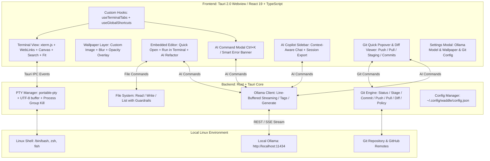

# 🏗️ Waddle Architecture & Technical Specifications

This document outlines the system architecture, subsystem designs, process lifecycle management, and core technical stack of **Waddle**.

---

## 🏛️ High-Level Architecture Diagram



---

## 🧩 Architectural Layers

Waddle is built on a hybrid architecture combining a high-performance **Rust backend** with a reactive **React 19 frontend** hosted within **Tauri v2**.

### 1. Presentation Layer (Frontend)
- **Framework**: React 19 with TypeScript and Vite.
- **Rendering Engines**:
  - `@xterm/xterm` (v5): High-performance VT100/xterm terminal emulator core.
  - `@xterm/addon-canvas`: 2D Canvas renderer providing hardware-accelerated text rendering with transparent window support, eliminating GPU shader compilation stalls.
  - `@xterm/addon-search`: Hardware-accelerated terminal scrollback buffer search.
  - `@xterm/addon-fit`: Responsive dimension calculation matching parent DOM geometry.
  - `@xterm/addon-web-links`: Automatic detection and click navigation for HTTP/HTTPS URLs.
- **State Management**:
  - `useTerminalTabs`: Manages tab hierarchies, multi-pane layouts, zoom state, dynamic split ratios, and automatic session persistence to `localStorage`.
  - `useGlobalShortcuts`: Centralized keybinding dispatcher with focus-aware bubbling prevention.

### 2. IPC & Bridge Layer (Tauri v2)
- **Events & Invocations**:
  - Asynchronous bidirectional communication via Tauri `invoke` and event emitters (`pty:data:{session_id}`, `pty:exit:{session_id}`).
  - Tauri custom URI scheme (`asset://`) for high-speed local image streaming without Base64 overhead.

### 3. Native Services Layer (Rust Backend)
- **Runtime**: Tokio multi-threaded asynchronous runtime.
- **Subsystem Modules**:
  - `pty.rs`: Pseudo-terminal allocation, output stream coalescing, UTF-8 decoders, and process group lifecycle control.
  - `ai.rs`: Ollama HTTP client, line-buffered SSE chunk assembly, prompt templates, and dangerous command detection engine.
  - `config.rs`: Atomic read/write operations for `~/.config/waddle/config.json`, wallpaper management, and legacy migration.
  - `lib.rs`: Tauri command router, directory traversal, file operations with prefix guards, and Git CLI wrappers.

---

## ⚙️ Deep-Dive Subsystem Specifications

### 1. PTY Management & Process Lifecycle (`src-tauri/src/pty.rs`)

```
+-------------------------------------------------------------+
|                      Rust PTY Subsystem                     |
|                                                             |
|  [portable-pty] ---> [32KB Buffer] ---> [UTF-8 Boundary]    |
|   Master/Slave       Output Reader      Byte Carry-Over     |
|         |                                      |            |
|         v                                      v            |
|  [Child Shell]                           [Tauri IPC]        |
|  (/bin/bash, etc.)                       pty:data event     |
+-------------------------------------------------------------+
```

- **Master/Slave Allocation**:
  - Uses `portable_pty::native_pty_system()` to allocate POSIX pseudoterminals.
  - Resolves default user shell from `$SHELL` or `/etc/passwd`, defaulting to `/bin/bash`.
- **32KB Buffer Coalescing**:
  - High-throughput terminal output (e.g. `cat large_file.log` or compile jobs) is read in 32KB buffers.
  - Decoded text is emitted as a single coalesced IPC event, avoiding UI event loop saturation while maintaining sub-millisecond keystroke responsiveness.
- **UTF-8 Multi-Byte Boundary Protection**:
  - Read boundaries can split multi-byte UTF-8 codepoints (Japanese characters require 3 bytes, emojis require 4 bytes).
  - If a buffer ends on an incomplete UTF-8 byte sequence, `std::str::from_utf8` reports `valid_up_to`. Valid bytes are emitted immediately, and remainder bytes are held in an accumulator buffer to be prepended to the next read cycle.
  - This eliminates replacement character (`\u{FFFD}`) artifacts.
- **Process Group Termination & Zombie Prevention**:
  - PTY sessions run as a dedicated process group (`setpgid`).
  - Upon closing a tab, pane, or application exit, Waddle sends `libc::kill(-pid, SIGHUP)` to the negative PID (targeting the whole process group).
  - If child processes fail to terminate within 150ms, `SIGTERM` followed by `SIGKILL` is sent, guaranteeing that background processes (e.g. `node`, `python`, `less`) do not leak as zombie processes.
- **CWD Resolution via `/proc/<pid>/cwd`**:
  - Dynamic working directory tracking queries `std::fs::read_link(format!("/proc/{}/cwd", child_pid))`.
  - Non-invasive: requires zero shell hooks, rc-file modifications, or prompt escapes.

---

### 2. Ollama AI Streaming Subsystem (`src-tauri/src/ai.rs`)

- **Connection**:
  - Direct HTTP connection to `http://localhost:11434` (configurable) with a 3-second connection timeout and 60-second read timeout.
- **Chunk Packet Assembly**:
  - Ollama streams newline-delimited JSON objects (`{"response": "...", "done": false}`).
  - When TCP packets split a JSON string in half, naive parsing fails. Waddle implements a line buffer:
    ```rust
    // Accumulate stream chunks into pending buffer
    pending_buffer.push_str(&chunk_str);
    while let Some(pos) = pending_buffer.find('\n') {
        let line = pending_buffer[..pos].trim();
        if !line.is_empty() {
            if let Ok(val) = serde_json::from_str::<OllamaChunk>(line) {
                // emit token to frontend
            }
        }
        pending_buffer.drain(..=pos);
    }
    ```
- **64KB Chunk Buffer Guard**:
  - A 64KB ceiling prevents unbounded memory allocation if a non-compliant server streams data without newline delimiters.

---

### 3. Git Operations Subsystem (`src-tauri/src/lib.rs`)

- **Subprocess Isolation**:
  - Commands execute via `std::process::Command` wrapped in `tokio::task::spawn_blocking` to avoid blocking Tokio worker threads.
- **Lock Contention Prevention**:
  - Runs with `GIT_OPTIONAL_LOCKS=0` and `--no-optional-locks` flags, preventing background status checks from locking index files during active command-line Git operations.
- **Authentication Safety**:
  - Runs with `GIT_TERMINAL_PROMPT=0`, ensuring that operations needing interactive credentials fail immediately with informative feedback rather than freezing the GUI.
- **Remote Inspection**:
  - Inspects `git remote -v` to ensure push/pull operations target GitHub domains when the GitHub-only policy is enabled.

---

### 4. Storage & Configuration Subsystem (`src-tauri/src/config.rs`)

- **Config Location**:
  - Standard XDG location: `~/.config/waddle/config.json`.
- **Atomic File Writes**:
  - Config updates write to a temporary file (`config.json.tmp`) and atomically rename it to `config.json`, preventing corruption during power cuts or abrupt terminations.
- **Wallpaper Asset Protocol**:
  - Wallpapers are stored at `~/.config/waddle/wallpapers/<filename>`.
  - Tauri's `assetProtocol` serves images directly to the Webview over `asset://localhost/...`.
  - Scope is strictly constrained to `$CONFIG/waddle/**/*`, `$PICTURE/**/*`, and `$DOWNLOAD/**/*`.

---

## 💻 Tech Stack Reference Table

| Layer | Technologies / Crates / Libraries | Purpose |
| :--- | :--- | :--- |
| **Framework** | [Tauri 2.0](https://tauri.app/) | Cross-platform desktop application framework |
| **Backend Language** | [Rust](https://www.rust-lang.org/) (2021 edition) | Memory-safe, high-performance systems programming |
| **PTY Management** | `portable-pty` | Cross-platform pseudoterminal allocation |
| **Async Runtime** | `tokio` (v1) | Multi-threaded asynchronous I/O and task scheduling |
| **HTTP Client** | `reqwest` (v0.12) | Asynchronous HTTP client for local Ollama API |
| **POSIX Interop** | `libc` | Process group signaling (`SIGHUP`, `SIGTERM`, `SIGKILL`) |
| **Serialization** | `serde`, `serde_json` | Configuration and JSON stream serialization |
| **Frontend Framework** | [React 19](https://react.dev/) + [TypeScript](https://www.typescriptlang.org/) | User interface and component state management |
| **Build Tool** | [Vite 7](https://vitejs.dev/) | High-speed frontend development and bundler |
| **Terminal Core** | `@xterm/xterm` (v5) | Hardware-accelerated terminal emulation |
| **Terminal Addons** | `@xterm/addon-canvas` | 2D Canvas rendering over transparent background |
| | `@xterm/addon-search` | Scrollback buffer search engine |
| | `@xterm/addon-fit` | Automatic dimension fitting to DOM container |
| | `@xterm/addon-web-links` | Clickable hyperlink navigation |
| **Icons & Markdown** | `lucide-react`, `react-markdown`, `remark-gfm` | Clean UI icons and Markdown formatting |
| **Packaging** | Arch Linux PKGBUILD, `pacman` bundle | Native Linux binary package distribution |
