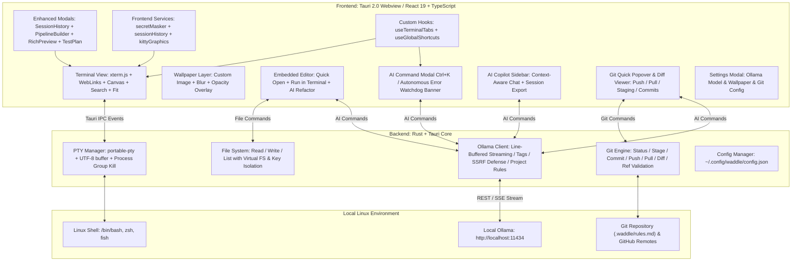
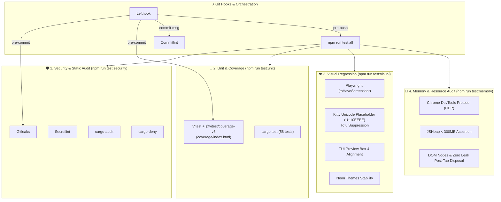
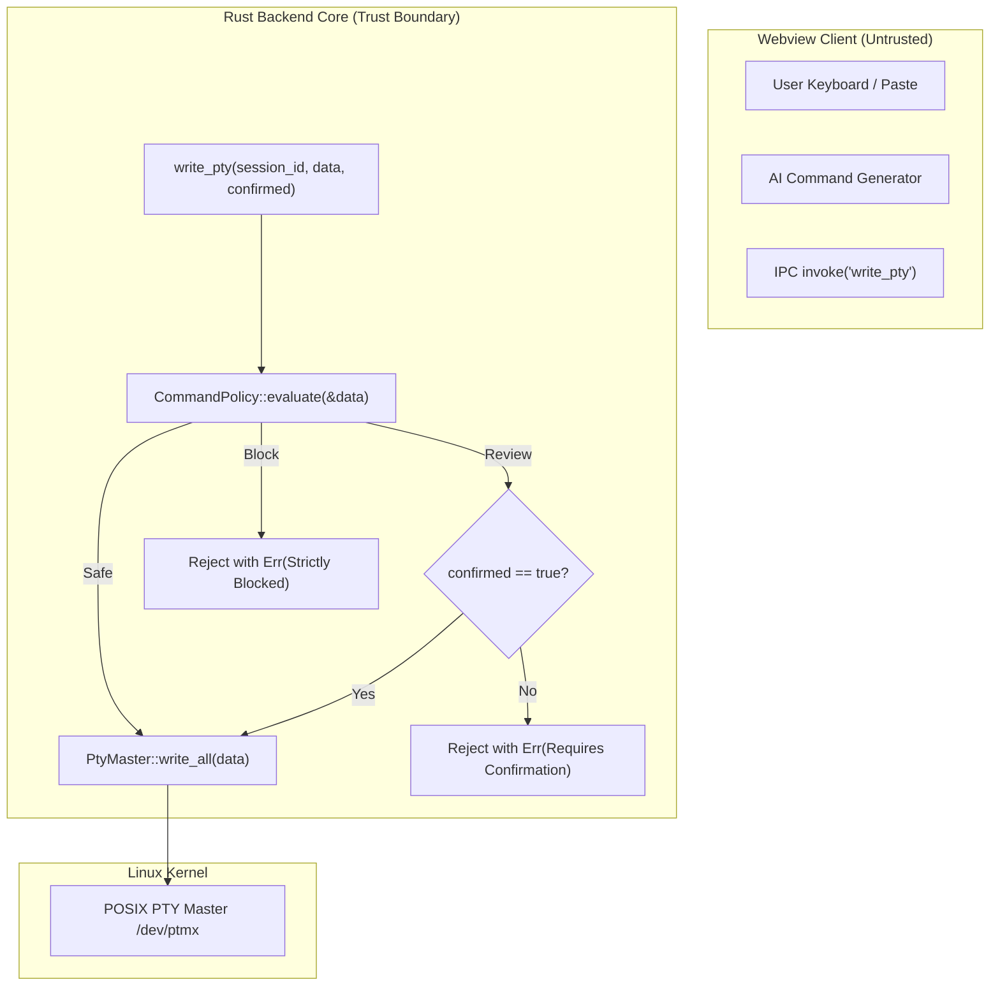

# 🏗️ Waddle Architecture & Technical Specifications

This document outlines the system architecture, subsystem designs, process lifecycle management, and core technical stack of **Waddle**.

---

## 🏛️ High-Level Architecture Diagram



---

## 🧩 Architectural Layers

Waddle is built on a hybrid architecture combining a high-performance **Rust backend** with a reactive **React 19 frontend** hosted within **Tauri v2**.

### 1. Presentation Layer (Frontend)
- **Framework**: React 19 with TypeScript and Vite.
- **Rendering Engines**:
  - `@xterm/xterm` (v5): High-performance VT100/xterm terminal emulator core.
  - `@xterm/addon-canvas`: 2D Canvas renderer providing hardware-accelerated text rendering with transparent window support, eliminating GPU shader compilation stalls.
  - `@xterm/addon-search`: Hardware-accelerated terminal scrollback buffer search.
  - `@xterm/addon-fit`: Responsive dimension calculation matching parent DOM geometry.
  - `@xterm/addon-web-links`: Automatic detection and click navigation for HTTP/HTTPS URLs.
- **Frontend Services & Extended Subsystems**:
  - `src/services/secretMasker.ts`: Real-time regex pattern evaluator masking sensitive credentials (`ghp_...`, `sk-...`, `AKIA...`, JWT, private keys) in the terminal output stream.
  - `src/services/sessionHistory.ts`: Comprehensive command timeline tracking, exit code logging, CWD recording, and `localStorage` snapshot persistence.
  - `src/services/kittyGraphics/`: Full Kitty Graphics Protocol subsystem (APC parser, texture manager, 256MB LRU cache, infinite/counted animation timers, Unicode placeholder tofu suppression).
- **Modals & Visual Tools**:
  - `SessionHistoryModal.tsx`: Time travel session replay and snapshot restoration (`Ctrl+Shift+H`).
  - `PipelineBuilderModal.tsx`: Visual multi-step command chaining and sequential execution (`Ctrl+Shift+P`).
  - `RichPreviewModal.tsx`: Formatted Markdown, sortable/filterable CSV table, and collapsible JSON tree visualizer.
  - `TestPlanModal.tsx`: Interactive verification form for 87 test cases across 10 suites with Markdown/JSON export.
- **State Management**:
  - `useTerminalTabs`: Manages tab hierarchies, multi-pane layouts, zoom state, dynamic split ratios, and automatic session persistence to `localStorage`.
  - `useGlobalShortcuts`: Centralized keybinding dispatcher with focus-aware bubbling prevention.

### 2. IPC & Bridge Layer (Tauri v2)
- **Events & Invocations**:
  - Asynchronous bidirectional communication via Tauri `invoke` and event emitters (`pty:data:{session_id}`, `pty:exit:{session_id}`).
  - Tauri custom URI scheme (`asset://`) for high-speed local image streaming without Base64 overhead.

### 3. Native Services Layer (Rust Backend)
- **Runtime**: Tokio multi-threaded asynchronous runtime.
- **Subsystem Modules**:
  - `pty.rs`: Pseudo-terminal allocation, output stream coalescing, UTF-8 decoders, process group lifecycle control, non-blocking `waitpid` zombie harvesting, and Git branch ref validation.
  - `command_policy.rs`: Absolute Rust-level execution security engine evaluating commands into `Safe`, `Review`, and `Block` tiers before writing to PTY.
  - `ai.rs`: Ollama HTTP client, line-buffered SSE chunk assembly, prompt templates, SSRF/DNS-rebinding protection with synchronous IP verification, redirect prevention, untrusted project rules isolation, and two-tier hierarchical AI rules resolution.
  - `config.rs`: Atomic read/write operations for `~/.config/waddle/config.json`, wallpaper management, and legacy migration.
  - `kitty.rs`: Sandboxed local image reader with path canonicalization, symlink escape checks, decompression bomb defenses, Base64 encoder, and temporary file auto-unlinking.
  - `lib.rs`: Tauri command router, virtual filesystem traversal defense (`/proc`, `/sys`, `/dev`), private key isolation (`~/.ssh`, `~/.gnupg`, `~/.local/share/keyrings`), and Git CLI execution.

---

## ⚙️ Deep-Dive Subsystem Specifications

### 1. PTY Management & Process Lifecycle (`src-tauri/src/pty.rs`)

```
+-------------------------------------------------------------+
|                      Rust PTY Subsystem                     |
|                                                             |
|  [portable-pty] ---> [32KB Buffer] ---> [UTF-8 Boundary]    |
|   Master/Slave       Output Reader      Byte Carry-Over     |
|         |                                      |            |
|         v                                      v            |
|  [Child Shell]                           [Tauri IPC]        |
|  (/bin/bash, etc.)                       pty:data event     |
+-------------------------------------------------------------+
```

- **Master/Slave Allocation**:
  - Uses `portable_pty::native_pty_system()` to allocate POSIX pseudoterminals.
  - Resolves default user shell from `$SHELL` or `/etc/passwd`, defaulting to `/bin/bash`.
- **32KB Buffer Coalescing**:
  - High-throughput terminal output (e.g. `cat large_file.log` or compile jobs) is read in 32KB buffers.
  - Decoded text is emitted as a single coalesced IPC event, avoiding UI event loop saturation while maintaining sub-millisecond keystroke responsiveness.
- **UTF-8 Multi-Byte Boundary Protection**:
  - Read boundaries can split multi-byte UTF-8 codepoints (Japanese characters require 3 bytes, emojis require 4 bytes).
  - If a buffer ends on an incomplete UTF-8 byte sequence, `std::str::from_utf8` reports `valid_up_to`. Valid bytes are emitted immediately, and remainder bytes are held in an accumulator buffer to be prepended to the next read cycle.
  - This eliminates replacement character (`\u{FFFD}`) artifacts.
- **Kernel-Cooperative Backpressure Flow Control (`pause_pty`/`resume_pty`)**:
  - Monitors xterm.js unrendered buffer queue (`_pendingData`).
  - When `_pendingData > 256KB`, triggers `pause_pty`, suspending the Tokio PTY reader thread.
  - The Linux kernel PTY master buffer (~64KB) fills, causing the kernel to place the child producer process (`yes`, unbounded streams) into `TASK_INTERRUPTIBLE` sleep at the `write()` system call level.
  - When xterm.js callbacks finish rendering and drop below 64KB, `resume_pty` awakens the reader thread.
  - Prevents IPC memory runaway, keeping resident memory (RES) bounded to **266MB–305MB** (reducing memory usage by ~80% from 1.5GB).
- **0ms Instant `Ctrl+C` Queue Purge**:
  - `\x03` (SIGINT) input instantly zeroes xterm's internal `_writeBuffer`, `_callbacks`, and `_pendingData` in 0ms.
  - Rust reader discards saturated chunks and terminates child command.
  - Frontend drops in-flight lagging IPC packets (>256B) arriving within 150ms.
  - Restores terminal prompt within **60ms** and returns CPU usage to **0.7%–1.3%**.
- **60 FPS Saturated Output Pacing**:
  - Paces 32KB saturated bursts at 16–20ms (60 FPS) to prevent UI thread lockup while keeping interactive keystrokes at 0ms.
- **Process Group Termination & Non-Blocking Zombie Harvest (`waitpid`)**:
  - PTY sessions run as a dedicated process group (`setpgid`).
  - Upon closing a tab, pane, or application exit, Waddle sends `libc::killpg(pid, SIGHUP)` and `libc::killpg(pid, SIGTERM)` to the process group.
  - If child processes fail to terminate within 150ms, `SIGKILL` is sent, ensuring background processes (e.g. `node`, `python`, `less`) are killed.
  - Furthermore, `pty.rs` runs a non-blocking `libc::waitpid(pid, &mut status, libc::WNOHANG)` zombie harvest loop upon termination, actively sweeping terminated processes from the Linux kernel process table. Verified by a 1,000-cycle stress test with zero zombie processes and zero file descriptor leaks.
- **CWD Resolution via `/proc/<pid>/cwd`**:
  - Dynamic working directory tracking queries `std::fs::read_link(format!("/proc/{}/cwd", child_pid))`.
  - Non-invasive: requires zero shell hooks, rc-file modifications, or prompt escapes.

---

### 2. Ollama AI Streaming Subsystem (`src-tauri/src/ai.rs`)

- **Connection**:
  - Direct HTTP connection to `http://localhost:11434` (configurable) with a 3-second connection timeout and 60-second read timeout.
- **Chunk Packet Assembly**:
  - Ollama streams newline-delimited JSON objects (`{"response": "...", "done": false}`).
  - When TCP packets split a JSON string in half, naive parsing fails. Waddle implements a line buffer:
    ```rust
    // Accumulate stream chunks into pending buffer
    pending_buffer.push_str(&chunk_str);
    while let Some(pos) = pending_buffer.find('\n') {
        let line = pending_buffer[..pos].trim();
        if !line.is_empty() {
            if let Ok(val) = serde_json::from_str::<OllamaChunk>(line) {
                // emit token to frontend
            }
        }
        pending_buffer.drain(..=pos);
    }
    ```
- **64KB Chunk Buffer Guard**:
  - A 64KB ceiling prevents unbounded memory allocation if a non-compliant server streams data without newline delimiters.

---

### 3. Git Operations Subsystem (`src-tauri/src/lib.rs`)

- **Subprocess Isolation**:
  - Commands execute via `std::process::Command` wrapped in `tokio::task::spawn_blocking` to avoid blocking Tokio worker threads.
- **Lock Contention Prevention**:
  - Runs with `GIT_OPTIONAL_LOCKS=0` and `--no-optional-locks` flags, preventing background status checks from locking index files during active command-line Git operations.
- **Authentication Safety**:
  - Runs with `GIT_TERMINAL_PROMPT=0`, ensuring that operations needing interactive credentials fail immediately with informative feedback rather than freezing the GUI.
- **Remote Inspection**:
  - Inspects `git remote -v` to ensure push/pull operations target GitHub domains when the GitHub-only policy is enabled.

---

### 4. Storage & Configuration Subsystem (`src-tauri/src/config.rs`)

- **Config Location**:
  - Standard XDG location: `~/.config/waddle/config.json`.
- **Atomic File Writes**:
  - Config updates write to a temporary file (`config.json.tmp`) and atomically rename it to `config.json`, preventing corruption during power cuts or abrupt terminations.
- **Wallpaper Asset Protocol**:
  - Wallpapers are stored at `~/.config/waddle/wallpapers/<filename>`.
  - Tauri's `assetProtocol` serves images directly to the Webview over `asset://localhost/...`.
  - Scope is strictly constrained to `$CONFIG/waddle/**/*`, `$PICTURE/**/*`, and `$DOWNLOAD/**/*`.

---

### 5. Kitty Graphics Subsystem & Canvas Pipeline (`src-tauri/src/kitty.rs` & `src/services/kittyGraphics/`)

```
+---------------------------------------------------------------------------------+
|                         Kitty Graphics Pipeline Architecture                    |
|                                                                                 |
|  [PTY Output Stream]                                                            |
|          |                                                                      |
|          v                                                                      |
|  [KittyApcParser] ---> Plain Terminal Text ----------> [xterm.js term.write()] |
|          |                                                    |                 |
|          | APC Sequence (\x1b_G...;)                          |                 |
|          v                                                    v                 |
|  [KittyGraphicsManager]                                [.xterm-screen]          |
|    |            |                                             |                 |
|    | Query a=q  | Transmit / Display a=T, a=t, a=p            |                 |
|    |            v                                             |                 |
|    |    [KittyDecoder]                                        |                 |
|    |      - Direct Base64 (f=100 PNG, f=32 RGBA, f=24 RGB)    |                 |
|    |      - Local File Sandbox (t=f via Tauri Command)        |                 |
|    |            |                                             |                 |
|    |            v                                             |                 |
|    |    [KittyLruCache] (256MB Cap, bitmap.close() on evict)  |                 |
|    |            |                                             |                 |
|    |            v                                             |                 |
|    |    [CanvasOverlay] <-------------------------------------+                 |
|    |    Order: [Wallpaper] -> [Kitty Canvas] -> [TextLayer] -> [CursorLayer]    |
|    |                                                                            |
|    v (Immediate reply)                                                          |
|  [TauriApi.writePty("\x1b_Gi=<id>;OK\x1b\")]                                    |
+---------------------------------------------------------------------------------+
```

- **Zero-Lag Stream Separation & 0ms Rust PTY Capability Handshake (Universal Linux TUI/CLI Ecosystem Integration)**:
  - APC escape sequences (`\x1b_G...`) carrying megabytes of Base64 image data are intercepted before reaching `@xterm/xterm`.
  - Stripped text is passed to `term.write()`, preventing parser bottlenecking and terminal lag.
  - **Zero-Latency PTY Query Response & Official `kitten` Compliance**: The Rust PTY background reader (`process_kitty_output`) intercepts capability inquiries (`a=q`) and immediately replies with uppercase `\x1b_Gi=<id>;OK\x1b\` to child stdin with 0ms latency. Strictly satisfies Kitty's Go implementation (`DetectSupport`) check for `g.ResponseMessage() == "OK"`, eliminating probe timeouts in `kitten icat`, `fastfetch`, and CLI tools.
  - **PTY-Level Temporary File Inlining (`t=t` -> `t=d`) for Zero Race Conditions**:
    - CLI tools such as `viu` immediately delete (unlink) temporary files (`/tmp/.tty-graphics-protocol.viuer.*`) upon receiving DSR (`\x1b[5n` -> `\x1b[0n`) before exiting.
    - Because asynchronous frontend file reading encounters `ENOENT` due to this race condition, the PTY reader thread (`src-tauri/src/pty.rs`) intercepts `t=t` commands at the byte stream level and immediately calls `read_and_unlink_temp_file_base64` (`src-tauri/src/kitty.rs`) in Rust memory.
    - Re-writing the payload to Base64 inline data (`t=d`) before forwarding it to the webview completely eliminates file deletion race conditions, guaranteeing 100% reliable instant image rendering.
  - **Protocol Response Policy (`quiet` Key `q` Compliance & TUI Flicker Elimination)**:
    - **Transmit & Display Commands (`a=t`, `a=T`)**: Synchronous clients such as `ranger` block on `self.stdbin.read(1)` waiting for an `OK` reply after sending `draw()`. For commands carrying an explicit image ID (`explicitId > 0`), `manager.ts` synchronously returns `\x1b_Gi=<id>;OK\x1b\` to the PTY, resolving terminal freezes on first-frame preview.
    - **Silent Success for Delete, Place, and Frame Commands (`a=d`, `a=p`, `a=f`, `a=a`)**: Conforms strictly to the official Kitty Graphics Protocol specification where success responses are silent by default (returning `OK` only when `cmd.keys.q === 0` is explicitly requested). Because `ranger`'s `clear()` does not read terminal replies by design, suppressing unnecessary `OK` messages prevents escape sequences from polluting the stdin buffer. This completely eliminates curses event loop misfires where escape codes are parsed as rapid user keystrokes, ending screen flicker loops (`redrawwin`/`refresh`) and UI hangs during rapid file navigation.
  - **Universal CLI / TUI Probes Auto-Detection**:
    - **XTVERSION (`\x1b[>q` / `\x1b[>0q`)**: PTY reader instantly answers with `\x1bP>|kitty(0.35.0)\x1b\`, enabling `timg` to auto-detect Kitty graphics without requiring `-p k`.
    - **DA1 Primary Device Attributes (`\x1b[c` / `\x1b[0c`)**: Emits `\x1b[?62c` cleanly without Sixel capabilities (omitting `;4;`), preventing `viuer` from falling back to Sixel mode.
    - **DSR (`\x1b[5n`)**: Instantly replies with `\x1b[0n` (Terminal OK), completing `viu` status checks in 0ms.
    - **Unicode Placeholder Probe (`\x1b[?996n`)**: Instantly replies with `\x1b[?996;1n` (supported).
    - **Cell Size Query (`\x1b[16t`)**: Instantly replies with `\x1b[6;18;9t` (height 18px, width 9px).
  - **Dynamic Pixel Dimension Synchronization (`TIOCGWINSZ`)**: Propagates actual rendered cell dimensions (`cellWidth`, `cellHeight`) from xterm.js Canvas into the kernel PTY window size structure (`pixel_width`, `pixel_height` as `cols * cellWidth`, `rows * cellHeight`) on every resize, enabling accurate aspect ratio calculations for `kitten icat --place`.
  - **Intentional Omission of Shared Memory (`t=s`, `/dev/shm`)**: Refuses shared memory capability queries (`t=s`) to eliminate memory inspection and OOM denial-of-service attack vectors, smoothly falling back to direct Base64 (`t=d`) and sandboxed temp files (`t=t`). High-FPS video streaming is consciously omitted to uphold an uncompromised sandbox security model.
- **Web Standard zlib / Deflate Decompression (`o=z`)**:
  - Direct native decompression using Web Standard `DecompressionStream('deflate')` (with `'deflate-raw'` fallback) inside `KittyDecoder`.
  - Automatically handles compressed Base64 RGBA/RGB/PNG image streams (`o=z`) from CLI tools like `fastfetch` (`"type": "kitty"`).
  - Enforces strict decompression bomb limits (`maxPayloadBytes`, default 16 MB) with instant stream cancellation upon threshold violation.
- **Strict Path Canonicalization & Directory Jail**:
  - For `t=f`, the Rust backend verifies `$HOME/Pictures` prefix against `std::fs::canonicalize`.
  - Symlink escapes and `../` path traversal are strictly rejected with `EACCES` / `ENOENT`.
- **Decompression Bomb Protection**:
  - Image dimensions are capped at 4096×4096 px. PNG IHDR and JPEG SOF headers are validated before memory decoding.
- **LRU Texture Cache & GPU VRAM Management**:
  - Cache size is tracked dynamically (`width * height * 4` bytes).
  - Old textures are evicted when cache exceeds 256 MB.
  - Crucially, `ImageBitmap.close()` is called on eviction or deletion (`a=d`) to immediately free WebKitGTK and GPU memory.
- **Pipeline Layering Order & Canvas Stacking Architecture**:
  - The graphics layer is mounted at the bottom of `.xterm-screen` (`screen.firstChild`, `zIndex: 0`). This prevents the Linux WebKitGTK compositor from occluding underlying text surfaces, ensuring `TextRenderLayer` cleanly paints character glyphs in the foreground over transparent background cells.
  - Upon re-mounting or layout restructuring, previous `.xterm-kitty-graphics-layer` elements are purged from the DOM, guaranteeing a single active rendering canvas and eliminating ghost duplicate layers.
  - **Strict Rendering Separation for Unicode Placeholders & 100% Text Preservation (`U+10EEEE`)**:
    - Completely eliminates direct `drawImage` calls from inside `TextRenderLayer` font glyph loops. The text layer hooks dedicate strictly to skipping character passes for `U+10EEEE` to prevent missing-glyph "tofu" (□) boxes.
    - Image rendering is unified exclusively onto the dedicated Kitty graphics canvas (`renderVisiblePlaceholders()`) using predetermined grid geometry (`cols` / `rows`), completely eliminating cell-pass dynamic scaling errors and duplicate drawing.
    - **Eradication of False-Positive Placeholder Checks from xterm.js `workCell` Memory Pooling**: To optimize performance, xterm.js reuses a single `workCell` object across full-grid iterations. When a placeholder with combining diacritics is encountered, `workCell.combinedData` retains the placeholder string and is NOT cleared for subsequent simple ASCII cells. By enforcing an explicit `cell.isCombined()` check before inspecting combined character sequences or strings, normal text cells (directory trees, file names, borders, status bars) are guaranteed never to be misclassified as placeholders, completely restoring 100% of terminal text rendering alongside image previews.
- **Animated GIF & Delta Frame Compositing Architecture (`a=f`, `a=a`)**:
  - **32-bit RGBA Strict Format Determination**: Base images (`a=T`) may be 24-bit RGB (`f=24`), but animation delta frames (`a=f`) require an alpha channel for transparent delta overlay (Kitty specification default is `f=32`). Payloads are validated via byte length vs pixel count arithmetic ($S = s \times v \times 4$), reliably decoding RGBA frames without stride skew, black-and-white static noise, or synthetic opacity corruption.
  - **Sub-Rectangle Delta Composition**: Composes rectangular animation patches (`x, y, s, v`) onto base or previous frames (`c=<frame_index>`) via offscreen canvas alpha blending (`ctx.drawImage`), generating sequential full-frame ImageBitmaps with zero-leak lifecycle management.
  - **ANSI CSI Cursor Sync & CUP Coordinate Parsing**: `calculateCursorOffset` accurately parses full CSI escape codes (`CUF \x1b[..C`, `CUB \x1b[..D`, `CHA \x1b[..G`) as well as absolute `CUP \x1b[<row>;<col>H` / `HVP \x1b[<row>;<col>f` sequences emitted by TUI tools prior to image transfer, ensuring precise cell anchoring.
  - **TUI (Yazi, Ranger, lf, image.nvim, etc.) Placement & Non-Advancing Cursor (`C=1`) Buffer Protection**:
    - When `C=1` is specified or when running in the Alternate Screen buffer, zero buffer space and zero linefeeds (`\r\n`) are allocated. Eliminates unwanted screen scrolling in fixed full-screen grids.
    - **Uppercase Deletion (`d=A`) Support**: Handles `a=d, d=A` to completely wipe all placements, memory caches, and animation timers instantly, preventing ghost overlay retention during preview transitions and exit.

---

### 6. File System & Hardened Embedded Editor Subsystem

- **Bounded Directory Listing & Pagination (`read_directory`)**:
  - `read_directory(path, show_hidden, limit)` returns `DirectoryListing { entries, total_count, has_more }`.
  - Enforces a safe default ceiling of 500 entries, preventing WebKitGTK DOM memory bloat on massive trees (`node_modules`, `/usr/bin`).
  - Client can request dynamic on-demand expansion (+500 items) via interactive `[+] Load more...` button.
- **Multi-Tab Architecture & Lazy Tab Rendering**:
  - State manages up to 5 concurrent `EditorTab` instances (`MAX_TABS = 5`).
  - Active tab only mounts the DOM (`<textarea>` + Prism `<pre>`), saving cursor position and scroll offsets before switching tabs.
- **Multi-Layer Non-Privileged Security Boundary (`editor_ops.rs`)**:
  - `editor_open_file` & `editor_save_file` enforce strict security guards:
    - Root execution (`libc::geteuid() == 0`) strictly denied.
    - Path canonicalization (`std::fs::canonicalize`) to verify real physical target.
    - Physical target must be under `$HOME` and file owner UID (`MetadataExt::uid()`) must match process effective UID (`$USER`).
    - Symlinks pointing outside `$HOME` are detected as path traversal escapes and forced into Read-Only mode.
    - Pre-open 5MB ceiling and initial 1KB null-byte binary probe.
- **Dedicated AutoSave Cache Aggregation (`~/.cache/waddle/autosave/`)**:
  - Dirty tabs trigger a 120-second background write to `~/.cache/waddle/autosave/` (directory permission `0700`, file permission `0600`).
  - Target paths are escaped (`/` -> `%`, e.g., `%home%user%.config%fish%config.fish`), keeping git repositories untouched.
  - Clean saves atomically update real files (`.tmp` write -> mode restore -> `rename`) and remove the cache file.
- **Focus-Exclusive Shortcut Isolation**:
  - Container element (`tabIndex={-1}`) intercepts keystrokes via `onKeyDownCapture` and `e.stopPropagation()`, isolating editor-specific shortcuts (`Ctrl+F`, `Ctrl+H`, `Ctrl+S`, `Esc`, `Ctrl+Z`, `Ctrl+Y`) from global terminal bindings.
- **Zero-Mutation Visual Secret Masking Architecture**:
  - `findSecretRanges(activeTab.content)` runs high-speed credential analysis across 10 security rules without modifying the buffer string.
  - Three-tier render stack ensures zero data corruption on save:
    1. **Base Highlighting**: Prism.js `<pre>` (`zIndex: 0`) renders complete syntax colors.
    2. **Mask Overlay**: Dedicated `<pre>` (`zIndex: 0`) maps secret ranges to bullet characters (`•`) with opaque `#181e2e` background and `outline: 1px dashed rgba(239, 68, 68, 0.7)`. Non-secret text is converted to whitespace spaces, preserving exact monospace column/row alignments with 0-pixel displacement.
    3. **Transparent Input**: `<textarea>` (`zIndex: 1`, `-webkit-text-fill-color: transparent !important;`) handles all user keystrokes, selections, and cursors.
  - Interactive toolbar badge `[🛡️ N Secrets Detected]` allows one-click Eye / Eye-Off toggling for intentional plain-text inspection.

---

### 7. Integrated Quality & Security Pipeline Architecture

Waddle employs an automated four-tier quality and security assurance pipeline orchestrated from local development to pre-push Git verification.



---

### 8. Rust Security Trust Boundary Architecture (`command_policy.rs`)

To guarantee absolute defense against UI bypasses, malicious IPC calls, and AI prompt injection escapes, Waddle decouples security policy enforcement from webview JavaScript and centralizes it inside the Rust backend core.



- **Inviolable Kernel Perimeter**:
  - Commands evaluated as `Block` (`rm -rf /`, `:(){ :|:& };:`, piped script execution) are rejected with a Rust `Err` at the native function entry point.
  - Commands evaluated as `Review` (`git reset --hard`, `git push --force`, `dd if=`, `mkfs`, `systemctl stop`) mandate an explicit `confirmed: Some(true)` flag, which can only be supplied after user verification in the modal UI.
- **SSRF, DNS Rebinding & Redirect Defense**:
  - `validate_ollama_endpoint` performs synchronous DNS lookup (`ToSocketAddrs`) to verify all resolved IPs before initiating network connections.
  - Link-local (`169.254.0.0/16`, `fe80::/10`) and cloud instance metadata addresses (`169.254.169.254`, `[fd00:ec2::254]`) are completely blocked.
  - HTTP redirects are disabled via `reqwest::redirect::Policy::none()`.
- **Project Rules Untrusted Isolation**:
  - Repository-level `.waddle/rules.md` files are treated as untrusted inputs, sanitized against closing tags, and isolated within `<untrusted_project_rules>` blocks in the AI prompt.
  - LLM-generated output is deterministically passed through `CommandPolicy::evaluate` before being presented or executed.

---

## 💻 Tech Stack Reference Table

| Layer | Technologies / Crates / Libraries | Purpose |
| :--- | :--- | :--- |
| **Framework** | [Tauri 2.0](https://tauri.app/) | Cross-platform desktop application framework |
| **Backend Language** | [Rust](https://www.rust-lang.org/) (2021 edition) | Memory-safe, high-performance systems programming |
| **PTY Management** | `portable-pty` | Cross-platform pseudoterminal allocation |
| **Async Runtime** | `tokio` (v1) | Multi-threaded asynchronous I/O and task scheduling |
| **HTTP Client** | `reqwest` (v0.12) | Asynchronous HTTP client for local Ollama API |
| **POSIX Interop** | `libc` | Process group signaling (`SIGHUP`, `SIGTERM`, `SIGKILL`) |
| **Serialization** | `serde`, `serde_json` | Configuration and JSON stream serialization |
| **Frontend Framework** | [React 19](https://react.dev/) + [TypeScript](https://www.typescriptlang.org/) | User interface and component state management |
| **Build Tooling** | [Vite 7](https://vitejs.dev/) | Frontend bundler and hot-module-replacement server |
| **Terminal Core** | `@xterm/xterm` (v5) | Fast, hardware-accelerated terminal emulation |
| **Terminal Addons** | `@xterm/addon-canvas` | Hardware 2D Canvas rendering |
| | `@xterm/addon-search` | Full-buffer scrollback search |
| | `@xterm/addon-fit` | Automatic geometry fitting to pane DOM |
| | `@xterm/addon-web-links` | URL link detection and external browser launching |
| **Testing & Coverage** | `vitest`, `@vitest/coverage-v8`, `cargo test` | Frontend/backend unit tests & V8 HTML coverage reporting |
| **Visual Regression & CDP** | `@playwright/test` (Chromium CDP) | Canvas snapshot assertions & 300MB memory ceiling validation |
| **Security Auditing** | `gitleaks`, `secretlint`, `cargo-audit`, `cargo-deny` | Secret leak scanning, dependency vulnerability and license auditing |
| **Git Hooks & CI** | `lefthook`, `@commitlint/cli` | Conventional Commits enforcement and pre-commit orchestration |
| **Styling & Assets** | `lucide-react`, `react-markdown`, `remark-gfm` | Vector iconography and GitHub Flavored Markdown rendering |
| **Packaging** | Arch Linux PKGBUILD, `pacman` bundle | Native Linux distribution packages (.pkg.tar.zst) |
