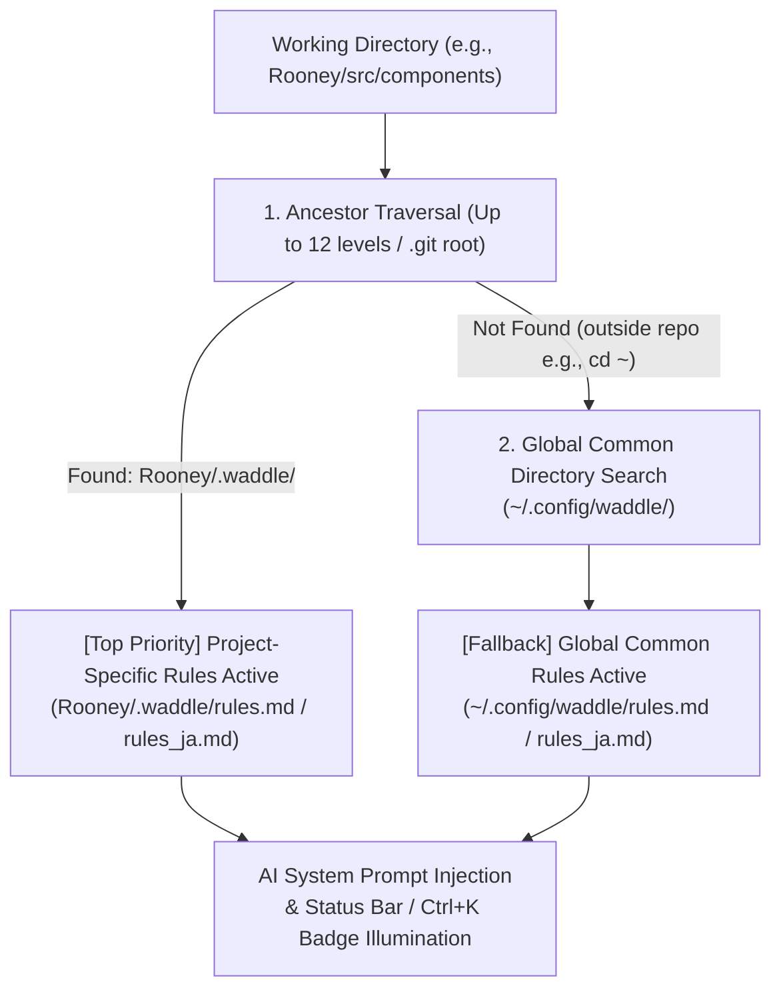
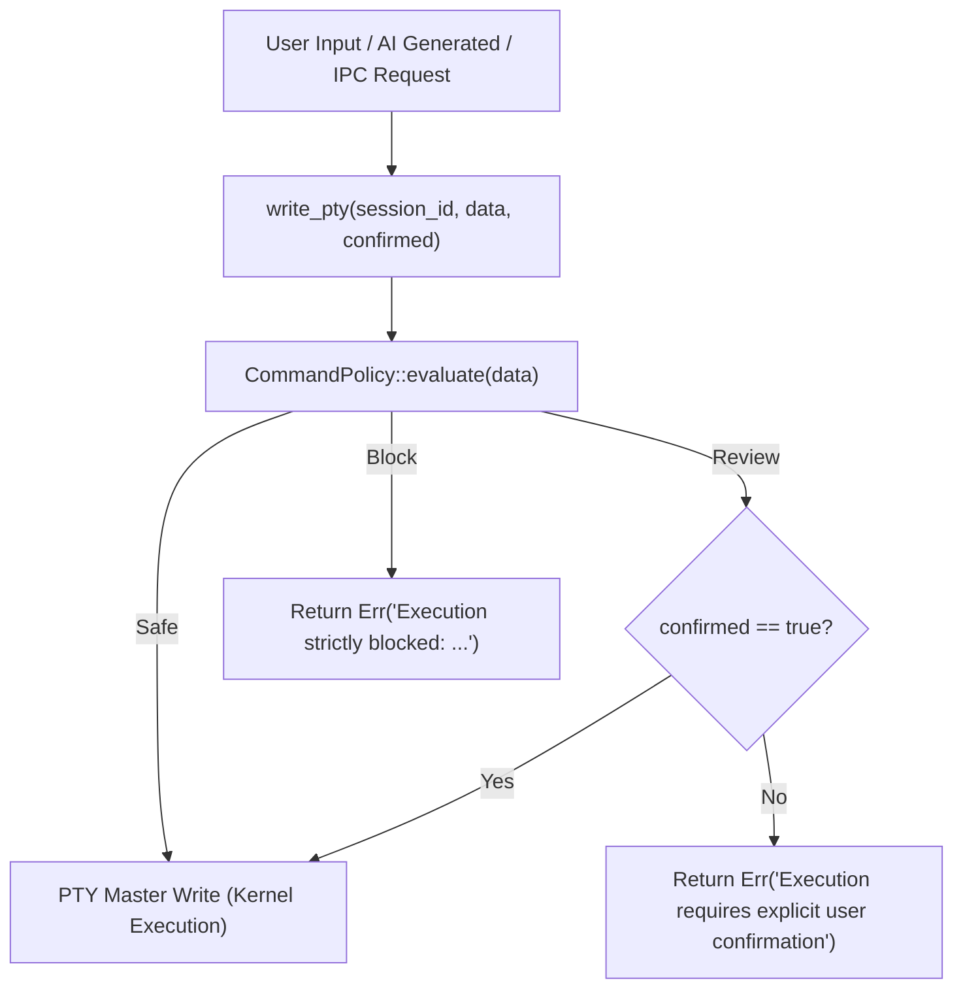

# 🌟 Waddle Feature Guide & Specifications

Welcome to the comprehensive feature guide for **Waddle**, the AI-integrated, privacy-first Linux terminal emulator. This document provides an exhaustive breakdown of Waddle's 15 core features, their low-level internal mechanisms, and the complete keybindings reference.

---

## 📑 Table of Contents

1. [🤖 Natural Language Command Generator (`Ctrl + K`)](#1--natural-language-command-generator-ctrl--k)
2. [🖼️ Custom Background Wallpapers & Native File Picker (`Ctrl + ,`)](#2-️-custom-background-wallpapers--native-file-picker-ctrl--)
3. [📂 Left Sidebar: File Tree Explorer (`Ctrl + B`)](#3--left-sidebar-file-tree-explorer-ctrl--b)
4. [📝 Embedded Lightweight Code Editor & AI Code Assistant (`Ctrl + E`)](#4--embedded-lightweight-code-editor--ai-code-assistant-ctrl--e)
5. [🪟 Flexible Multi-Pane Split & Draggable Resizing (1 to 4 Panes)](#5--flexible-multi-pane-split--draggable-resizing-1-to-4-panes)
6. [🔎 In-Terminal Log Search (`Ctrl + Shift + F` / `Ctrl + F`)](#6--in-terminal-log-search-ctrl--shift--f--ctrl--f)
7. [🚨 Intelligent Error Diagnosis & Smart False-Positive Suppression](#7--intelligent-error-diagnosis--smart-false-positive-suppression)
8. [💬 Context-Aware AI Copilot Sidebar & Chat Session Export](#8--context-aware-ai-copilot-sidebar--chat-session-export)
9. [🦙 Auto-Discovery of Local Ollama Models & Line-Buffered Streaming](#9--auto-discovery-of-local-ollama-models--line-buffered-streaming)
10. [⚡ High-Performance PTY & Zero-Lag 2D Canvas Acceleration](#10--high-performance-pty--zero-lag-2d-canvas-acceleration)
11. [🎨 22 Premium Themes & High-Voltage Neon Collection](#11--22-premium-themes--high-voltage-neon-collection)
12. [🌐 Multi-Language Support (English US / UK, 日本語)](#12--multi-language-support-english-us--uk-日本語)
13. [🛡️ Hardened Multi-Layer Security & AI Safety Guardrails](#13-️-hardened-multi-layer-security--ai-safety-guardrails)
14. [🐙 Git & GitHub Integration, Local AI Commits & Push/Pull Policy](#14--git--github-integration-local-ai-commits--pushpull-policy)
15. [🔄 One-Click Workspace Refresh & Safe Confirmation Dialog](#15--one-click-workspace-refresh--safe-confirmation-dialog)
16. [🖼️ Kitty Graphics Protocol Support & Strict Security Sandboxing](#16--kitty-graphics-protocol-support--strict-security-sandboxing)
17. [🛡️ Real-Time Secret Masking (`SecretMasker`)](#17--real-time-secret-masking-secretmasker)
18. [⏳ Session Time Travel & Snapshot History (`Ctrl + Shift + H`)](#18--session-time-travel--snapshot-history-ctrl--shift--h)
19. [📊 Rich Data Visualizer (Markdown / CSV / JSON Preview)](#19--rich-data-visualizer-markdown--csv--json-preview)
20. [🐕 Autonomous AI Error Watchdog & 1-Click Fix](#20--autonomous-ai-error-watchdog--1-click-fix)
21. [🔗 Visual Pipeline Builder (`Ctrl + Shift + P`)](#21--visual-pipeline-builder-ctrl--shift--p)
22. [📜 Project-Specific & Global Common AI Rules (`.waddle/` & `~/.config/waddle/`)](#22--project-specific--global-common-ai-rules-waddle--configwaddle)
23. [📜 High-Performance Overlay Scrollbar](#23--high-performance-overlay-scrollbar)
24. [⌨️ Complete Keybindings Reference](#️-complete-keybindings-reference)

---

### 1. 🤖 Natural Language Command Generator (`Ctrl + K`)

- **Overview**: Instant natural language to Linux command synthesis powered entirely by your local Ollama engine.
- **Workflow**:
  - Press `Ctrl + K` to open the modal overlay from anywhere in Waddle.
  - Type prompt in English or Japanese (e.g., *"Find all .log files larger than 100MB modified in the last 7 days"* or *"ポート8080を使っているプロセスを特定して強制終了"*).
  - The model streams the recommended shell command, an explanation of its flags, and potential caveats.
- **Safety Badges**:
  - The generated command is analyzed in real time. Commands containing destructive operations (e.g., `rm -rf`, disk wipes, force git pushes) trigger danger warning badges.
- **Action Hotkeys**:
  - `Enter`: Safe insert directly into active terminal prompt (without executing, allowing review and editing).
  - `Ctrl + Enter`: Immediate execution in active terminal.
  - `Esc`: Close modal without modifying terminal state.

---

### 2. 🖼️ Custom Background Wallpapers & Native File Picker (`Ctrl + ,`)

- **Native Linux File Dialog**:
  - Integration with Linux desktop environments (GNOME, KDE Plasma, Hyprland, Sway) using native file choosers (`zenity` / `kdialog`) via verified `/usr/bin/` paths.
- **Binary Header & Magic Byte Verification**:
  - Uploaded images undergo magic byte inspection in Rust before acceptance:
    - PNG (`89 50 4E 47 0D 0A 1A 0A`)
    - JPEG (`FF D8 FF`)
    - WebP (`52 49 46 46 ... 57 45 42 50`)
    - GIF (`47 49 46 38`)
    - BMP (`42 4D`)
    - SVG (XML header check `<svg`)
  - Prevents disguised scripts or executables from being stored.
- **Optimized Asset Protocol**:
  - Saved files are written directly to `~/.config/waddle/wallpapers/` and referenced via Tauri v2's secure `protocol-asset` URL scheme.
  - Keeps `~/.config/waddle/config.json` featherlight (~480 bytes) while automatically migrating legacy Base64 wallpaper strings.
- **Sub-Millisecond 0ms Startup**:
  - Asynchronous background image decoding (`decoding="async"`, `loading="eager"`) off the main thread with GPU hardware isolation (`contain: strict`).
- **Drag & Drop Wallpaper Application (`TC-THM-03`)**:
  - Drag and drop image files directly from your desktop or file manager into the dedicated drop zone in Settings (`getCurrentWebview().onDragDropEvent`).
- **60 FPS Real-Time Live Preview (`TC-THM-04`)**:
  - Slider adjustments for opacity (10%–100%) and frosted glass blur (0–20px) bind directly to CSS variables (`--live-wallpaper-opacity`, `--live-wallpaper-blur`) in real time behind the modal.
  - Automated contrast overlay (`rgba(10, 14, 22, alpha)`) ensures crisp terminal text readability across all background images.

---

### 3. 📂 Left Sidebar: File Tree Explorer (`Ctrl + B`)

- **Real-Time Directory Tracking**:
  - Reads the active terminal's current working directory directly from the Linux `/proc/<pid>/cwd` symlink.
  - Automatically loads and synchronizes file listings when switching tabs or navigating (`cd`).
- **Rich Visual Elements**:
  - **Language Badges**: Color-coded badges for 20+ file formats (TS, TSX, RS, PY, JSON, MD, CSS, HTML, SH, YML, TOML, SQL, GO, C, CPP, IMG, ZIP, CFG, LOCK).
  - **Interactive Breadcrumbs**: Visual path segments allowing one-click navigation to any parent folder.
  - **Tree Indent Guides**: Structural guide lines indicating folder nesting levels.
  - **Item Metadata & Dynamic Count Badges**: Displays formatted file sizes (e.g., `4.2 KB`) and folder child counts (e.g., `(12)` or `(500/600)` when capped).
- **Large Directory Safety Guard & Dynamic Pagination (`TC-FILE-04`)**:
  - Automatically caps directory listing to an initial safe limit of 500 items to prevent WebKitGTK DOM memory bloat when expanding massive directories (`node_modules`, `/usr/bin`).
  - Folders with remaining items display a cyber-styled interactive button `[+] Load more (N remaining)...` at the bottom of the listing.
  - Clicking "Load more" dynamically loads the next 500 items (+500 -> 1000 -> 1500...) on demand without UI freezes.
- **Embedded Search & Hidden File Filtering**:
  - Real-time search filter for file names.
  - Toggle dotfiles (`.gitignore`, `.env`, etc.) with one click.
- **Context Menu Actions**:
  - Right-click any file or folder to:
    - 📝 Open in Embedded Editor
    - 💻 Insert relative or absolute path into terminal
    - 📋 Copy relative or absolute path to clipboard
    - 📁 Reveal in OS file manager (`reveal_in_file_manager` via `xdg-open`)
    - ✏️ Inline rename (`rename_entry` with collision checks)
    - 🗑️ Safe deletion with confirmation
    - ➕ Create new file or folder

---

### 4. 📝 Hardened Embedded Code Editor & Multi-Tab Workspace (`Ctrl + E`)
<a id="4--embedded-lightweight-code-editor--ai-code-assistant-ctrl--e"></a>

> 🎯 **Design Philosophy & Scope (Dedicated to Config Files & Quick Tasks)**:
> Waddle's embedded editor is not intended as a replacement for heavy, full-featured IDEs like VS Code, JetBrains, or complex Neovim environments. Rather, it is designed specifically for **"editing configuration files (dotfiles, YAML, TOML, JSON, ini, conf, .env, etc.)"**, **"quick inspection and minor fixes of shell scripts"**, and **"lightweight scratch notes & previews"**.
> It is built to be summoned instantly via `Ctrl + E` without losing terminal context (CWD, Git status), safely complete edits, and immediately return to the command line.

#### 💡 Deliberately Omitted Features for Security, Lightweightness & Simplicity (Design Trade-offs)
Rather than building an all-encompassing heavyweight editor, Waddle intentionally compromises and omits features along three core pillars to preserve Linux system integrity and lightweight performance:

1. **Security Requirements**:
   - **Total Elimination of Root/Elevated Operations (`sudo`, `pkexec`, etc.)**:
     To prevent accidental system corruption or privilege escalation vulnerabilities, editing is strictly restricted to files within `$HOME` owned by the current process effective UID (`$USER`). System-critical paths (`/etc`, `/var`, etc.) and files owned by other users are mounted strictly Read-Only (saving blocked).
   - **ReDoS Vulnerability Elimination via Plain-Text Search/Replace**:
     Regular expressions in search and replace are completely omitted to prevent editor freeze attacks caused by catastrophic backtracking (ReDoS). Only exact substring matching is supported.
   - **Exclusion of Plugins / Arbitrary Extension Ecosystem**:
     To eliminate supply-chain attack vectors and unvetted background script execution, third-party plugin engines are completely omitted in favor of a self-contained, statically audited codebase.
   - **Pre-emptive Guard on Sensitive Credentials, Virtual FS & Binaries**:
     Direct opening of SSH/GPG private keys, OS keyrings, virtual filesystem paths (`/proc`, `/sys`, `/dev`), and binary files (detected via initial 1KB `\0` null-byte scan) is blocked immediately at the Rust backend.
   - **5MB File Size Guard**:
     To prevent DOM memory bloat and Denial-of-Service (DoS) crashes, files larger than 5MB are refused with guidance to use terminal pagers like `less`.

2. **Lightweightness (Instant 0ms Startup & Minimal Memory)**:
   - **Strict Avoidance of Heavy Editor Engines (Monaco, CodeMirror, etc.)**:
     Avoids bloated JavaScript bundles and launch latency by adopting a minimal dual-layer design: a Prism.js syntax `<pre>` layer beneath a transparent `<textarea>` synchronized 1:1 down to the pixel.
   - **5-Tab Hard Limit & Lazy DOM Mounting**:
     Prevents runaway tab creation and memory consumption. Only the active tab is mounted into the DOM, while inactive tabs reside in lightweight state.
   - **Exclusion of Background Language Server Protocol (LSP) Daemons**:
     Avoids background daemon processes that continuously consume substantial CPU and RAM for language indexing.

3. **Simplicity & Prevention of Config Corruption**:
   - **Deliberate Omission of Smart Auto-Indentation**:
     Indentation-sensitive files (such as YAML and TOML) frequently suffer from accidental syntax errors when editors make automatic indentation assumptions. Waddle sticks to standard newlines and soft tabs (4 spaces) without unpredictable auto-shifts.
   - **Exclusion of Complex Multi-Cursors, Column Blocks, and Macros**:
     Focuses purely on fast, predictable configuration adjustments without cognitive overhead or complex keybinding conflicts.

#### 📊 Feature Matrix: What It Can Do vs. What It Cannot Do

| Category | What It Can Do (Supported) | What It Cannot Do / Deliberately Omitted |
| :--- | :--- | :--- |
| **Primary Scope & File Operations** | ・Rapid editing of configuration files in `$HOME` (dotfiles, YAML, TOML, JSON, ini, conf, .env, etc.) and scripts<br>・Multi-tab editing up to 5 tabs with lazy DOM rendering for low memory<br>・Symlink resolution within `$HOME` with safe atomic saving to the canonical target<br>・Rich previews for Markdown, CSV, and JSON | ・Full-stack software engineering (large-scale IDE workflows, full debugging suites)<br>・Editing large files (>5MB) or massive logs (terminal `less` recommended)<br>・Editing binary files (blocked via 1KB null-byte inspection)<br>・Unlimited tab sprawl (hard-capped at 5 tabs) |
| **Security & Privilege Boundaries** | ・Safe atomic saving strictly for files matching the unprivileged UID<br>・Forced Read-Only protection for paths outside `$HOME` or files owned by other users<br>・Zero-mutation visual secret protection (masks API keys with `•` overlay while keeping raw bytes intact)<br>・Blocking saves for hazardous symlinks pointing outside `$HOME` | ・Direct editing or overwriting system files (`/etc`, etc.) via root/elevation (`sudo`, `pkexec`)<br>・Viewing or editing sensitive credentials (SSH/GPG keys, OS keyrings)<br>・Inspecting virtual kernel files (`/proc`, `/sys`, `/dev`) |
| **Editing & Input Assistance** | ・Soft tabs (4 spaces) insertion and multi-line indent/unindent<br>・Auto-closing bracket and quote pairs (`[`, `{`, `(`, `"`, `'`) and selection wrapping<br>・Self-contained Undo/Redo (`Ctrl+Z`, `Ctrl+Y` / `Ctrl+Shift+Z`)<br>・Exact plain-text Search & Replace (`Ctrl+F`, `Ctrl+H`, navigation, Replace All) | ・Smart auto-indentation (intentionally omitted to prevent YAML/TOML syntax corruption)<br>・Regular expression search/replace (eliminated to prevent ReDoS freeze risks)<br>・Multi-cursor editing, columnar selection, macro recording |
| **Code Intelligence & Extensibility** | ・Syntax highlighting for major languages & config formats via Prism.js<br>・Local Ollama AI assistance for refactoring and explanations (`Ctrl + Shift + K`)<br>・Direct script execution in active terminal (Play button with dangerous command warnings) | ・LSP (Language Server Protocol) definition jumping, type checking, renaming (avoids background daemon bloat)<br>・Third-party plugins/extensions (eliminating supply-chain vulnerabilities)<br>・Integrated visual debugger (breakpoints, stepping) |
| **Data Protection & Recovery** | ・First-input anchored 120-second automated backup rotation (AutoSave)<br>・Up to 6-generation snapshot retention with permanent header `Restore (N)` UI<br>・Safe sandboxed backup directory (`~/.cache/waddle/autosave/` [0700/0600])<br>・Crash recovery prompt on startup if uncommitted snapshots exist | ・Real-time collaborative editing<br>・In-editor Git branch graph exploration (handled by dedicated Git Popover & Diff Viewer) |

---

- **Ultra-Lightweight Dual-Layer Architecture**:
  - Maintains zero-lag typing and instant startup by strictly avoiding heavy web editors like Monaco. Uses Prism.js background `<pre>` layer pixel-perfectly aligned beneath a transparent editable `<textarea>` (`-webkit-text-fill-color: transparent !important;`).
- **Multi-Layer Security & Privilege Boundary**:
  - **Editable Scope Restriction**: Only files whose canonical real path resides within `$HOME` and whose file owner UID matches the process effective UID (`$USER`) are permitted for editing and saving.
  - **Root Operation Elimination**: Root/elevated operations (`sudo`, `pkexec`, etc.) are completely prohibited inside the editor.
  - **Forced Read-Only Mode**: Files outside `$HOME`, non-matching owner UIDs, or filesystem write-protected files are automatically mounted in Read-Only mode (`readOnly` textarea attribute, `🔒 Read-Only` header badge with reason tooltip, and `Ctrl + S` disabled).
  - **Pre-Open Security Guards**: Hard 5MB file size limit (prompts user to use terminal `less`), initial 1KB null byte (`\0`) binary detection, system virtual directories (`/proc`, `/sys`, `/dev`), and sensitive credentials (`~/.ssh/id_*`, `~/.gnupg/private-keys-v1.d`, `~/.local/share/keyrings`) are blocked immediately at the Rust backend.
- **Symlink Resolution & Escape Prevention**:
  - Evaluates target canonical paths via Rust `std::fs::canonicalize(path)`.
  - **Safe Symlinks (Target inside `$HOME`)**: Preserves symlink relationship by atomically writing directly to the target file. Triggers warning toast: `[注意] シンボリックリンク先のファイルを保存しました: <実体パス>`.
  - **Dangerous Symlinks (Target outside `$HOME`)**: Treated as path traversal escape attempts; automatically forced into Read-Only mode and saving is strictly blocked: `[保存不可] このファイルはシンボリックリンクですが、リンク先の実ファイル (<実体パス>) が $HOME 外にあるため編集・保存は遮断されました。`
- **Multi-Tab Management & Lazy Tab Rendering**:
  - **Hard Limit**: Maximum 5 concurrent tabs. 6th tab attempt triggers an informational blocking dialog: `[上限超過] 一度に開けるタブは最大 5 件までです。不要なタブを閉じてから再度お試しください。`
  - **Lazy Tab Rendering**: Only the active tab mounts the DOM (`<textarea>` + Prism `<pre>`), keeping memory minimal. Inactive tabs retain content, scroll position, and undo/redo stacks in state.
  - **Unsaved Dirty Guards**: Displays `●` dirty indicator on tabs. Requesting tab or editor close prompts confirmation: `[未保存の変更] 保存されていない変更があります。破棄して閉じますか？`
- **Text Editing & Input Assistance**:
  - **Soft Tabs (4 Spaces)**: `Tab` inserts 4 spaces; multi-line selection indents all lines by 4 spaces. `Shift + Tab` unindents up to 4 leading spaces.
  - **Standard Newline**: Pure `\n` newline without smart auto-indentation to prevent YAML/TOML syntax corruption.
  - **Auto-Closing Brackets & Quotes**: Automatically pairs `[`, `{`, `(`, `"`, `'` and wraps active selections.
- **State Protection, Undo/Redo & Plain-Text Search/Replace**:
  - **Self-Contained Undo/Redo**: `Ctrl + Z` (Undo) and `Ctrl + Shift + Z` / `Ctrl + Y` (Redo) with 400ms debounce merge during typing.
  - **ReDoS-Free Exact Match Search/Replace**: Strictly forbids regular expressions, using exact substring matching. Mini-bar opened with `Ctrl + F` (Search) or `Ctrl + H` (Replace), featuring match count indicator (`1 / 5`), jump to match, single replace, and replace all.
- **Automated Backup Cache (AutoSave / Dedicated Cache Aggregation & 6-Generation Rotation)**:
  - **Settings Toggle**: Configurable in Settings (`Ctrl + ,`).
  - **Dedicated Cache Directory & Safe Sandboxing**: Saves to `~/.cache/waddle/autosave/` (enforcing `0700` directory and `0600` file permissions), escaping canonical paths with `%` and appending millisecond timestamps (e.g., `%home%user%.config%fish%config.fish.1726500000000`).
  - **First-Input Timer Anchor & 120s Periodic AutoSave (`AutosaveScheduler`)**: The 120-second autosave timer starts on the *first input* of an editing session. Subsequent keystrokes do not reset or push the timer forward (unlike classic debounce), guaranteeing that uncommitted edits are written to cache every 120 seconds even during continuous typing. Manual save (`Ctrl + S`), buffer restoration, or tab closing resets the timer, allowing the next edit to initiate a new 120s cycle from that first input.
  - **Up to 6-Generation Snapshot Rotation**: Retains up to 6 historical snapshots per file, automatically pruning the oldest when the 7th is written.
  - **Safe Snapshot Retention Policy**: Snapshots are preserved even on explicit save (`Ctrl + S`), editor close, or tab discard. Stale snapshots older than 7 days (604,800s) are automatically cleaned up via startup/background garbage collection.
  - **Header Restore UI & Popover Modal (`Restore (N)`)**:
    - Editor header toolbar includes a permanent `Restore (N)` button (with `RotateCcw` icon and active snapshot count badge) visible whenever snapshots exist.
    - Clicking toggles a dropdown popover displaying up to 6 snapshots sorted newest-first with `[Latest]` badge, monospace timestamps (`YYYY/MM/DD HH:mm:ss`), relative times (`2m ago`), and human-readable file sizes (`1.2 KB`).
    - **One-Click Safe Restoration**: Clicking `Restore` loads the snapshot content and marks the tab dirty (`isDirty = true`, uncommitted dot `●` on). The pre-restore buffer is automatically pushed to the undo history stack, guaranteeing instant non-destructive rollback via `Ctrl + Z`.
  - **Crash Recovery Dialog**: On file open, if uncommitted backup data is detected, prompts with a recovery modal (`[リカバリ検知] 前回の未保存バックアップデータが見つかりました。復元しますか？`).
- **Focus-Exclusive Shortcut Handling**:
  - Container (`tabIndex={-1}`) intercepts keystrokes via `onKeyDownCapture` and `e.stopPropagation()`:
    - `Ctrl + F`: Opens/closes Find mini-bar (suppresses terminal log search).
    - `Ctrl + H`: Opens/closes Replace mini-bar (suppresses timeline modal).
    - `Ctrl + S`: Atomically saves active tab (disabled when Read-Only).
    - `Esc`: Closes Find/Replace mini-bar if open; otherwise closes editor (with unsaved confirmation).
- **Visual Secret Protection (Zero-Mutation Guarantee)**:
  - Real-time scanning for API keys, tokens, and credentials via `findSecretRanges()`.
  - Header displays `[🛡️ N Secrets Detected]` with an interactive Eye / Eye-Off toggle button.
  - An opaque monospace overlay renders `•` bullets with `#181e2e` background and red dashed outline over detected credentials, while preserving raw file content untouched so `Ctrl + S` never corrupts real keys or `.env` files.
- **Run in Terminal & AI Code Edit**:
  - `Play` button runs script in active terminal (with `DangerousCommandModal` interception).
  - `Ctrl + Shift + K`: Prompts local Ollama AI to refactor code or add error handling.

---

### 5. 🪟 Flexible Multi-Pane Split & Draggable Resizing (1 to 4 Panes)

- **Independent Pseudo-Terminals**:
  - Split any tab into 2, 3, or 4 independent terminals. Each pane owns its PTY session, CWD tracking, and Git status monitoring.
- **10 Visual Layout Presets**:
  - **Single (1 Pane)**: `single`
  - **2-Pane**: Side-by-Side (`split-2-h`), Top & Bottom (`split-2-v`)
  - **3-Pane**: Left Main + 2 Right (`split-3-left-main`), Top Main + 2 Bottom (`split-3-top-main`), 3 Columns (`split-3-h`), 3 Rows (`split-3-v`)
  - **4-Pane**: 2×2 Grid (`grid-4`), Left Main + 3 Right (`split-4-left-main`), 4 Columns (`split-4-h`)
- **Draggable Neon Dividers**:
  - 16px wide grab hitboxes with luminous hover indicators.
  - Adjust pane split ratios dynamically from 15% to 85%.
  - Zero-flicker dragging: preserves xterm canvas during drag and refits via `@xterm/addon-fit` on mouse release.
- **Keyboard Split Resizing & Swapping**:
  - `Ctrl + Alt + Arrow Keys`: Adjust active split ratio in 5% increments.
  - `Ctrl + Shift + S`: Instant pane swapping (rotates positions among split panes).
  - `Alt + Z`: Zoom active pane to full-screen; press again to restore layout.

---

### 6. 🔎 In-Terminal Log Search (`Ctrl + Shift + F` / `Ctrl + F`)

- **Hardware-Accelerated Scrollback Search**:
  - Powered by `@xterm/addon-search`, enabling instant searching through 10,000+ lines of scrollback buffer.
- **Floating Search Bar**:
  - Glassmorphic top-right search overlay.
  - Navigate matches using `Enter` (next match) and `Shift + Enter` (previous match) or arrow buttons.
  - Search controls: Case-sensitive (`Aa`) and regular expression (`.*`) toggles.
  - Instant dismissal with `Esc`.

---

### 7. 🚨 Intelligent Error Diagnosis & Smart False-Positive Suppression

- **Automated Failure Detection**:
  - Monitors command execution and stdout/stderr streams for shell error signatures (`command not found`, `Permission denied`, `fatal: not a git repository`, non-zero exit codes).
- **False-Positive Noise Filter**:
  - Automatically suppresses alerts for informational and search commands (`grep`, `find`, `cat`, `echo`, `diff`, `git log`).
  - Prevents alert loops by tracking duplicate error outputs.
- **One-Click Local AI Remedy**:
  - Action banner displays error summary with a single-click "Analyze Error" button.
  - Ollama analyzes the exact failure reason and proposes a verified remediation command ready for execution.

---

### 8. 💬 Context-Aware AI Copilot Sidebar & Chat Session Export

- **Deep Context Awareness**:
  - Automatically packages system metadata into prompt context:
    - Operating System & Shell type
    - Current Working Directory (`pwd`)
    - Git Branch & Staged/Unstaged counts
    - Recent executed commands and terminal output buffer
- **Interactive Assistance**:
  - One-click insertion, execution, or clipboard copying for generated code blocks.
- **Session Export**:
  - Export full chat transcripts with timestamps, prompt context, and code blocks to **Markdown (`.md`)** or **JSON (`.json`)**.

---

### 9. 🦙 Auto-Discovery of Local Ollama Models & Line-Buffered Streaming

- **Model Auto-Detection**:
  - Dynamically queries `http://localhost:11434/api/tags` to populate installed models (`llama3.2`, `qwen2.5-coder`, `deepseek-r1`, `codellama`, etc.).
- **Line-Buffered Chunk Assembler**:
  - HTTP chunks from Ollama are accumulated into a buffer across TCP packet boundaries.
  - Incomplete JSON lines are reconstructed before deserialization, completely eliminating dropped tokens or truncated responses.
- **64KB Chunk Buffer Guard**:
  - Enforces a 64KB line length limit in `stream_ollama` to guard against memory exhaustion from malformed streaming streams.
- **100% Offline**:
  - Zero telemetry, zero external API keys, zero cloud egress.

---

### 10. ⚡ High-Performance PTY & Zero-Lag 2D Canvas Acceleration

- **Rust PTY Engine**:
  - Built on `portable-pty` with asynchronous read loops on Tokio background threads.
- **Kernel-Cooperative Backpressure Flow Control (`pause_pty`/`resume_pty`) (`TC-PTY-02`, `TC-PERF-03`)**:
  - Actively monitors xterm.js unrendered buffer queue (`_pendingData`).
  - When pending data exceeds 256KB, invokes `pause_pty` to pause the Rust reader thread. The Linux kernel PTY master buffer (~64KB) fills naturally, causing the Linux kernel to suspend the producer process (`yes`, unbuffered stream) in `TASK_INTERRUPTIBLE` sleep.
  - Once xterm.js finishes rendering and drops below 64KB, invokes `resume_pty` to resume stream consumption.
  - **Result**: Keeps application resident memory (RES) flat-capped at **266MB–305MB** (reducing memory usage by ~80% from 1.5GB) without memory bloat or IPC queue saturation.
- **0ms Instant `Ctrl+C` Queue Purge**:
  - Upon receiving `\x03` (SIGINT), immediately purges xterm's internal `_writeBuffer` and callbacks in 0ms, and drops lagging IPC packets (>256B) arriving within 150ms.
  - Eliminates 20–30 second UI freezes, returning to the prompt within **60ms** while dropping CPU utilization from 231% to **0.7%–1.3%**.
- **60 FPS Saturated Output Pacing**:
  - Rust reader paces continuous 32KB saturated bursts at 16–20ms (60 FPS refresh rate) while maintaining instantaneous 0ms response for interactive commands (<32KB).
- **UTF-8 Multi-Byte Boundary Protection**:
  - Uses `std::str::from_utf8` validation with `valid_up_to` to carry incomplete multi-byte slices across read cycles, preventing `\u{FFFD}` glyph corruption for Japanese, CJK, and emojis.
- **Process Group Termination**:
  - Signals the entire process group (`-pid`) with `SIGHUP` and `SIGTERM`/`SIGKILL` on tab/pane close, guaranteeing zero zombie processes or orphaned background tasks.
- **2D Canvas Acceleration**:
  - Uses `@xterm/addon-canvas` for instant 0ms startup without GPU shader compilation pauses or WebKitGTK Wayland transparency stalls.
  - Supports `@xterm/addon-unicode11` (`allowProposedApi: true`) for accurate double-width emoji rendering (`TC-PTY-03`).

---

### 11. 🎨 22 Premium Themes & High-Voltage Neon Collection

- **22 Built-in Color Themes**:
  - **High-Voltage Neon Group (11 Themes)**:
    - *Neon Overdrive* (Cyberpunk Pink & Electric Cyan)
    - *Toxic Matrix* (Radioactive Fluorescent Lime & Emerald)
    - *Outrun Sunset* (Blazing Orange, Gold & Twilight)
    - *Electric Violet* (Blacklight Ultraviolet & Magenta)
    - *Neo Tokyo 2099* (Aggressive Laser Red & Gold)
    - *Acid Cyber* (Highlighter Acid Yellow & Lime)
    - *Miami Vice Neon* (Turquoise & Flamingo Pink)
    - *Laser Glitch* (Glitch Magenta & White Strobe)
    - *Plasma Cyan* (Extreme Luminescence Plasma Cyan & Sapphire)
    - *Cyberpunk 2077* (Night City Yellow & Cyan)
    - *Synthwave '84* (Retro 80s Neon Purple & Grid)
  - **Classic & Pro Group (11 Themes)**:
    - *Waddle Cyber (Default)*, *Tokyo Night*, *Catppuccin Mocha*, *Dracula*, *Nord (Arctic)*, *Gruvbox Dark*, *One Dark Pro*, *Rosé Pine*, *Monokai Pro*, *Solarized Dark*, *Midnight Abyss (OLED Pure Black #000000)*
- **Dynamic Glow Synchronization**:
  - Terminal ANSI colors and window UI elements (titlebar, tab borders, status bar, modal borders) synchronize their glow aura via dynamic CSS variables (`--accent-rgb`, `--border-active`).
- **Typography & Nerd Fonts (Local Font Integration)**:
  - Waddle references locally installed fonts on the host OS and does not bundle font binaries.
  - Comprehensive presets with automatic symbol fallback: *JetBrainsMono Nerd Font*, *MesloLGS NF*, *FiraCode Nerd Font*, *Hack Nerd Font*, *CaskaydiaCove Nerd Font*, *SauceCodePro Nerd Font*, and *Symbols Nerd Font Mono*.
  - Full support for system monospace fallback and custom local font configurations.

---

### 12. 🌐 Multi-Language Support (English US / UK, 日本語)

- **Selectable UI Languages**:
  - English (US), English (GB / UK), and Japanese (日本語).
- **Comprehensive Coverage**:
  - All dialogs, settings, error banners, tooltips, file tree context menus, and diff viewers adapt in real time without restarting.
- **Persistence**:
  - Language selection is saved to `~/.config/waddle/config.json`.

---

### 13. 🛡️ Hardened Multi-Layer Security & AI Safety Guardrails

- **System Directory Prefix Protection & Virtual FS Isolation**:
  - Prefixed canonical path validation blocks writing or deletion in `/etc`, `/usr`, `/bin`, `/sbin`, `/boot`, `/lib`, `/sys`, `/proc`, `/dev`, `/root`, `/run`.
  - Directory listing and path traversal into virtual kernel mounts (`/proc`, `/sys`, `/dev`) are blocked at the backend to prevent host process reconnaissance.
- **Sensitive Credential Shield**:
  - Completely blocks reading, writing, and deletion of SSH private keys (`~/.ssh/id_rsa`, `id_ed25519`, etc.), GPG private keys (`~/.gnupg/private-keys-v1.d`), Linux keyrings (`~/.local/share/keyrings`), shell startup files (`.bashrc`, `.zshrc`, etc.), and `~/.config` root. Public keys (`.pub`) and `known_hosts` remain safely readable.
- **Ollama SSRF & Cloud Metadata Defense**:
  - `validate_ollama_endpoint` strictly blocks local link-local and cloud metadata addresses (`169.254.169.254`, IPv6 `[fd00:ec2::254]`), preventing SSRF attacks aimed at exfiltrating AWS/GCP/Azure instance IAM credentials.
- **Git Branch Ref Strict Sanitization**:
  - `git_checkout_branch` and `git_create_branch` sanitize branch arguments, strictly rejecting leading hyphens (preventing CLI option injection like `-D` or `--help`), control characters, spaces, and `..` path sequences.
- **Indirect Prompt Injection Defense**:
  - Terminal output is escaped with XML delimiter wrappers (`<untrusted_terminal_output>`) to neutralize prompt breakout attacks.
- **Word-Boundary Dangerous Command Interception**:
  - Accurate regex token checks intercept destructive commands (`rm`, `mkfs`, `fdisk`, `dd`, `git reset --hard`, `iptables -F`, etc.) before execution.
- **Webview CSP & Scoped Asset Protocol**:
  - Strict Content Security Policy confines networking to local Ollama and GitHub.
- *(For comprehensive security specifications, see [SECURITY.md](SECURITY.md))*

---

### 14. 🐙 Git & GitHub Integration, Local AI Commits & Push/Pull Policy

- **Status Bar Quick Git Popover**:
  - Click the Git branch badge to toggle an interactive popover with branch checkout, ahead/behind tracking, and staged/unstaged file lists.
- **One-Click Push & Pull**:
  - Background asynchronous execution (`spawn_blocking`) with `GIT_TERMINAL_PROMPT=0` ensures GUI and terminal never freeze during network requests.
  - Animated count badges indicate ahead (`↑`) and behind (`↓`) commits.
- **Local AI Conventional Commit Generator (commitlint Compliant)**:
  - Local Ollama analyzes staged, unstaged, or untracked changes to draft semantic commit messages (`feat: ...`, `fix: ...`, `docs: ...`).
  - **commitlint Strict Conformance**: Automatically enforces `@commitlint/config-conventional` specifications (lowercase type and subject, allowed type enum, no trailing punctuation, under 100 characters).
  - **Robust Post-Processing**: Automatically strips thinking tags (`<think>`, `<thought>`), code fences, and conversational preambles; normalizes synonyms (`add` -> `feat`, `update` -> `chore`, etc.); guarantees zero commitlint validation failures.
  - **Untracked File Synthetic Diffs**: Safely constructs synthetic diffs for newly created files so messages can be generated even prior to staging.
  - **Multibyte Char Boundary Protection**: Uses safe UTF-8 slicing to prevent boundary panics on non-ASCII commit diffs.
  - **Dynamic Model Fallback**: Automatically discovers installed models via `/api/tags` if no model is specified.
- **Visual Syntax-Highlighted Diff Viewer**:
  - Inspect unified diffs with side-by-side line numbers and diff hunks.
  - Stage, unstage, or discard changes directly from the viewer.
- **GitHub-Only Security Policy**:
  - When enabled, blocks push/pull operations to non-GitHub remotes to protect proprietary code from being pushed to unapproved servers.

---

### 15. 🔄 One-Click Workspace Refresh & Safe Confirmation Dialog

- **Titlebar Refresh Button**:
  - Dedicated `RotateCcw` button in the titlebar between Layout selection and Settings.
- **Safe Confirmation Dialog (`RefreshConfirmModal`)**:
  - Mounted via React Portal (`createPortal(..., document.body)`) to ensure top-level display immune to titlebar drag events.
  - Clearly summarizes the reset action:
    - 📑 Close all tabs and split panes
    - ⚡ Terminate running terminal processes
    - 💾 Clear saved session state (`localStorage`)
    - 📁 Reset working directory to home folder
  - Amber warning box highlights loss of unsaved terminal outputs.
  - Keyboard accessible: `Escape` to cancel, `Enter` to confirm.
- **Thorough Reset**:
  - Safely closes all PTY process groups, deletes `waddle_session_state`, starts a fresh single tab in user home directory, and re-mounts the File Tree Sidebar with cleared cache.

---

### 16. 🖼️ Kitty Graphics Protocol Support & Strict Security Sandboxing

- **Overview**:
  - Full native support for the **Kitty Graphics Protocol** directly within Waddle's accelerated Canvas viewport, enabling inline image rendering and graphics manipulation from CLI and TUI tools such as `fastfetch`, `yazi`, and Neovim (`image.nvim`).
- **APC Escape Sequence Parsing & Stream Interception**:
  - State machine parser handles `\x1b_G<control_keys>;<payload>\x1b\` and `\x07` sequences.
  - Strips megabytes of Base64 graphics data from the PTY stream before reaching `@xterm/xterm`, preventing terminal freezing or DEC parser degradation.
  - Chunked transfer support: smoothly reassembles multi-chunk transmissions (`m=1` followed by `m=0`).
  - **Zero-Latency (0ms) PTY Capability Probe Handshake (`a=q`)**:
    - Rust PTY background reader directly intercepts capability queries (`\x1b_Gi=1,s=1,v=1,a=q;\x1b\` or any sequence with `a=q`) and writes `\x1b_Gi=<id>;ok\x1b\` back to child stdin with 0ms latency.
    - Eliminates query timeout issues in CLI tools (`fastfetch`, `chafa`, `timg`), ensuring tools never fall back to ASCII art.
    - Strips capability query sequences from terminal output before reaching frontend xterm.
    - PTY window size handling (`TIOCGWINSZ`) reports non-zero cell pixel dimensions (`cols * 9`, `rows * 18`) so CLI font dimension detection (`getCharacterPixelDimensions()`) succeeds.
  - Diagnostic logging: all incoming `\x1b_G` headers are logged on the Rust backend (`println!("[Kitty Graphics] Received header: {}", header)`).
- **Web Standard zlib / Deflate Decompression (`o=z`)**:
  - Full support for zlib-compressed payloads (`o=z`), used by tools like `fastfetch` (`"type": "kitty"`) to conserve terminal I/O bandwidth.
  - Built-in streaming decompression using native `DecompressionStream('deflate')` with fallback to `'deflate-raw'`.
  - Seamlessly decompresses compressed Base64 RGBA, RGB, or PNG streams before rasterization.
  - Strictly enforces cumulative decompression bomb limits (`maxPayloadBytes`, default 16 MB) to protect system memory.
- **Quiet (`q`) Parameter Specification Compliance**:
  - Full compliance with the Kitty Graphics quiet response protocol to prevent PTY escape sequence leakage into the user's shell:
    - `q=0` or omitted: Completely silent. No ACK/NAK or error response is written back to PTY stdin.
    - `q=1`: Errors only. Failures (`EBADMSG`, `ENOENT`, `EACCES`, `EFBIG`) return diagnostic responses; successful operations (`OK`) remain silent.
    - `q=2`: Verbose. Both `OK` and error responses are written back.
    - Capability query probe (`a=q` with `s=1,v=1`): Always sends `\x1b_Gi=<id>;ok\x1b\` regardless of quiet level to ensure proper tool handshake.
- **Temporary File Auto-Deletion & Sandboxing (`t=t`)**:
  - CLI/TUI tools (such as Yazi and Neovim) transmit temporary files via `t=t`.
  - Waddle loads the file into memory and immediately unlinks it from disk (`std::fs::remove_file`) before dimension verification, preventing disk space accumulation or resource leaks even if decompression bomb limits fail.
  - Temporary files are securely restricted to system temp directories (`std::env::temp_dir()`, `/tmp`, `/var/tmp`) and the configured allowed directory, with sensitive system locations (`/etc`, `/root`, `~/.ssh`) strictly blocked.
- **Asynchronous Race Condition Elimination (`a=t` vs `a=p`)**:
  - Serialized command execution via a FIFO Promise queue (`commandQueue`) ensures commands from PTY streams are processed in strict chronological order.
  - In-flight image loading tracking (`loadingImages: Map<number, Promise<void>>`) ensures that immediate placement commands (`a=p`) cleanly await pending image decoding (`a=t`) before cache inspection, eliminating race-induced `ENOENT: Image ID not found in cache` errors.
- **Strict Security Sandboxing & Directory Jail (`t=f`)**:
  - Local file reading via `t=f` is strictly restricted to `$HOME/Pictures` (and its subdirectories) by default.
  - Rust backend enforces path canonicalization (`std::fs::canonicalize`).
  - Directory traversal (`../`) and symbolic links pointing outside the sandbox (such as `~/.ssh`, `/etc`, or `/usr`) are actively rejected with `EACCES` / `ENOENT`.
  - Configurable in Settings (`Ctrl + ,`), with real-time validation against sensitive system paths.
- **Decompression Bomb Defense**:
  - Image dimensions are capped at 4096×4096 px by default (configurable 1024–8192 px).
  - PNG IHDR and JPEG SOF headers are inspected before full memory allocation. Oversized images are discarded immediately with `EBADMSG`.
  - Single request cumulative Base64 payload is limited to 16 MB (configurable 4–64 MB).
- **VRAM & Memory Management (LRU Cache)**:
  - Cache size is capped at 256 MB (configurable 64–1024 MB).
  - When the upper limit is reached, least recently used textures are evicted.
  - Explicitly invokes `ImageBitmap.close()` upon eviction or image deletion (`a=d`), preventing GPU/VRAM and WebKitGTK memory leaks.
- **Cursor Advance & Buffer Space Allocation (`C` Key)**:
  - Full compliance with the Kitty Graphics cursor movement policy:
    - `C=0` (or omitted, default): Cursor advances to the right edge of the image on its final row (`start_col + cols` at row `start_row + rows - 1`). If the image reaches or exceeds terminal width, it wraps to column 0 on the line below. Text following the image (e.g. `<- TEXT HERE`) renders at the right of the image on the last row without overlapping image pixels, and shell prompts drop cleanly below the image area.
    - `C=1`: Cursor does not move; its position is preserved at `(start_col, start_row)`. When running TUI applications (such as `yazi`) or in the Alternate Screen buffer, zero buffer space and zero linefeeds (`\r\n`) are injected, completely preventing accidental scrolling and row-shift overlapping.
- **Placeholder Cell Allocation & Automatic Bottom Scrolling (`C=0` Standard Screen)**:
  - In standard CLI workflows (`fastfetch`, `kitten icat`), automatically allocates the `cols x rows` grid in xterm's buffer at the exact stream position of `\x1b_G...` using space characters and linefeeds (`\r\n`).
  - When an image is placed near the bottom of the screen (`start_row + rows > termRows`), linefeeds trigger native terminal scrolling, shifting preceding lines into scrollback and ensuring the full image height is visible without clipping.
- **Partial Clipping & Scissoring (AABB Intersection & UV Mapping)**:
  - Supports smooth partial rendering when multi-row images cross the top or bottom viewport boundaries:
    - **AABB Intersection**: Checks overlap between the image bounds `[col..col+c, row..row+r]` and the visible terminal viewport `[0..termCols, 0..termRows]`. If even a single row or column is visible, the image remains actively rendered rather than popping out of existence.
    - **Viewport Scissoring (Approach A)**: Applies hardware-accelerated clipping bounds matching viewport dimensions `[0..width, 0..height]`.
- **Anchor Cell Synchronization, CUP Cursor Parsing & Uppercase Deletion (`d=A`)**:
  - Maintains zero-latency synchronous PTY streaming (`term.write`), guaranteeing instantaneous 0ms rendering for shell startup, `fish_greetings`, and terminal prompts.
  - Precisely captures true anchor coordinates `(start_col, start_row)` even when preceded by text or ANSI cursor movements in the same chunk via `calculateCursorOffset(textBefore)` (supporting full CSI codes: `CUF \x1b[..C`, `CUB \x1b[..D`, `CHA \x1b[..G`, and absolute `CUP \x1b[<row>;<col>H` / `HVP \x1b[<row>;<col>f` positioning utilized by Yazi).
  - Deletion action `a=d` fully supports `d=a` and `d=A` (uppercase: wipe all images and placements from memory and screen), ensuring instantaneous zero-leak cleanup during Yazi preview switching and exiting.
  - Renderer coordinates adhere strictly to `render_x = padding_left + col * cell_width` and `render_y = padding_top + (row - scroll_offset) * cell_height`, preventing default (0, 0) collisions over previous output.
  - Animation frame transmissions (`a=f`) update frame textures in cache while strictly inheriting and preserving the placement anchor coordinates established during initial placement.
- **Delta Frame 32-bit RGBA Auto-Detection & Alpha Compositing**:
  - Automatically identifies whether an incoming animation delta frame (`a=f`) is 32-bit RGBA or 24-bit RGB based on exact byte length and pixel count arithmetic ($S = s \times v \times 4$), adhering strictly to the Kitty specification default (`f=32`).
  - Prevents byte stride skew, pixel misalignment, and opaque black-and-white static noise by never forcing base RGB formats onto RGBA delta frames.
  - Composes rectangular delta patches (`x, y, s, v`) seamlessly over previous frames (`c=<frame_index>`) via offscreen canvas alpha blending (`ctx.drawImage`).
- **Ghost Layer Prevention & Single Active Canvas Stacking**:
  - Prunes stale `.xterm-kitty-graphics-layer` elements before re-attaching canvases, preventing ghost image doubling during split layout changes or tab switches.
  - Graphics layer is mounted with `zIndex: 1` directly above `TextRenderLayer` (`zIndex: 0`) and beneath `SelectionRenderLayer` (`zIndex: 1` in DOM order) and `CursorRenderLayer` (`zIndex: 3`).
- **Animation Loop Count (`v`) Specification Compliance & Resilient Timer Scheduling**:
  - **Loop Count Default**: Parameter `v` defaults to `0` (Infinite Loop) per Kitty Graphics Protocol specification.
  - **Infinite Playback (`v=0`)**: Automatically loops back to frame 1 (index 0) upon expiration of the final frame's delay (`z` ms), continually rescheduling the frame timer to sustain perpetual animation.
  - **Finite Count Playback (`v>0`)**: Accurately tracks completed cycles (`loopsCompleted`); when the requested loop count is reached, halts the timer and freezes on the final frame.
  - **Animation Control (`a=a`)**: Supports playback state (`s=1` stop, `s=3` run), seeking to designated frame (`r`), dynamic frame gap delay updates (`z`), and dynamic loop count reconfiguration (`v`).
  - **Dedicated 60 FPS Graphics Loop**: `advanceFrame` directly re-renders the Kitty graphics canvas without triggering full text layer refreshes (`term.refresh()`), maintaining high animation smoothness with low CPU usage.
  - **Resource Management**: Automatically cleans up and unregisters active animation timers upon LRU cache eviction, image deletion (`a=d`), or terminal disposal to prevent memory or timer leaks.
- **Sub-Rectangle Source Clipping (`x, y, w, h`)**:
  - Full support for source texture clipping parameters: `x` (source X offset in pixels), `y` (source Y offset in pixels), `w` (source rectangle width in pixels), and `h` (source rectangle height in pixels).
  - Automatically calculates normalized UV bounds (`u_min = x / texture_width`, `v_min = y / texture_height`, `u_max = (x + w) / texture_width`, `v_max = (y + h) / texture_height`), seamlessly combining source sub-rectangles with viewport boundary scissoring.
- **Unicode Graphic Placeholder (`U+10EEEE`) & Virtual Placements (`U=1`)**:
  - Intercepts the private-use Unicode graphic placeholder codepoint `U+10EEEE` directly in character rendering, completely suppressing "tofu" (□) missing-glyph boxes.
  - **Rendering Responsibility Separation, Multi-Layer Glyph Suppression & 100% Regular Text Preservation**: Hooks `TextRenderLayer.prototype._drawForeground`, `BaseRenderLayer` (`_drawChars`), and `CursorRenderLayer` to skip character rasterization, glyph lookup, and font drawing for placeholder cells. Actual image rendering is unified exclusively onto the dedicated Kitty graphics canvas (`renderVisiblePlaceholders()`) using predetermined grid geometry (`cols` / `rows`). This completely eliminates dynamic scaling errors during cell-by-cell passes (which caused row-by-row distortion and shift-stacking) as well as duplicate drawing between font and graphics layers. Furthermore, guards against stale `workCell.combinedData` residue in xterm's memory pool via strict `cell.isCombined()` verification, guaranteeing normal terminal text (file lists, borders, status bars) is never misidentified as placeholders or hidden from view.
  - Automatically parses combining diacritic marks attached to `U+10EEEE` from the 297 standard combining marks defined by the Kitty Graphics Protocol to determine the grid row and column index of the slice.
  - Supports diacritic omission with left-to-right inheritance and 3rd-diacritic high byte extension for 32-bit image IDs.
  - Extracts image IDs from cell foreground colors (24-bit TrueColor RGB or 256-color palette index) with automatic fallback to the most recently transmitted image.
  - Seamlessly handles virtual placements (`U=1`), suppressing buffer space reservation while holding placement dimensions and source sub-rectangles for Unicode placeholders.
- **Comprehensive Linux TUI & CLI Ecosystem Integration**:
  - Delivers pixel-perfect inline rendering and flawless text co-existence across native and plugin-driven Linux CLI/TUI tools: `yazi`, `ranger`, `lf`, `fastfetch`, `kitten icat`, `chafa`, `timg`, `viu`, and Neovim (`image.nvim`).
  - **4 Universal Architecture Foundations**:
    1. **100% Normal Text Preservation (`workCell` Memory Hygiene)**:
       - Eliminates stale cache misclassifications in xterm's shared cell memory pool by enforcing strict `cell.isCombined()` verification.
       - Guarantees that in any placeholder-based environment (Yazi, Neovim `image.nvim`, Ranger), all surrounding text, file lists, borders, code lines, and status indicators remain 100% visible and uncorrupted when images appear.
    2. **TUI Fixed-Grid Protection (`C=1` & Alternate Screen Zero-Allocation)**:
       - Strictly suppresses extraneous linefeed (`\r\n`) and space character allocation in alternate screen buffers and `C=1` placements. Completely prevents runaway scrolling, screen jumping, and pushed-down pane borders in full-screen TUIs (`yazi`, `ranger`, `lf`).
    3. **ANSI CSI Cursor Tracking & Absolute CUP Coordinate Parsing**:
       - Accurately tracks both relative cursor offsets (`CUF \x1b[..C`, `CUB \x1b[..D`, `CHA \x1b[..G`) and absolute screen coordinates (`CUP \x1b[<row>;<col>H` / `HVP \x1b[<row>;<col>f`) used by TUI windowing layouts, anchoring images precisely at the target preview pane's boundaries.
    4. **Zero-Latency PTY Probe Responses & Timeout Prevention**:
       - The Rust PTY reader loop intercepts and instantly answers graphics capability inquiries (`a=q`, `\x1b[?996n`, `\x1b[16t`, `\x1b[c` / `\x1b[0c`) in 0ms with official uppercase `OK` and VT220 DA1 attributes. Prevents tools from timing out or falling back to ASCII art, enabling instant first-frame graphic rendering.
  - **Verified Tool Compatibility**:
    - **`fastfetch` (`"type": "kitty"`)**: Displays official distro logos in high-resolution graphics with 0ms startup.
    - **`kitten icat`**: Dynamic `TIOCGWINSZ` pixel reporting ensures `--place`, `--fit contain`, and aspect ratio mathematics align perfectly without unexpected wrapping.
    - **`chafa` (`--format kitty`)**: Restores prompt positions cleanly beneath images upon CLI return.
    - **`timg` (Zero-Config Auto-Detection)**:
      - Responds immediately (0ms) to XTVERSION inquiries (`\x1b[>q` / `\x1b[>0q`) with `\x1bP>|kitty(0.35.0)\x1b\`.
      - Eliminates the need for manual flags (`-p k`), automatically detecting Kitty Graphics capability for plain `timg image.png` invocations.
    - **`viu` (Zero-Config Auto-Detection & Race-Free Inlining)**:
      - Strictly emits clean DA1 responses (`\x1b[?62c`) without Sixel capabilities (omitting `;4;`), ensuring `viuer` reliably detects Kitty graphics support.
      - **PTY-Level Temporary File Inlining (`t=t` -> `t=d`)**: Securely inspects and inlines temporary file payloads (`/tmp/.tty-graphics-protocol.viuer.*`) into Base64 within the PTY reader thread before immediately unlinking them, completely eliminating file deletion race conditions when `viu` exits upon receiving DSR (`\x1b[5n` -> `\x1b[0n`). Renders PNG, JPEG, WebP, and other raster images instantly without prompt pollution.
      - *Note*: SVG files are not displayed by `viu` because `viu`'s internal image decoding crate (`image-rs`) only supports raster formats and lacks a vector graphics rasterization engine (such as librsvg or resvg), causing `viu` to exit with an `UnsupportedError` (this is an upstream limitation of `viu` itself; for terminal SVG rendering, tools with built-in SVG engines like `timg` or `chafa` are recommended).
    - **`yazi`**: Pixel-perfect preview rendering within right pane bounds, zero row-shift overlap, and 100% text display in left/middle panes.
    - **`ranger` (`set preview_images_method kitty`)**:
      - Shell startup environment is set to `TERM=xterm-kitty`, effortlessly satisfying ranger's hardcoded `if 'kitty' not in os.environ['TERM']` check.
      - **Explicit Image ID `OK` Response Synchronization**: Automatically sends `\x1b_Gi=<id>;OK\x1b\` for draw requests (`a=T`) specifying an explicit image ID (`i=<id>`), unblocking ranger's synchronous `self.stdbin.read(1)` wait loop and preventing terminal freeze/hangs.
      - **Spec-Compliant Silent Responses for Deletes (`a=d`)**: Conforms strictly to the Kitty Graphics specification where image delete operations are silent on success. Because ranger's `clear()` does not read terminal responses, suppressing extraneous `OK` replies prevents escape codes from lingering in the stdin buffer and triggering rapid curses key event storms, screen flicker loops, and UI hangs during rapid file navigation.
      - Rigid TUI grid geometry protection prevents unexpected vertical scrolling when rendering previews.
    - **`lf` (External Preview Integration)**:
      - Since `lf` lacks an internal image renderer by design, Kitty Graphics previews are configured via `~/.config/lf/lfrc`:
        ```bash
        # ~/.config/lf/lfrc
        set previewer ~/.config/lf/pv.sh
        ```
        ```bash
        # ~/.config/lf/pv.sh (chmod +x)
        #!/bin/sh
        file="$1"; width="$2"; height="$3"; x="$4"; y="$5"
        case "$(file -Lb --mime-type "$file")" in
          image/*)
            kitty +kitten icat --silent --stdin no --transfer-mode file \
              --place "${width}x${height}@${x}x${y}" "$file" < /dev/null > /dev/tty
            exit 1
            ;;
          *)
            cat "$file"
            ;;
        esac
        ```
    - **`image.nvim` (Neovim)**: Displays inline Markdown and image previews without hiding buffer text or triggering missing-glyph tofu boxes.
  - **Universal Image Deletion (`a=d, d=A`)**:
    - Fully supports uppercase deletion (`d=A`), purging all placements, cached textures, and animation timers instantly on file change or tool exit.
- **Security Architecture: Intentional Omission of Shared Memory (`t=s`, `/dev/shm`) & Video Playback Trade-Off**:
  - **Threat Model & Design Rationale**:
    - POSIX Shared Memory (`/dev/shm`) on Linux is accessible to all processes running under the same UID. Supporting arbitrary shared memory handles creates dangerous attack vectors, including cross-process memory inspection, symlink traversal, and memory-exhaustion denial of service (OOM crashes).
  - **Security-First Architecture Trade-Off**:
    - Guided by Waddle's privacy-first, zero-leakage security model, POSIX Shared Memory (`t=s`) is **intentionally unsupported and disallowed**.
    - Consequently, raw uncompressed high-FPS video streaming (such as `mpv --vo=kitty --vo-kitty-use-shm=yes`) is deliberately omitted in favor of ironclad sandbox security (resulting in smooth audio playback only, or jittery high-bandwidth Base64 streaming). Waddle is an engineering workstation, not a video player.
    - In contrast, static images, animated GIFs, `kitten diff`, and file manager previews render with 100% graphical fidelity via secure direct Base64 (`t=d`) and sandboxed temporary files (`t=t`, immediately unlinked from disk upon reading, with strict file size and dimension limits).
- **Layering Order**:
  - Render pipeline: **Terminal Background / Wallpaper → Kitty Graphics Canvas Layer → Text/Glyphs Layer → Cursor Layer**.
  - Text glyphs and the terminal cursor render crisp and clear on top of displayed graphics.

---

---

### 17. 🛡️ Real-Time Secret Masking (`SecretMasker`)

- **Automated Credential Detection**:
  - Intercepts live terminal PTY streams and runs high-speed regex evaluation against modern credential formats:
    - GitHub Personal Access Tokens (Classic `ghp_...`, `gho_...`, `ghu_...`, `ghs_...`, `ghr_...` & Fine-Grained `github_pat_...`)
    - AWS Access Key IDs (`AKIA...`) & Secret Access Keys (`AWS_SECRET_ACCESS_KEY` assignments and 40-char Base64 values)
    - AI Model API Keys: OpenAI Classic (`sk-...`), Project (`sk-proj-...`), Admin (`sk-admin-...`), Anthropic Claude (`sk-ant-...`), Google Cloud / Gemini (`AIza...`)
    - Slack Tokens (`xoxb-...`, `xoxp-...`, `xoxa-...`, `xoxr-...`, `xoxs-...`)
    - HTTP Bearer Tokens (`Authorization: Bearer <token>`) & JSON Web Tokens (JWT `eyJ...`)
    - Cryptographic Private Key Blocks (`-----BEGIN ... PRIVATE KEY-----` to `-----END ... PRIVATE KEY-----`)
    - Prefixed environment variables (`OPENAI_API_KEY`, `SLACK_BOT_TOKEN`, `DATABASE_PASSWORD`, etc.) & standalone `token=`, `base_key=`
- **Redaction & Protection**:
  - Terminal matches are instantly replaced in the display buffer with bullet masks or specific redaction tags (e.g. `[REDACTED_GH_TOKEN]`, `[REDACTED_AI_KEY]`, `[REDACTED_AWS_SECRET]`).
  - **Embedded Editor Visual Masking**: Monospace overlay with opaque bullets `•` and red dashed outlines protects secrets in the code editor without modifying file data.
  - **Storage & AI Boundaries**: Commands and output snippets are sanitized before `localStorage` persistence, and prior terminal context is sanitized before dispatching to Ollama.
  - Can be toggled on/off in the Settings modal under "Terminal Secret Masking".
  - Neutralizes credential leakage during screen sharing, live streams, and video recordings.

---

### 18. ⏳ Session Time Travel & Snapshot History (`Ctrl + Shift + H`)

- **Timeline Interface (`SessionHistoryModal`)**:
  - Activated via `Ctrl + Shift + H`. Displays chronological history of executed commands with execution timestamps, exit status (success: green, failure: red), working directory, and terminal output snapshots.
- **State Restoration & Replay**:
  - Select any historical command to re-run it in the active terminal pane or copy it to the clipboard with one click.
  - Session history records persist automatically to `localStorage` across app launches.

---

### 19. 📊 Rich Data Visualizer (Markdown / CSV / JSON Preview)

- **Dedicated Preview Modal (`RichPreviewModal`)**:
  - Accessible via the file tree right-click context menu or the "Rich Preview" button in the embedded editor.
- **Format-Specific Visualizers**:
  - **Markdown**: Clean typographic layout with headers, lists, syntax-highlighted code blocks, and tables.
  - **CSV**: Interactive data grid with auto-detected headers, sortable columns (ascending/descending), and instant full-text filtering.
  - **JSON**: Collapsible/expandable hierarchical tree view with syntax color-coding and fast search.

---

### 20. 🐕 Autonomous AI Error Watchdog & 1-Click Fix (`TC-ENH-04`)

- **Detection Engine**:
  - Automatically captures non-zero process exit codes and common CLI error patterns (`error:`, `fatal:`, `command not found`, `syntax error`, `Traceback`, `ModuleNotFoundError`, `failed to push`) in the PTY output stream.
  - **Command Output Slicing**: Scans only output generated after the most recent command prompt, eliminating false positives from historical scrollback.
- **Diagnosis & Fix**:
  - An unobtrusive diagnostic toast/banner appears at the bottom of the active terminal with root-cause analysis.
  - The AI Copilot sidebar displays a quick action card (`⚠️ Last Error: {cmd} [Fix with AI]`) enabling instant 1-click remediation prompt dispatch to Ollama.

---

### 21. 🔗 Visual Pipeline Builder (`Ctrl + Shift + P`)

- **Workflow Orchestration (`PipelineBuilderModal`)**:
  - Open with `Ctrl + Shift + P`. Graphically configure sequential build, test, lint, and deploy workflows.
- **Execution & Controls**:
  - Reorder steps, toggle steps on/off, and specify "Stop on Error" thresholds.
  - Clicking "Run Pipeline" streams outputs directly to the active terminal pane with live progress tracking.

---

### 22. 📜 Project-Specific & Global Common AI Rules (`.waddle/` & `~/.config/waddle/`)

Waddle's local AI subsystem (`Ctrl+K` command generator, error diagnostic watchdog, Copilot chat, and in-editor refactoring) features a powerful **Two-Tier Hierarchical Rule Discovery Architecture**.



#### 1. Two-Tier Hierarchical Discovery
1. **Tier 1 (Top Priority): Project-Specific Rules (`<PROJECT_ROOT>/.waddle/`)**:
   - Traverses upwards from current directory up to 12 ancestor levels or the Git repository root (`.git`).
   - **Concrete Example (Project `Rooney`)**:
     - Place your project-specific rules in the project root at `Rooney/.waddle/`:
       - English locales (`en-US`, `en-GB`): `Rooney/.waddle/rules.md`
       - Japanese locale (`ja`): `Rooney/.waddle/rules_ja.md`
     - Even when working inside deep subdirectories (e.g. `cd Rooney/src/components`), **Waddle automatically walks up ancestors and resolves `Rooney/.waddle/rules.md`**, ensuring project constraints are never lost while moving around inside the codebase.
2. **Tier 2 (Fallback & Default): Global Common Rules (`~/.config/waddle/`)**:
   - When navigating outside any repository (e.g. `cd ~` or `/tmp`), or inside projects without `.waddle/`, **Waddle automatically loads global common rules from `~/.config/waddle/`**:
     - English locales: `~/.config/waddle/rules.md`
     - Japanese locale: `~/.config/waddle/rules_ja.md`
   - On application startup or rule discovery, if these files do not exist, high-quality sample templates are automatically seeded under `~/.config/waddle/`.

#### 2. Full Locale Synchronization (`en-US`, `en-GB`, `ja`)
- **When Japanese (`ja`) is selected**:
  - Prioritizes `rules_ja.md`. Falls back to `rules.md` if absent.
- **When English (`en-US`, `en-GB`) is selected**:
  - Prioritizes `rules.md`. Falls back to `rules_ja.md` if absent.

#### 3. Visual Feedback & UI Indicators
- **Status Bar (Right Indicator)**:
  - Display Label:
    - Project-specific: `📖 Private Rules`
    - Global common: `📖 Global Rules`
  - Tooltip:
    - Project-specific: `Private Rules JA (.waddle/rules_ja.md)` / `Private Rules US (.waddle/rules.md)` / `Private Rules UK (.waddle/rules.md)`
    - Global common: `Global Rules JA (~/.config/waddle/rules_ja.md)` / `Global Rules US (~/.config/waddle/rules.md)` / `Global Rules UK (~/.config/waddle/rules.md)`
- **AI Command Modal (`Ctrl + K`)**:
  - Header badge illuminates `Private Rules JA` (or `Global Rules JA` / `US` / `UK`) with detailed path on hover.
- **Pre-Configured Sample Templates**:
  - `.waddle/rules.md` (English) and `.waddle/rules_ja.md` (Japanese) provide complete, battle-tested templates covering tech stack overview, command policies, coding guidelines, Conventional Commits, and security guardrails.

---

### 23. 🛡️ Integrated Quality & Security Suite (`npm run test:all`)

Waddle incorporates an industry-standard, multi-layered quality assurance and security pipeline orchestrated via single-command workflows and Git lifecycle hooks (Lefthook + Commitlint).

#### 1. Security & Static Vulnerability Audits (`npm run test:security`)
- **Gitleaks / Secretlint**: Scans staged commits and entire repository history for plaintext API keys, tokens, and private keys. Directly reinforces `SecretMasker` principles by ensuring zero credential leaks.
- **cargo-audit**: Queries the RustSec Advisory Database (RUSTSEC) to detect vulnerabilities in dependencies.
- **cargo-deny**: Audits licenses (MIT, Apache-2.0, BSD, ISC, Unicode, etc.), detects banned crates/features, and prevents unauthorized transitive sources.

#### 2. Unit Testing & V8 Coverage Visualization (`npm run test:unit`)
- **@vitest/coverage-v8**: Measures code coverage for TypeScript/React services and components with comprehensive multi-axis thresholds (`statements: 80%`, `branches: 80%`, `functions: 80%`, `lines: 80%`). Automatically outputs an interactive HTML dashboard to `coverage/index.html`.
- **cargo test**: Executes all backend Rust unit tests covering PTY, CommandPolicy, Kitty Graphics, filesystem boundaries, AI guardrails, and Git sandboxing.

#### 3. Visual Regression Testing (`npm run test:visual`)
- **Playwright (`toHaveScreenshot`)**:
  - Kitty Graphics Protocol Unicode placeholder (`U+10EEEE`) verification: rigorously prevents missing-glyph undefined boxes (□ tofu).
  - TUI (Yazi / Ranger) preview box alignment: verifies border integrity, image clipping boundaries, and text stability.
  - High-Voltage Neon themes: ensures visual fidelity and high-contrast styling across cyberpunk palettes.

#### 4. Memory & Resource Leak Auditing (`npm run test:memory`)
- **CDP (Chrome DevTools Protocol)**:
  - Asserts that JSHeapUsedSize remains strictly capped under 300MB following massive 10,000+ line streaming bursts.
  - Verifies zero lingering DOM node or detached document leaks following terminal tab creation and disposal cycles.

#### 5. Orchestration & Git Hooks (`lefthook.yml`)
- `pre-commit`: Runs Gitleaks, `cargo clippy --all-targets`, and staged file Vitest tests in parallel.
- `commit-msg`: Validates Conventional Commits format with `@commitlint/cli`.
- `pre-push`: Executes `npm run test:all` to ensure zero regressions reach the remote repository.

---

### 24. 🛡️ Rust-Centric Trust Boundary & CommandPolicy Engine

Waddle establishes the **native Rust core as the absolute security boundary (Trust Boundary)**. Rather than relying on frontend UI modal dialogs or browser JavaScript checks which can be bypassed via IPC or prompt manipulation, execution safety is enforced irreversibly inside the Tauri backend right before terminal input injection.



#### 1. Three-Tier Policy Evaluation (`PolicyAction`)
1. **`PolicyAction::Safe`**:
   - Harmless, read-only, or benign commands (e.g. `ls`, `cargo build`, `git status`, harmless variable names like `format_disk`).
   - Dispatched immediately to the active PTY master FD without suspension.
2. **`PolicyAction::Review`**:
   - Potentially dangerous or destructive operations that require human oversight:
     - Forced/destructive Git operations: `git reset --hard`, `git push --force`, `git push --delete`, `git branch -D`
     - Device & filesystem operations: `dd if=`, `mkfs`, `mkswap`, `cryptsetup`
     - System service disruptions: `systemctl stop`, `systemctl disable`
     - Destructive permission mutations: `chmod -R 777`
   - Rejects execution with an error unless the client explicitly passes `confirmed: Some(true)` after user modal acknowledgement.
3. **`PolicyAction::Block`**:
   - Irreversibly catastrophic or exploit-like commands that must NEVER be executed under any circumstances:
     - Root-level filesystem destruction: `rm -rf /`, `rm -rf /*`, `rm -rf --no-preserve-root /`
     - Shell fork bombs: `:(){ :|:& };:`
     - Unchecked piped remote execution: `curl ... | bash`, `wget ... | sh`, `bash <(...)`, `python <(...)`
   - Rejected unconditionally at the Rust kernel boundary (`Err`), preventing even confirmed executions.

#### 2. SSRF, DNS Rebinding & HTTP Redirect Defense (`validate_ollama_endpoint`)
- **Pre-Flight Synchronous DNS Resolution**:
  - Resolves hostnames via `std::net::ToSocketAddrs` to inspect the exact resolved IP addresses prior to initiating any HTTP requests.
  - Neutralizes DNS Rebinding attacks by rejecting connections if *any* resolved address belongs to:
    - IPv4 Link-Local / Cloud Metadata: `169.254.0.0/16` (including `169.254.169.254`)
    - IPv6 Cloud Metadata: `[fd00:ec2::254]`
    - IPv6 Link-Local: `fe80::/10`
- **Redirect Disablement**:
  - Configures `reqwest::redirect::Policy::none()` on all internal AI HTTP clients, preventing attackers from using external servers to 302-redirect requests into internal AWS/GCP/Azure instance metadata services.

#### 3. Untrusted Project Rules & LLM Output Clamping
- **Untrusted Context Encapsulation**:
  - Content from `.waddle/rules.md` is strictly sanitized to escape closing delimiter tags and wrapped in `<untrusted_project_rules>` blocks.
  - The AI prompt explicitly commands the model that `<untrusted_project_rules>` are user-provided repository files that must NEVER override core security instructions or safety boundaries.
- **Deterministic Rust Output Override**:
  - When the AI generates a command via `generate_command`, the proposed command string is fed through Rust's `CommandPolicy::evaluate`.
  - If the model attempts to emit a destructive or blocked command, the Rust backend deterministically clamps and overrides the output action, neutralizing indirect prompt injection attacks.

#### 4. PTY Process Group Cleanup & Zero-Zombie Guarantee
- **POSIX Process Group Termination**:
  - Terminates child shells and all sub-processes using `libc::killpg(pid, SIGTERM)` and `libc::killpg(pid, SIGKILL)`.
- **Non-Blocking Zombie Harvest Loop (`WNOHANG`)**:
  - Active `libc::waitpid(pid, &mut status, libc::WNOHANG)` loop sweeps and clears child process entries from the Linux kernel process table upon session termination.
  - Validated by continuous 1,000-cycle stress tests (`tests/pty_stress.rs`) proving 0 FD leaks, 0 zombie processes, and stable resident memory (< 100KB delta).

---

### 23. 📜 High-Performance Overlay Scrollbar

- **Zero-Impact Floating Architecture**:
  - Floats cleanly above the terminal canvas via `position: absolute; right: 2px;` without consuming cell grid width or triggering PTY re-fits (`SIGWINCH`).
- **O(1) Arithmetic Geometry**:
  - Calculates thumb height and offset directly from `term.buffer.active.length`, `term.rows`, `term.buffer.active.baseY`, and `viewportY` with zero buffer array traversal.
  - Enforces a minimum thumb height of 24px (`MIN_THUMB_HEIGHT`), preventing thumb collapse into an unclickable sliver even with 20,000+ lines of scrollback.
- **Render Pipeline Isolation (Zero React Re-renders)**:
  - Updates thumb geometry directly via DOM Refs using hardware-accelerated CSS transforms (`translate3d(0, Ypx, 0)`), bypassing the React virtual DOM lifecycle entirely.
  - Generates zero re-renders of parent pane components and triggers no repainting or reflowing of underlying terminal text or Kitty graphics canvas layers.
- **Three-State Lifecycle Machine**:
  - `hidden`: Fully invisible with `pointer-events: none` and animation timers deactivated (0% CPU/GPU consumption).
  - `visible`: Triggered instantly on scroll, track hover, or drag (100% opacity).
  - `fading_out`: Initiated after 700ms of inactivity, smoothly transitioning opacity over 250ms before entering `hidden`.
- **High-Throughput Streaming & Vsync Coalescing**:
  - Gathers rapid output events (`onScroll`, `onLineFeed`, `onWriteParsed`) through `requestAnimationFrame` (rAF), capping updates to display refresh rate (60Hz/120Hz).
  - Auto-Scroll Early-Exit: Skips style assignments entirely while auto-scrolling at the buffer tail with unchanged coordinates.
- **Precise Mouse Control & Text Selection Shielding**:
  - Intercepts `onPointerDown` / `onMouseDown` on track and thumb, completely preventing text selection leaks into the xterm buffer.
  - Uses `setPointerCapture` for uninterrupted thumb dragging even when the cursor leaves the pane bounds.
  - Track-click jumping centers the thumb and navigates directly to the corresponding scroll offset.

---

## 24. ⌨️ Complete Keybindings Reference

| Shortcut | Context | Action |
| :--- | :--- | :--- |
| `Ctrl + K` | Global | Open **AI Command Generator** modal |
| `Ctrl + B` | Global | Toggle **File Tree Sidebar** |
| `Ctrl + E` | Global | Toggle **Embedded Code Editor** |
| `Ctrl + S` | Editor | Save currently open file |
| `Ctrl + Shift + K` | Editor | Open **AI Code Edit / Refactor** |
| `Ctrl + Shift + F` / `Ctrl + F` | Terminal | Toggle **In-Terminal Log Search** |
| `Ctrl + Shift + H` | Global | Open **Session Timeline & History Restoration** modal |
| `Ctrl + Shift + P` | Global | Open **Visual Pipeline Builder** modal |
| `Enter` | Search Bar | Find next match in scrollback buffer |
| `Shift + Enter` | Search Bar | Find previous match in scrollback buffer |
| `Ctrl + T` | Global | Open a new terminal tab |
| `Ctrl + W` | Global | Close active terminal tab |
| `Ctrl + Shift + W` | Global | Close active split pane |
| `Ctrl + Shift + S` | Global | **Swap panes** in current split tab |
| `Ctrl + Alt + ↑ / ↓ / ← / →` | Split Tab | **Resize active split ratio** by 5% increments |
| `Alt + 1` | Global | Switch to **Single Pane (1画面)** layout |
| `Alt + 2` | Global | Switch to **2-Split Side-by-Side (左右2分割)** layout |
| `Alt + 3` | Global | Switch to **3-Split Left Main (左メイン3分割)** layout |
| `Alt + 4` | Global | Switch to **4-Split Grid (2×2グリッド)** layout |
| `Alt + Z` | Split Tab | Toggle **Zoom / Maximize active pane** |
| `Alt + ↑ / ↓ / ← / →` | Split Tab | Navigate focus across directional split panes |
| `Ctrl + ,` | Global | Open **Settings** (Theme, Font, Ollama, Wallpaper, Language, Git) |
| `Git Badge (Status Bar)` | Status Bar | Toggle **Git Quick Popover** |
| `Ctrl + Enter` | Git Popover | Commit staged changes |
| `Enter` | AI Modal | Insert generated command into terminal prompt |
| `Ctrl + Enter` | AI Modal | Execute generated command in terminal immediately |
| `Esc` | Global | Dismiss active modal, search overlay, or popover |
